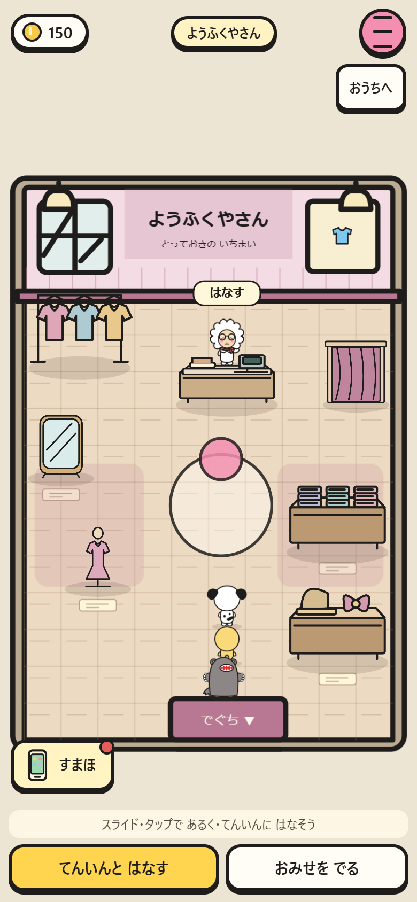
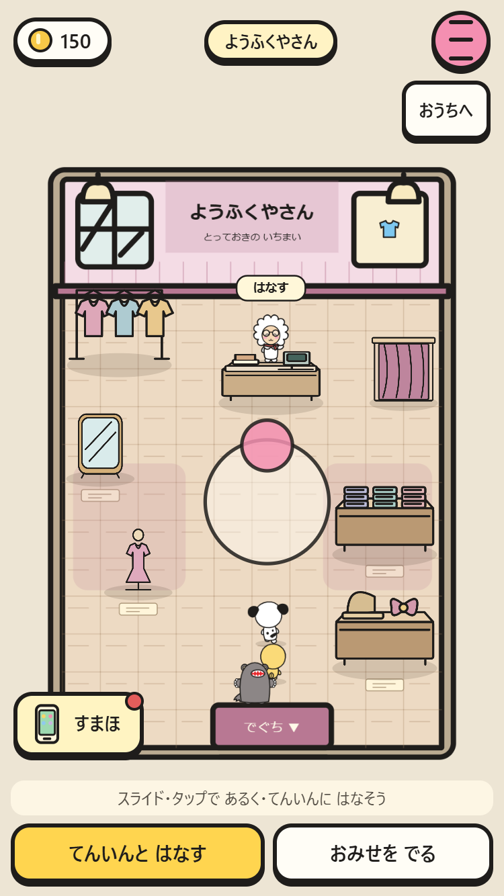
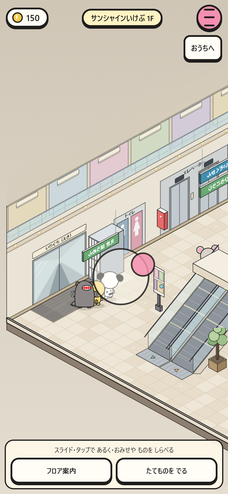
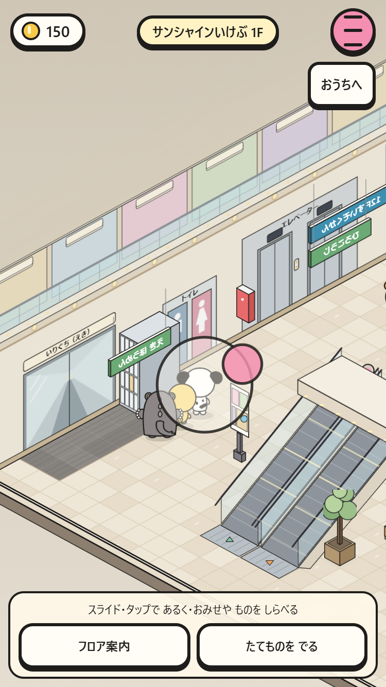
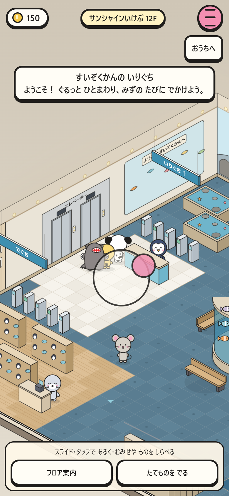
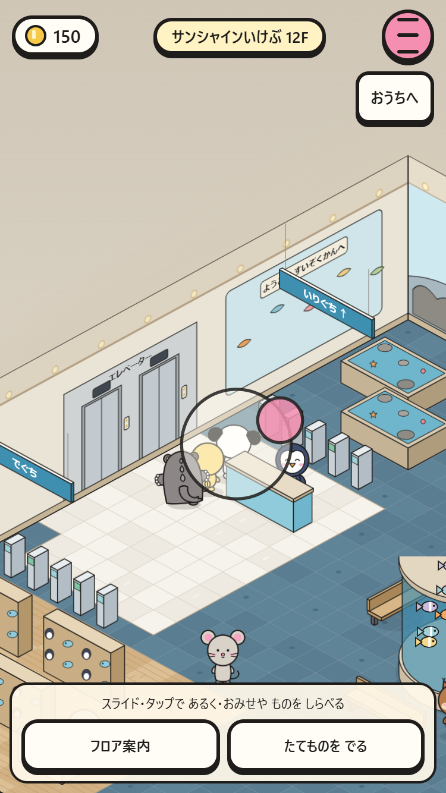

# 室内のスライド移動

通常店、学校、保育園、家電店、ゲームセンター、オフィス、サンシャインいけぶ（モール・水族館）に、町と同じドラッグ操作を追加。

- 床を短くタップ：目的地まで歩く。店員や展示のタップは従来どおり。
- 触れた位置から12論理px以上スライド：スティックで移動。中心の10px内では停止。
- 斜め視点では画面上の方向を床の軸へ変換。通れない壁・展示・吹き抜けには入らない。
- 指を離す、pointercancel、別画面への切替、会話、階移動でスティック解除。別の指で操作を奪わない。
- 3人同行と矢印/WASDは維持。保存キー・形式・所持金・アイテムの変更なし。

`tools/check-indoor-walk.mjs`：短いタップ、デッドゾーン、ドラッグ後の誤タップ、複数ポインター、キャンセル、入力ロック、斜め4方向、キーボード、階移動。

`tests/indoor-walk-smoke.mjs`：9か所×390×844 / 375×667で実Pointer入力、床タップ・会話・壁の衝突・解除・所持品保持。画像はスティックを保持中に撮影。

| 場所 | 390×844 | 375×667 |
|---|---|---|
| 通常のお店 |  |  |
| モール1F |  |  |
| 水族館12F |  |  |
