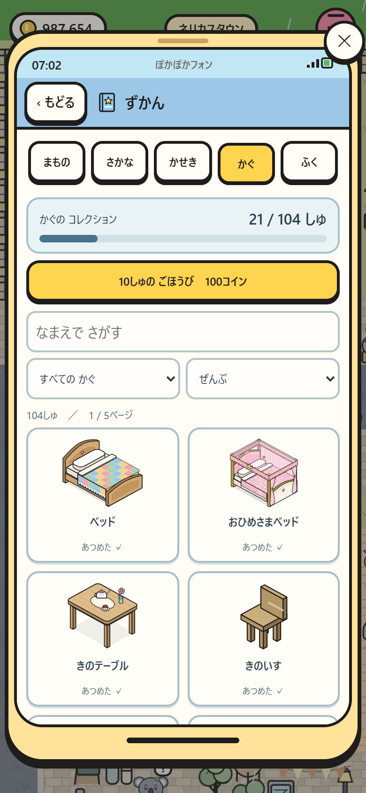
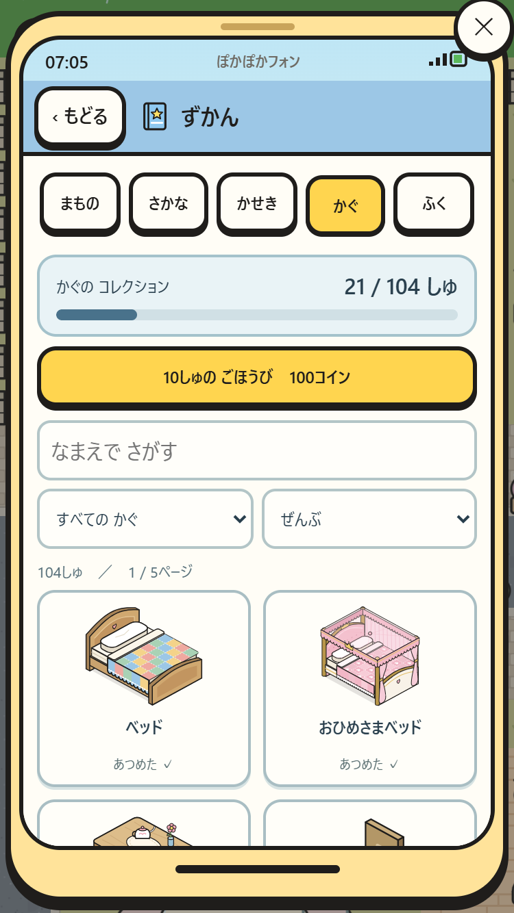
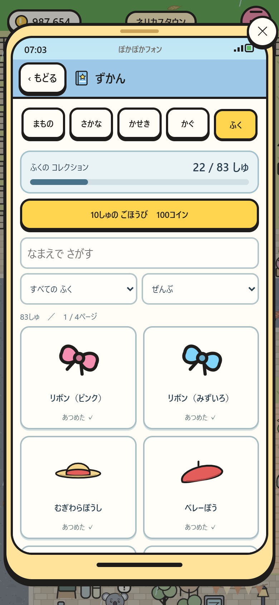
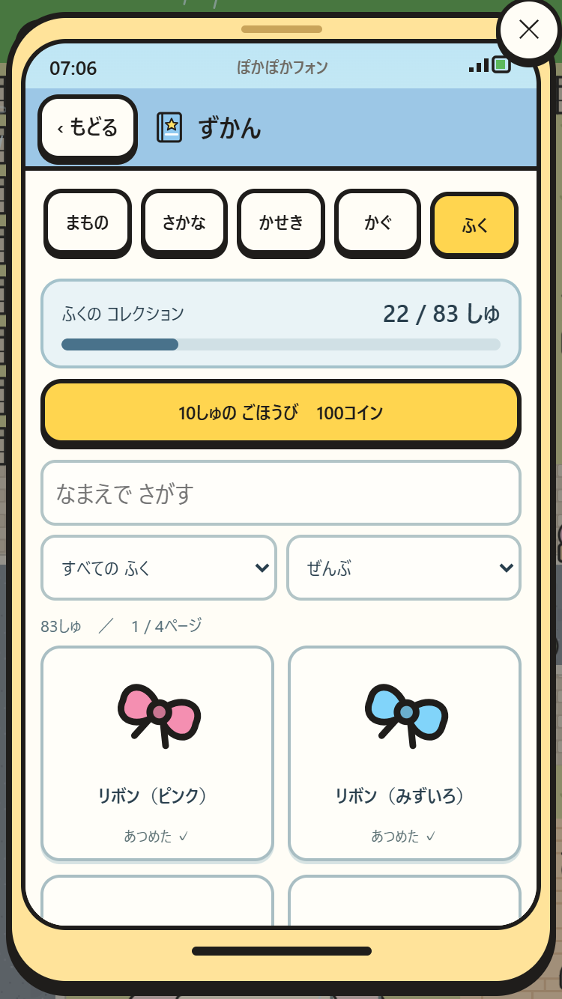
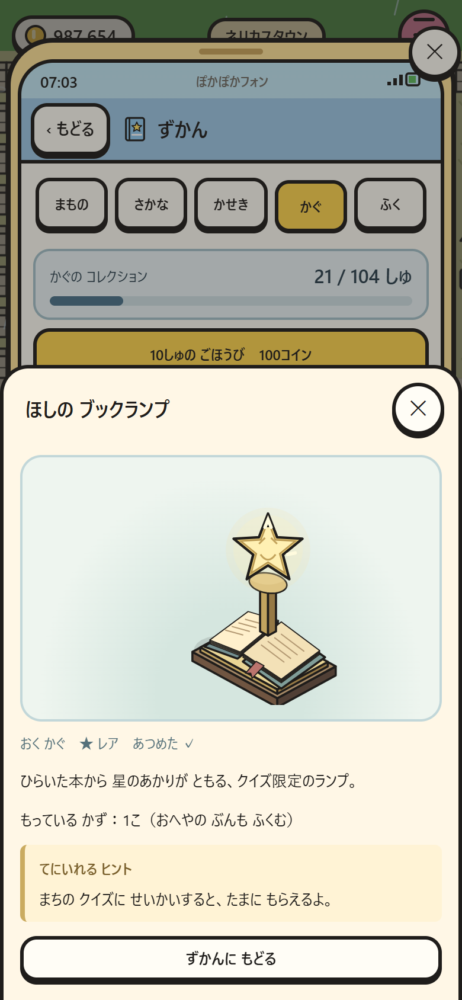
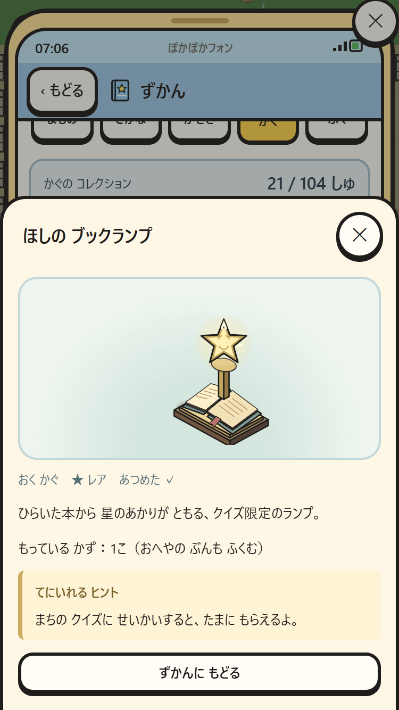
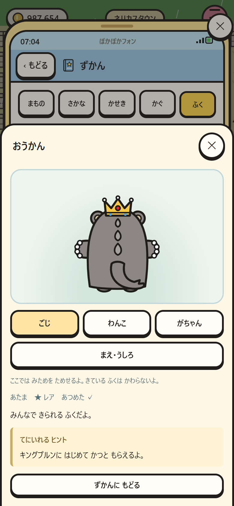
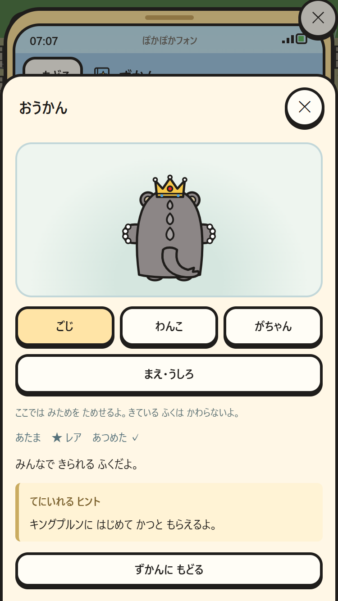

# 家具と服の図鑑

「すまほ → ずかん → かぐ / ふく」で開く。まもの・さかな・かせきも同じ画面から使える。

- 全家具104種類・服83種類（導入時）。限定品と非売品も数え、今後のカタログ追加は自動反映する。壁紙・床材、親の無料の見た目変更はこの2冊の対象に含めない。
- あつめた数 / 全種類、種類・収集済み・未入手・レアの絞り込み、名前検索、24種類ずつのページ。名前検索は空白とひらがな/カタカナの違いを吸収する。
- 未入手はシルエットと「？？？」。タップすると入手ヒントが見られる。入手済みは実際の家具の絵、説明、所持数、入手先を表示する。服は3人の前/後ろを見られるプレビューで、装備は変更しない。
- それぞれ10、20、30…種類ごとに100コイン。図鑑のボタンから各1回だけ受け取る。更新や閲覧だけでは所持金を増減しない。

## セーブ互換

`Save.KEY = pokapoka-town-save-v1` と `SCHEMA = 1` を維持。収集記録 `itemDex` だけを追加し、既存のまもの図鑑 `dex` は変更しない。古い所持品、着ている服、現在の部屋と別室に置いた家具から登録する。家具は個数ではなくIDごとの種類数で集計する。未対応の将来IDは保存したまま、現在の総数から除外する。収集記録は一度追加したら消さない。

コイン・所持品・部屋の配置・服・ショップ進捗は引き継ぐ。受領記録とごほうびは1回の保存で確定し、保存に失敗した場合は両方を戻す。

## 検証

- `npm run check`：全カタログと限定品、旧セーブの財産保持、設置/別室/着用の補完、種類の重複防止、収集履歴の維持、受取と再読み込み。
- `npm test -- --only=item-dex --shots --timeout-scale=4`：スマホ390×844・375×667で5タブ、検索、全ページ、絞り込み、シルエット、入手ヒント、試着、報酬ボタンと二重受領防止。
- 画面は `img/` に保存。ゲーム上の通常の図鑑を撮影する。

| 画面 | 390×844 | 375×667 |
| --- | --- | --- |
| 家具の一覧 |  |  |
| 服の一覧 |  |  |
| 限定家具の詳細 |  |  |
| 3人の試着 |  |  |
