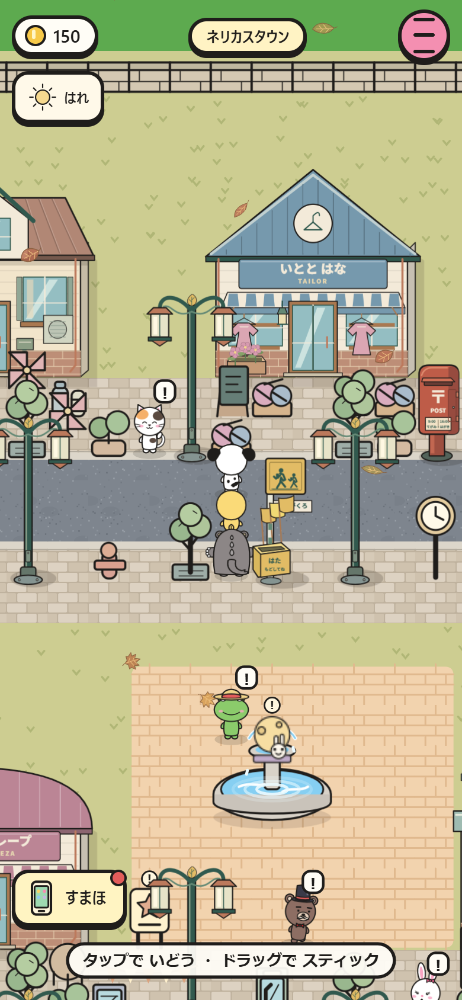
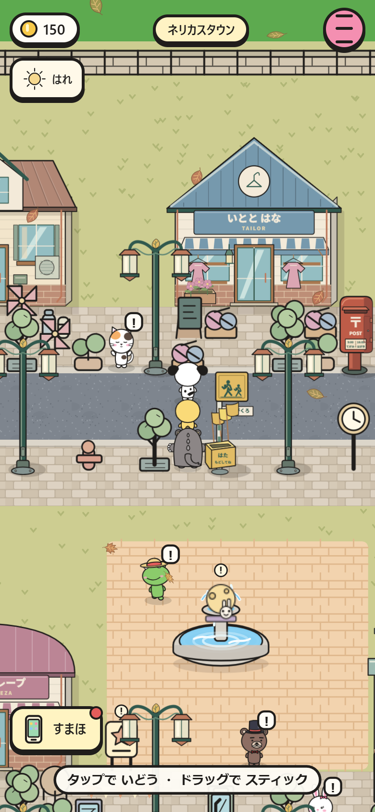
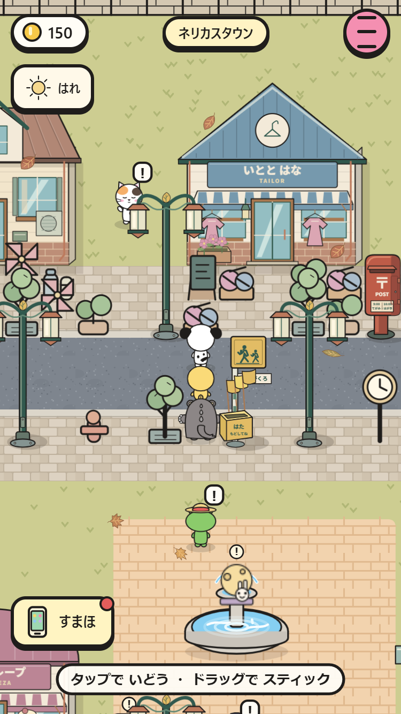
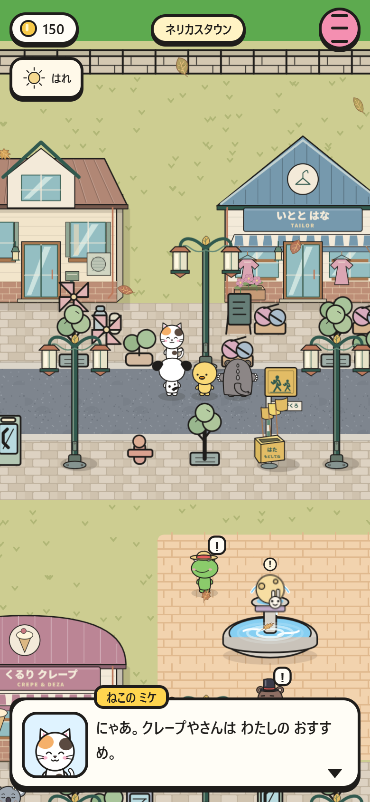
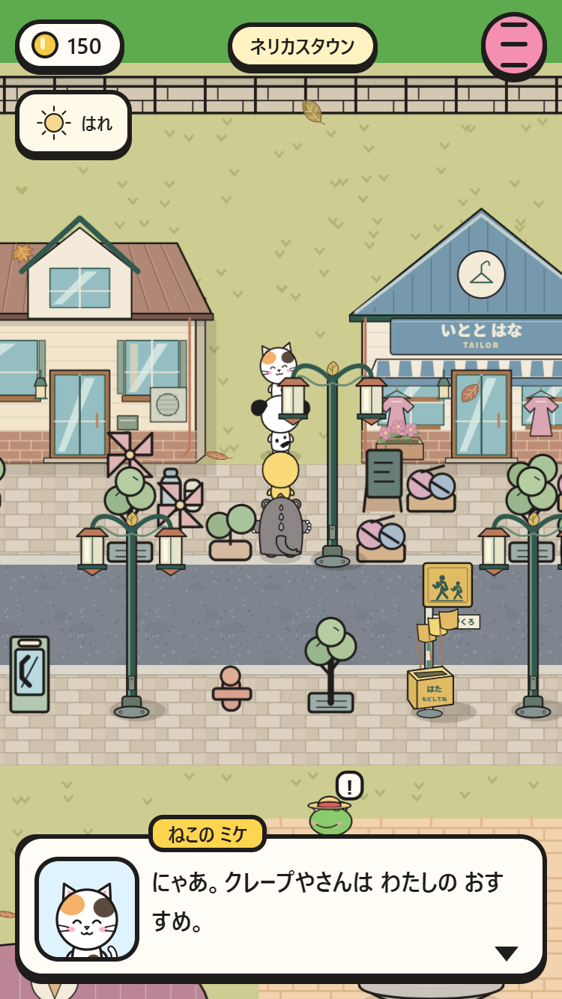
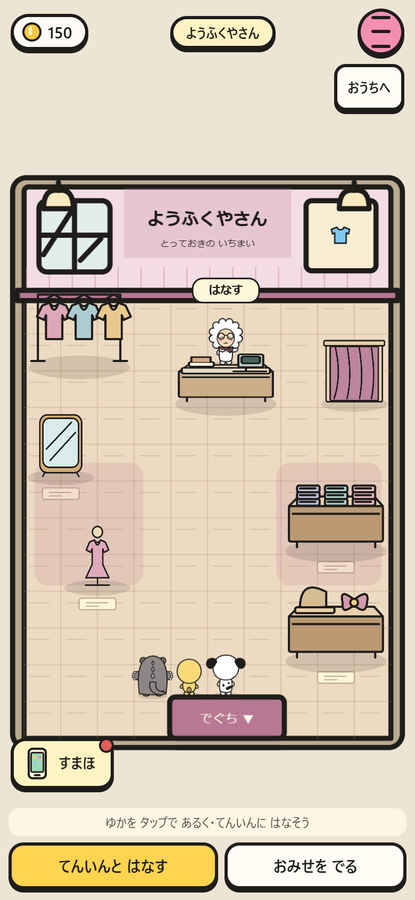
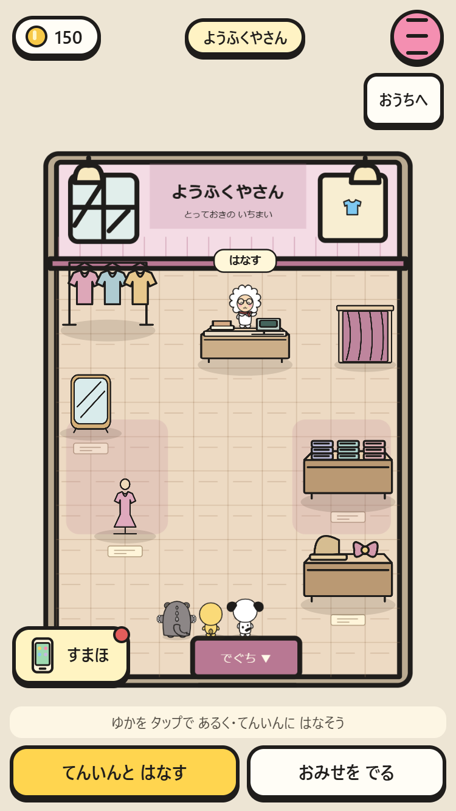

# 町の人の散歩・表情・しぐさ

- 屋外の住人は近所を散歩。既存の散歩範囲を優先し、範囲未指定の人は起点から3マス以内。
- 手を振る、伸び、考えごと、きょろきょろ、笑う、あくび、鼻歌、見とれる、照れる、おじぎの10種類。まばたきと会話中の身ぶりも追加。
- しぐさの後は10〜18秒休み、みんな同時にならない。近づいた相手に手を振り、再びあいさつするまで25〜45秒あける。
- 店員と受付は持ち場から離れず、表情や手・頭を動かす。既存の見た目、名前、服、会話、相談、クイズは保持。
- タップして近づいている相手・会話中の相手は歩き出さない。移動の前後のマスを予約し、入口、ワープ、細い通路、プレイヤーの経路を避ける。
- セーブに動作状態を追加しない。所持金・持ち物・会話の進行はそのまま。

## 検証

`npm run check`：全マップで3分間の動作をシミュレーション。重なり、範囲、入口、固定の持ち場、タップ対象の停止、メニュー停止、10動作×35種×4方向、セーブと原マップ不変を検査。

`npm test -- --only=npc-life --shots`：390×844・375×667で散歩、10動作、接近して会話、会話中の停止、店員、店から退出、再開と所持金保持を検査。

既存の家の静的テストで、親の初期化後に時刻を7時へ変えていたため実行時刻によって親が留守になる問題も修正。初期化前に7時を設定し、既存の検査内容は維持。

| しぐさ | 390×844 | 375×667 |
|---|---|---|
| 手を振る |  |  |
| 伸び |  |  |
| 会話 |  |  |
| 店員 |  |  |
