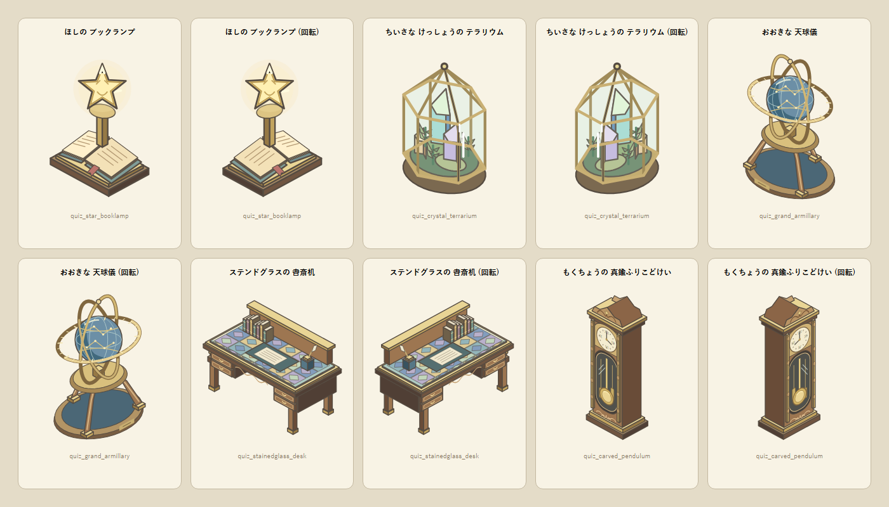
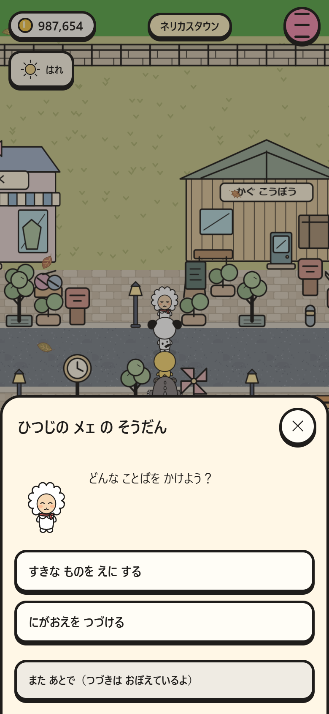
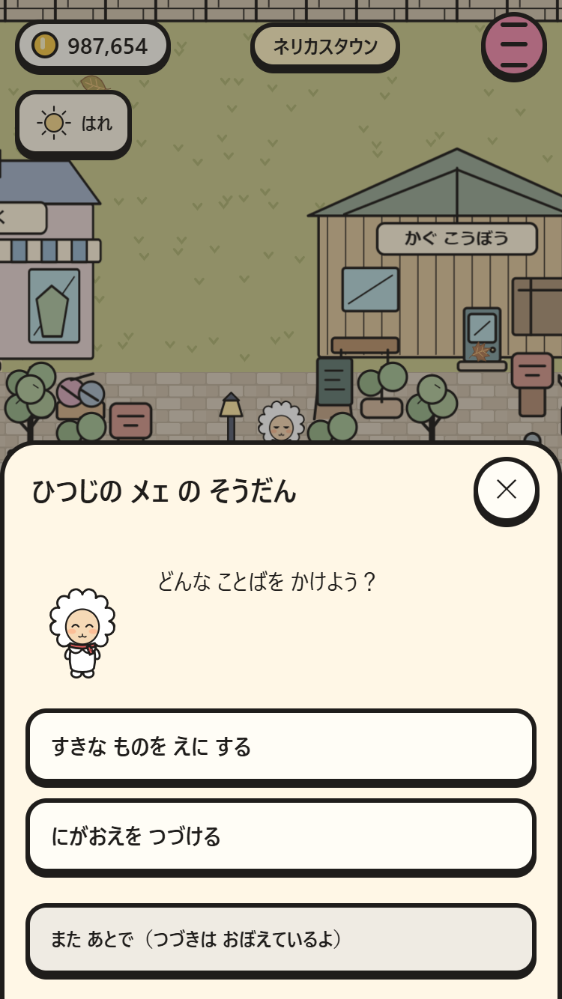
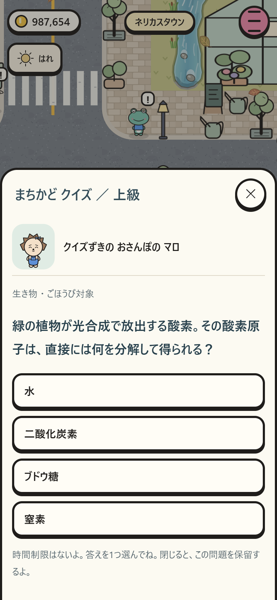
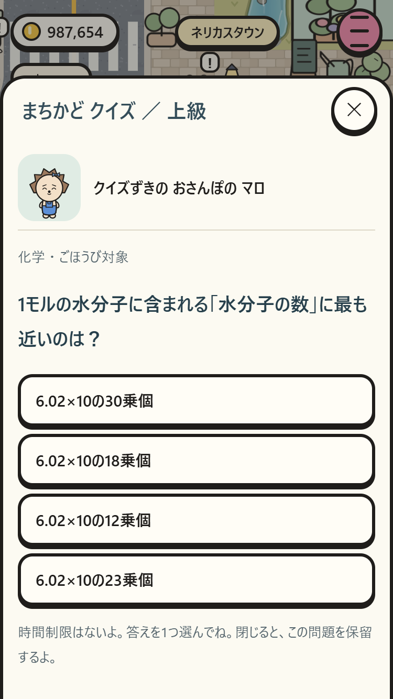
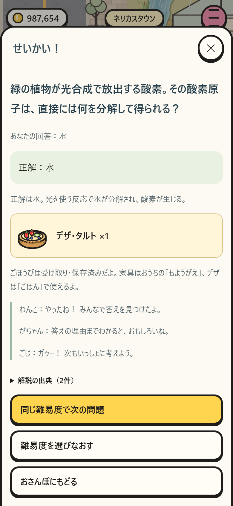
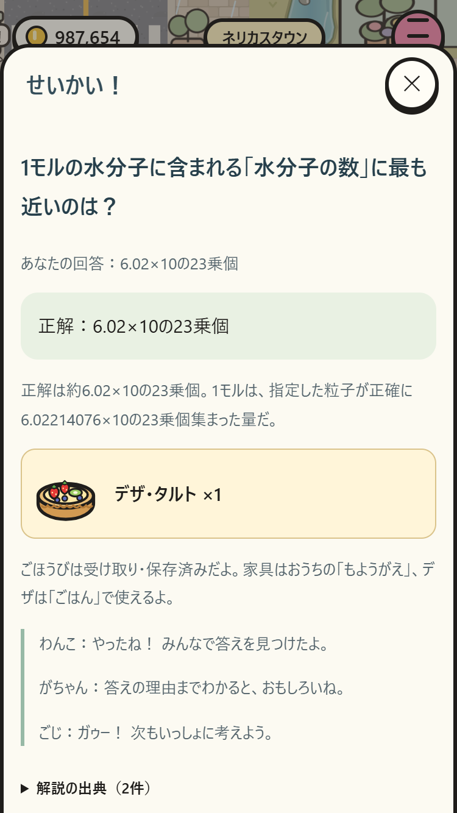

# 町の会話とまちかどクイズ

ネリカスタウンの南東、住宅街の北側（33,30）にいる「クイズずきの おさんぽの マロ」に話しかけるとクイズで遊べます。既存の見た目・固有名・移動範囲を引き継ぎます。

クイズ係は 6人（TOWN-QUIZ-HOSTS・2026-10-01）: ネリカスタウンの まえからの 係「クイズずきの まちの なかま」（いまは ふんすいの ひろば 41,23）・いこいの もりの そばの「もりの ふくろう」（しぜんと いきもの）・しょうがっこうの まえの「ほしぞら はかせ」（うちゅうと かがく）と、池袋えきの まえの「れきし はかせ」（れきしと ちり）・「えかきさん」（げいじゅつと おんがく）・「えきの ものしり」。係ごとに とくいな 分野の 問題を さきに だし、問題の 一巡・保留中の 問題・1日の ごほうび枠は みんなで 1つです（`TownQuiz.HOSTS`）。

## 会話

既存の台詞・おねがい・物々交換に加え、60組300行の掛け合いを追加。23人の固有の話題、14種類の住民の役割、天気・時間・季節・おまつりを条件に選びます。新しい会話は約75%、従来の短い会話と遊び方のヒントは約25%。無関係な返事をランダムに付け足す処理を廃止しました。

悩み相談は8本。音のすれ違い／おまつり出店／絵の贈り物／駅の忘れ物／芽が出ない／読書会／新しい友人／化石の展示。最後の台詞の上に出る「そうだんを きく」から任意で始めます。各話は2段階の選択、4つの結末、結末に対応する再会の会話を持ち、全32ルートにわんこ・がちゃん・ごじが参加します。

「また あとで」で中断でき、次回は同じ選択後の場面から再開。結末後には「そのごの はなし」、希望すれば相談のやり直しもできます。相談自体はお金や所持品を増減しません。

## クイズ

- 実世界の科学・歴史・地理・芸術など50問。大人向けの初級16問、中級18問、上級16問。各問3〜5択、正解1つ。
- 参加無料、時間制限なし。正誤どちらも解説と出典を読めます。
- 最初の10回答／日が報酬対象（不正解も1回答）。以降は回数無制限の練習。無料の連続回答だけで経済が崩れないようにした制限で、開始前の画面に残数とルールを表示します。
- 正解時の基本報酬は60%で35／65／100コイン、40%で難易度別のデザ1個。
- 基本報酬に加え、限定レア家具2品から1品を2%／3%／4%、高級家具3品から1品を0.3%／0.5%／0.8%で独立抽選。両方当選もあり、重複した家具も受け取れます。
- レア家具は星のブックランプ・結晶テラリウム。高級家具は大型天球儀・ステンドグラス書斎机・彫刻振り子時計（価格基準15,000／32,000／48,000）。すべて非売品で、おうちに配置・回転できます。
- 問題は難易度ごとに一巡まで重複なし。一巡の境界も連続して同じ問題にしません。選択肢順も抽選します。

問題・選択肢順・開始日・景品抽選は出題前に保存します。閉じる／再読み込みでは同じ問題を保留し、抽選し直しません。日をまたいだ保留問題は開始日の回答枠を使います。正誤・報酬・所持数は同時に保存し、保存結果を読み戻せない場合は変更前に戻します。連打・結果の再表示で報酬は増えません。

## 問題の根拠

[科学25問](quiz-science.json) と [文化25問](quiz-culture.json) が編集元です。各問に確認した一次資料2件、根拠の短い要約、確認日を記録しています。既存の問題集から文章を転載せず、複数資料で確認できる実在の事実を独自の日本語で設問化しました。実行時に外部API・外部通信で問題を取得しません。出典リンクはプレイヤーが選んだときだけ外部サイトを開きます。

`node tools/build-town-quiz.mjs` でオフライン用の `js/town-quiz-data.js` を生成。`--check` は元データとの一致を検査します。

## 互換・検証

保存キー `pokapoka-town-save-v1` と SCHEMA 1を維持。`conversations`（履歴・相談の進行）と `townQuiz`（保留・出題順・正誤・日次枠）を追加するだけです。古い所持金・所持品・部屋・育成・お店の進行を変換しません。

`npm run check` は全相談ルート、参加者、条件、全50問、出典2件、家具モデル、旧セーブ、正誤の報酬、保存失敗、二重回答、再読込、日またぎ、出題巡回を検査します。ブラウザ検証は `npm test`、対象を絞る場合は `node tests/smoke.mjs --only=town-dialogue --shots`。390×844と375×667で実際の会話・相談・クイズの導線を確認します。

## スマホ画面

| 場面 | 390×844 | 375×667 |
| --- | --- | --- |
| 相談の選択肢 |  |  |
| クイズ出題 |  |  |
| 解説と報酬 |  |  |
