# ネリカスタウンの建物と駅前

[建物原画集](index.html) · [承認済みの駅原画](../nerikasu-station/index.html)

駅舎に合わせて町の全22棟を実寸のSVGへ更新。学校、保育園、9店舗、主人公のおうち、8棟の住宅、川辺のあずまやを、それぞれの用途が見える建物にしました。1マス32px、南側の入口、左上の光、セージ・クリーム・木・レンガの材料を共通にしています。

## 原画と本編

- 駅の原画32種は `tools/town-design/nerikasu-assets.mjs` / `nerikasu-props.mjs` の形・細部を保持。
- 新しい建物21種は `tools/town-design/nerikasu-buildings.mjs`。汎用200pxの絵を横長に伸ばさず、5マスの洋服店から24マスの小学校まで、窓・扉・屋根を実寸で配置。
- `tools/build-nerikasu-town.mjs` が原画集と `js/nerikasu-town-art.js` を生成。本編も原画集も同じSVG。昼夜の状態は有限個。
- `js/nerikasu-town.js` が既存22棟のIDへ素材を接続。駅の14×5マスの寸法を確保するため駅を1マス北へ、駅東の1軒を東へ寄せた。その他の建物の位置・入口・施設機能は維持。
- 駅前は敷石・点字ブロック・駅名塔・地図・街灯・花だんを配置。列車はホームの範囲で停車・発車する。学校の掲示板、保育園のベンチ、通学路の標識、町のポストも原画を使用。
- bboxの原点と足もとを分け、屋根や影を押しつぶさず描く。描画とキャッシュは既存の `HeiwadaiArt` / `HeiwadaiTown` の仕組みを共用し、ネリカスの昼夜と列車のみ分岐する。平和台の原画・配置は変更しない。

## 互換性

`town`、全建物ID、交通ID、入店・学校・保育園の機能は維持。池袋への電車は500コイン、帰りは無料。Save.KEY / SCHEMAは変更しない。所持金・服・家具・部屋・お店の進行を維持し、古い立ち位置が建物や小物と重なる場合は既存の安全位置探索で救済する。

## 再生成と検証

```sh
cd game
node tools/build-nerikasu-town.mjs --shots
npm run check
npm run audit:town -- --check town
node tests/smoke.mjs --only=nerikasu --shots
```

`check-nerikasu-town.mjs` は原画と本編SVGの一致、22棟の実寸と入口、交通料金、旧資産の維持を検査。既存 `town-check.mjs` はすべての入口・歩けるマス・旧位置を検証する。スモークは390×844と375×667で旧データからの再開、昼夜、実際の駅入口とキャンセル、洋服店への入店、小学校と保育園の見学を確認する。

原画の昼夜一覧は `img/buildings-day.png` / `img/buildings-night.png`。実機画面は以下。

| 場所 | 390×844 | 375×667 |
| --- | --- | --- |
| 駅前 | 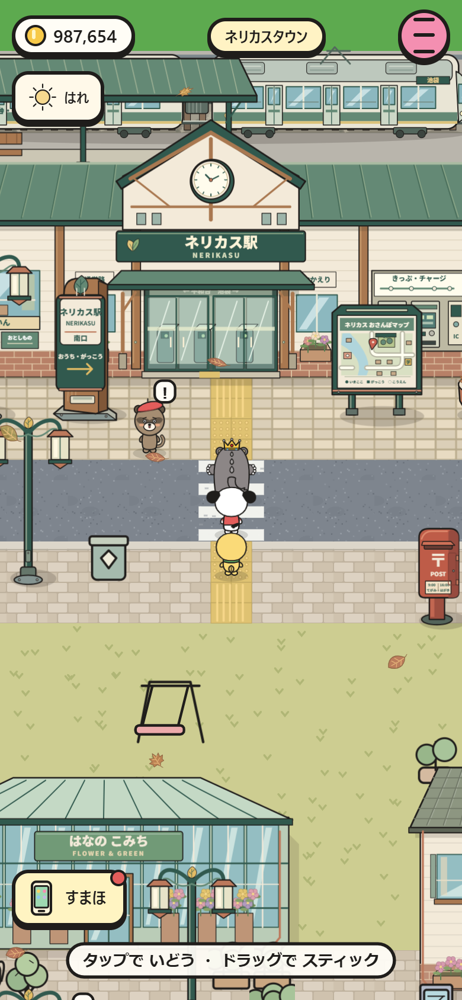 | 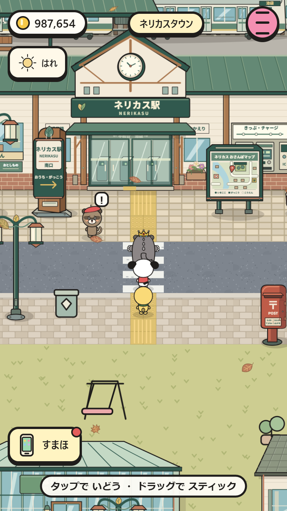 |
| おうち・洋服店 | 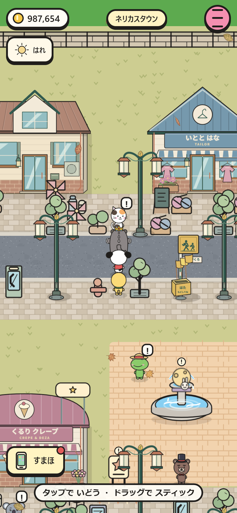 | 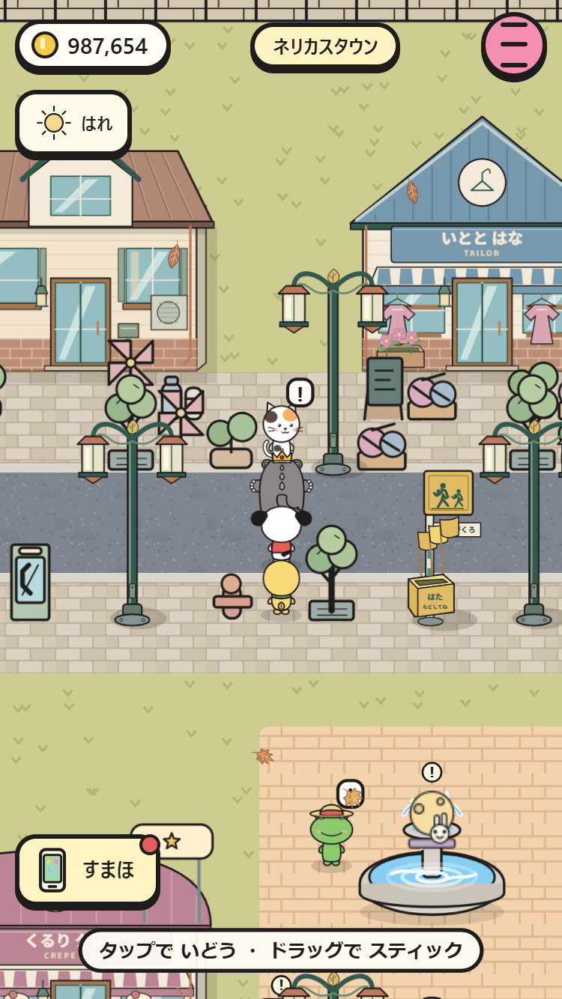 |
| 食べ物のお店 | 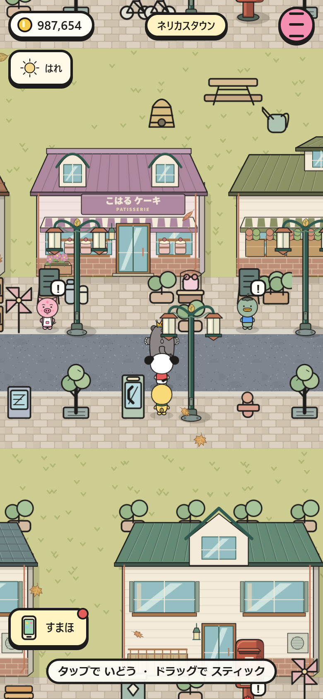 | 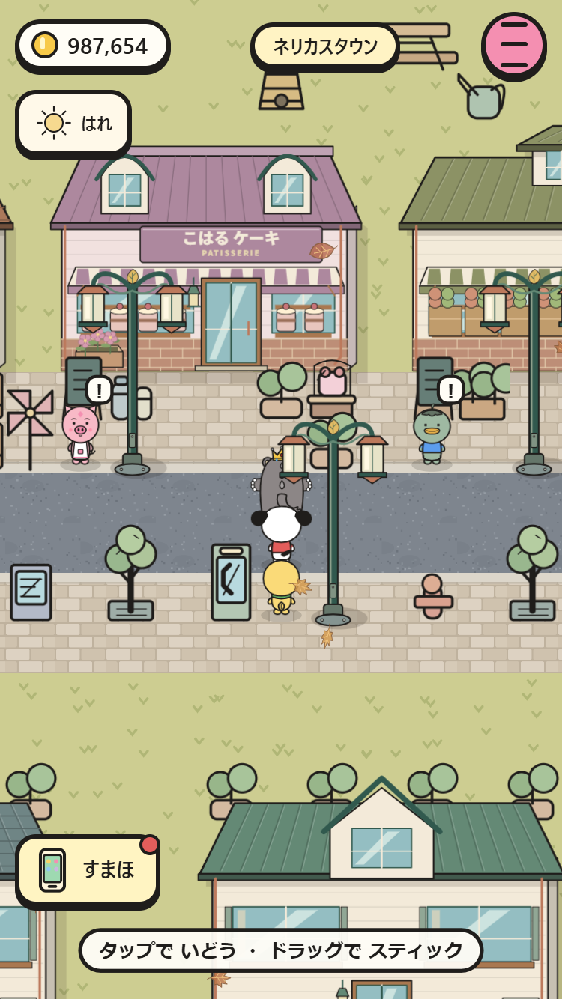 |
| 小学校 | 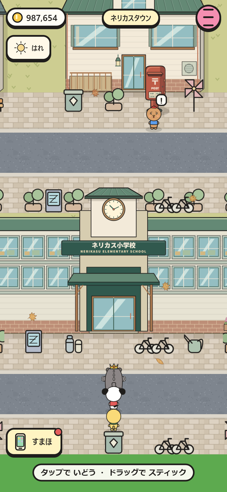 | 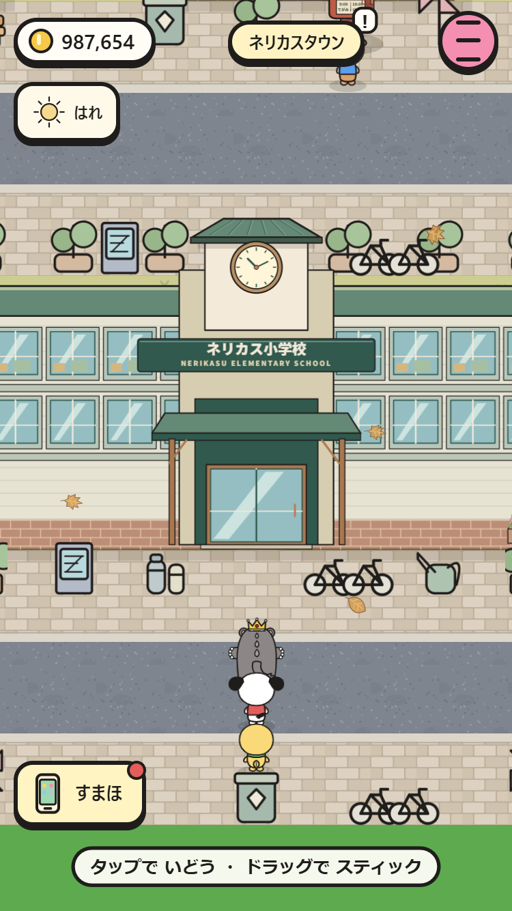 |
| 保育園 | 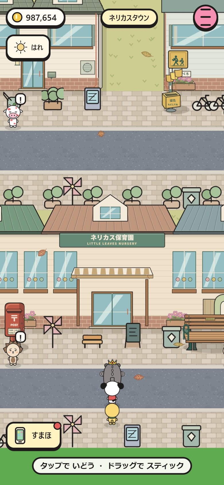 | 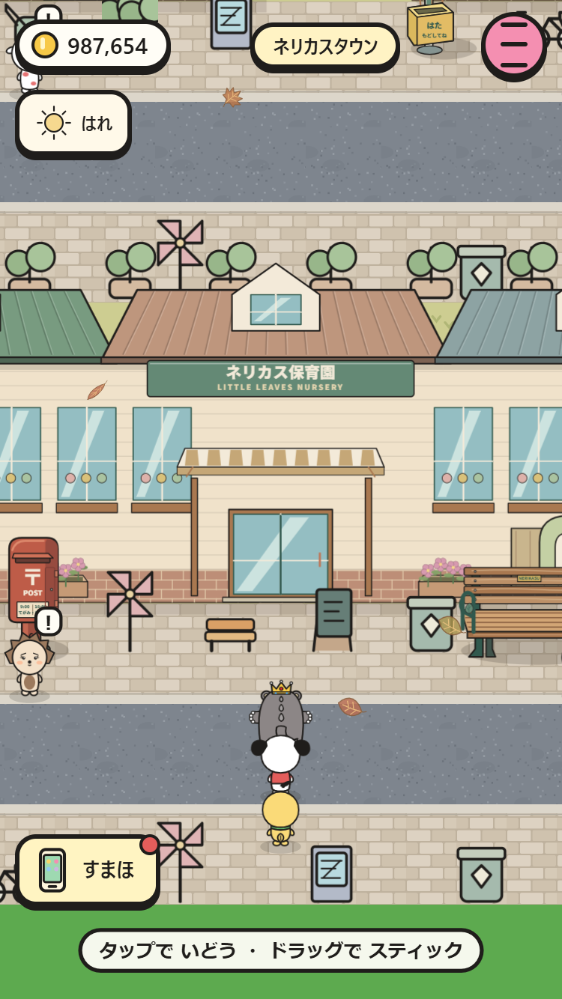 |
| 夜の駅 | 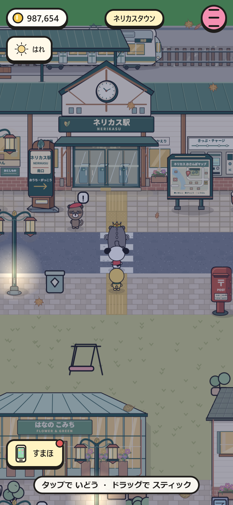 | 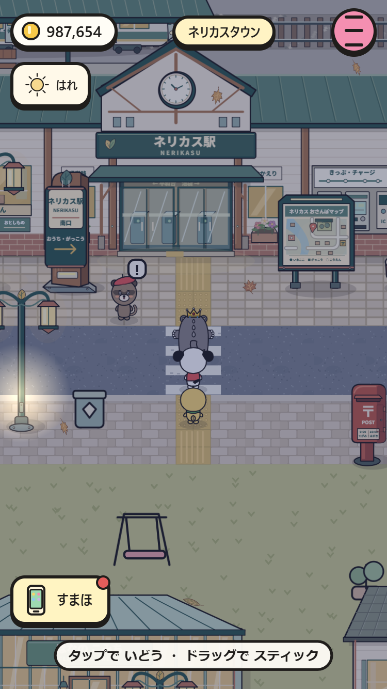 |
