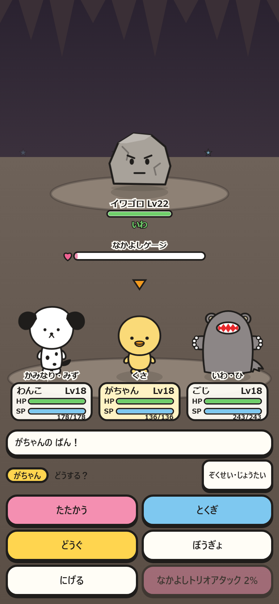
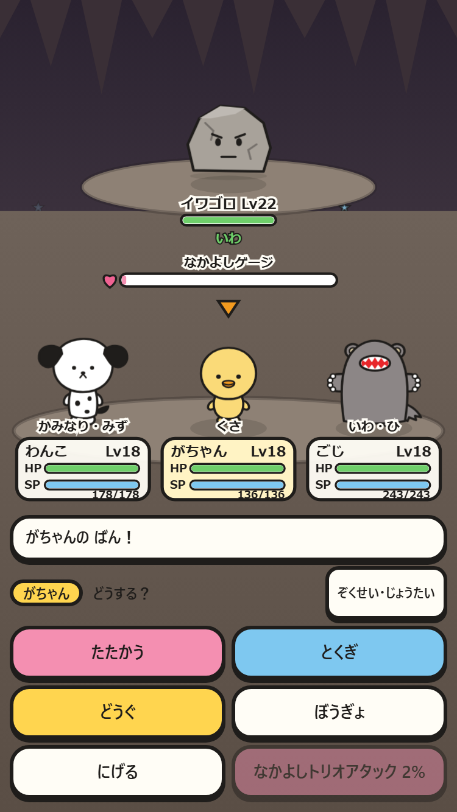
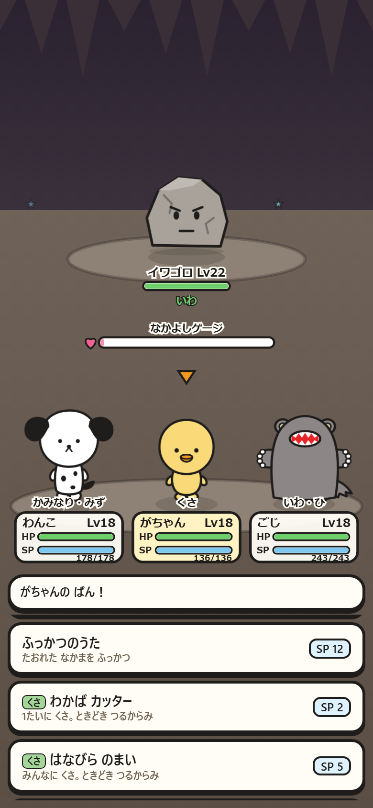
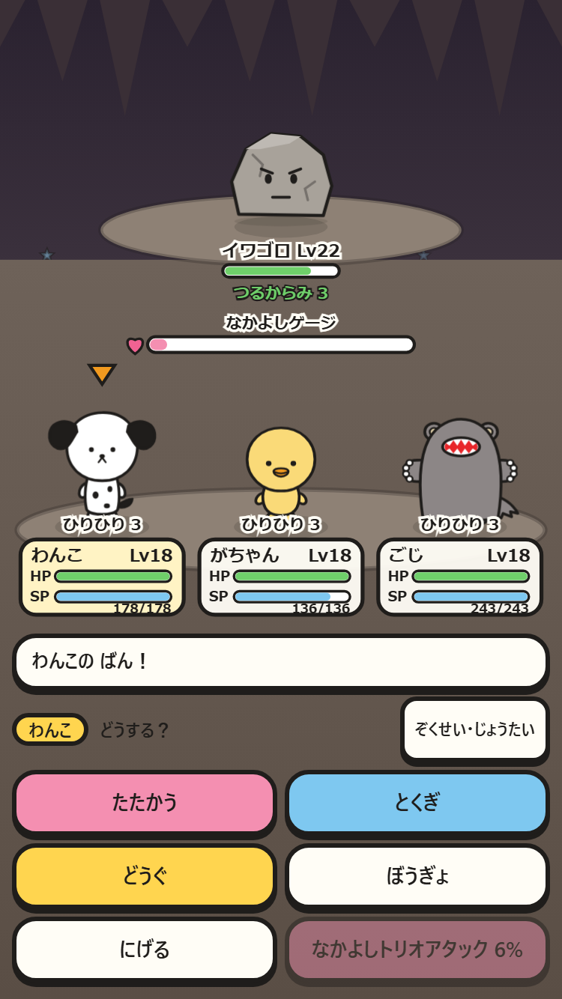

# 属性バトルのスマホ確認

実ゲームをPlaywrightで操作。端末倍率2、論理サイズは390×844 / 375×667。HP/SP・敵属性・技・状態とゲージを見比べる。

| 390×844 | 375×667 |
|---|---|
|  |  |
| 属性つきの技一覧 | 状態異常（自分の番の残り回数） |
|  |  |

撮影手順はtests/smoke.mjs「属性技と状態異常」。`node tests/smoke.mjs --full --shots --only=属性技` で再現できる。
