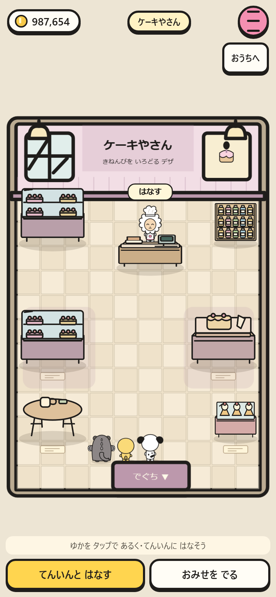
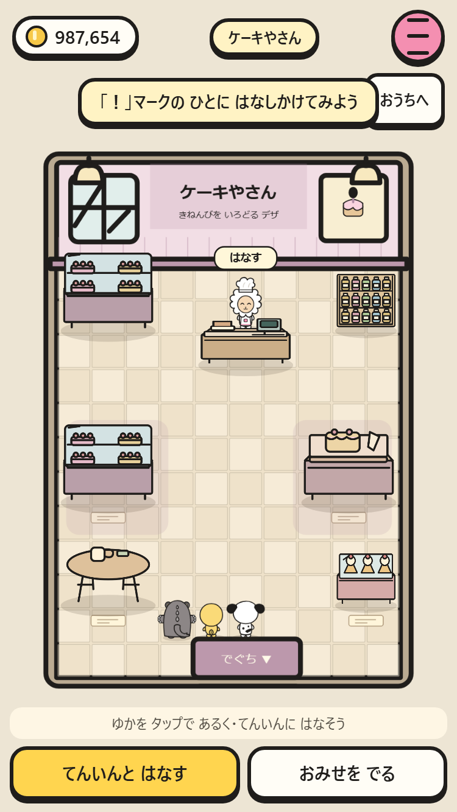
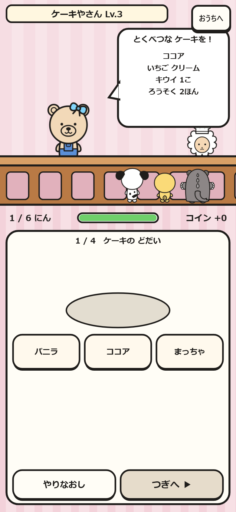
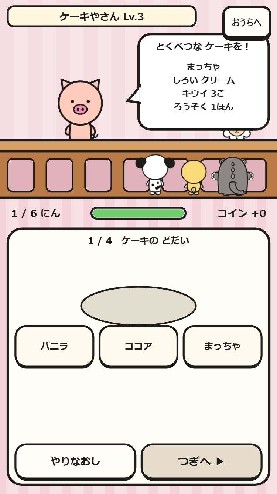
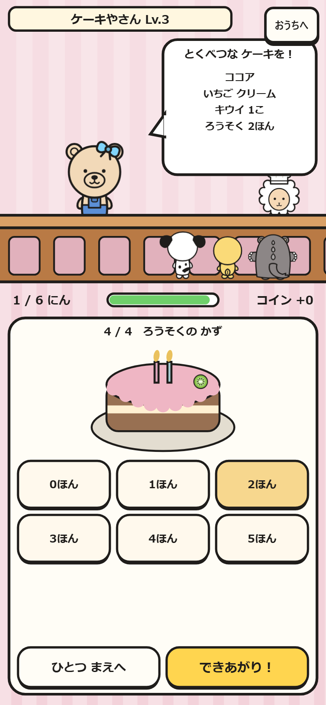
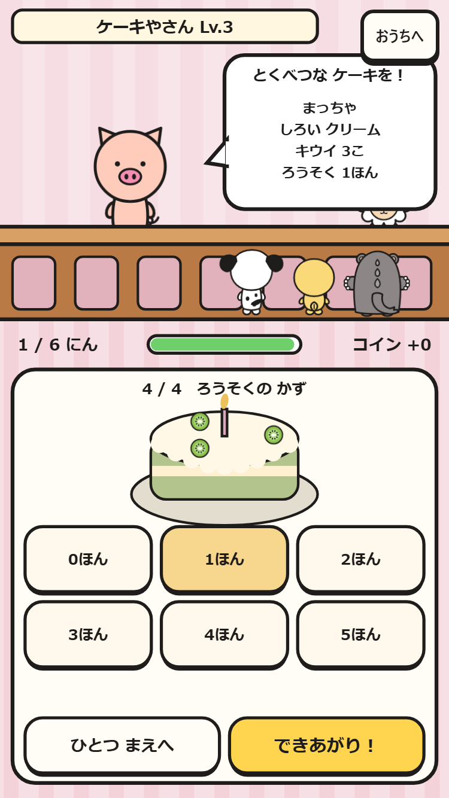

# ケーキやさん

町のパン屋の隣から入り、店員に話しかけて買い物やおてつだい。Lv1は果物、Lv2は土台とクリーム、Lv3からろうそくも選び、Lv3〜5では注文を覚えて作る。

|画面|390×844|375×667|
|---|---|---|
|店内|||
|注文|||
|完成直前|||

全レベルの採点・ボタン配置・町の入口と道の接続を npm run check で検査。ブラウザでは両サイズでLv3の6人分を注文どおりに作り、すべて◎と報酬の保存を確認。所持金・服・家具・部屋は保持する。
