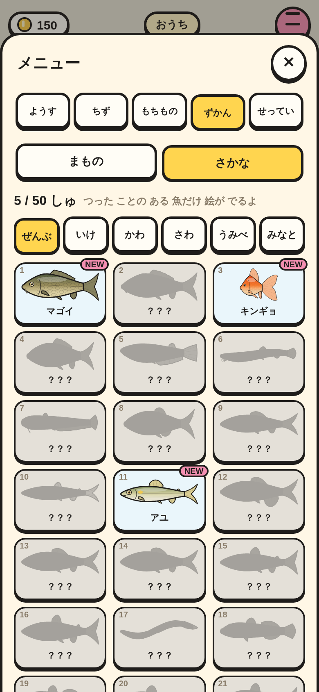
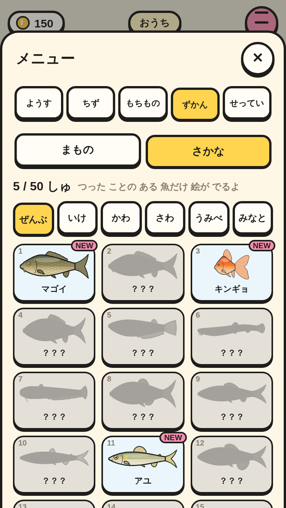
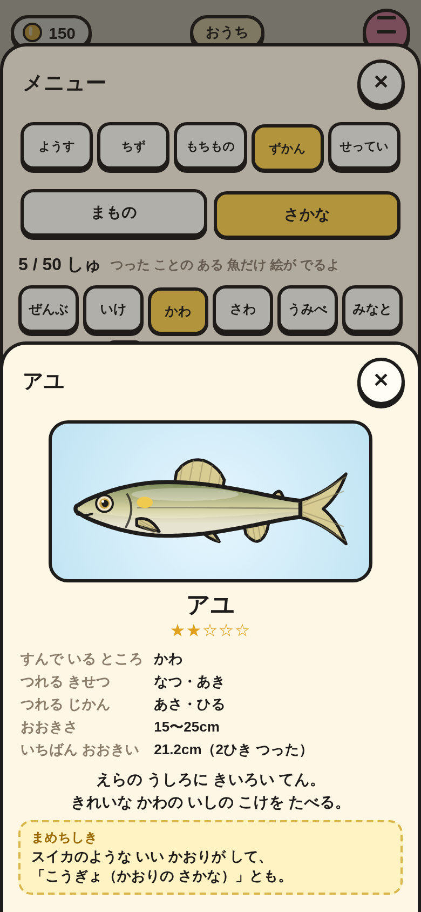
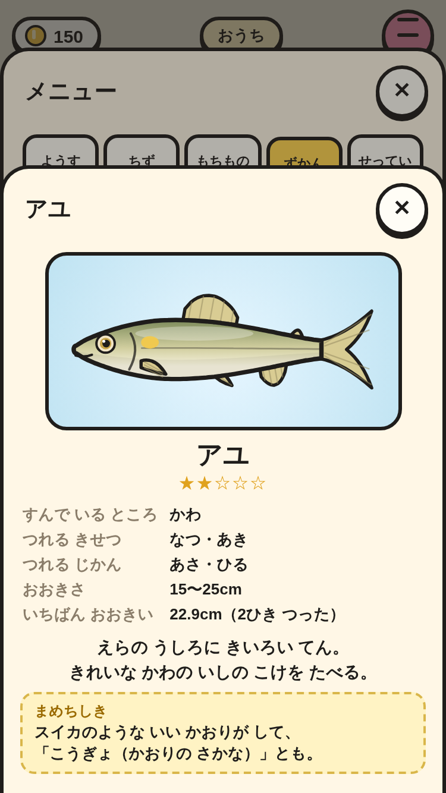

# さかな ずかん（③ の 1番）

メニューの「ずかん」に「さかな」を 足した。つった 魚だけ 絵が 出て、まだの 魚は かげ。場所で しぼれる。

|場面|390×844|375×667|
|---|---|---|
|さかな ずかん（5しゅ つった・きょう はじめての NEW）|||
|くわしい ページ（アユ）|||

スモーク `fish-dex-*` で、次を たしかめて いる。

- `fishGive` で ずかんと いけすに のる（アユ 2ひき → `n` 2・`keep` 2）。つりざおは まだ ない。
- まもの ずかんが さいしょに 出て、「さかな」で 50マスに かわる。つった 5しゅだけ なまえ と 絵、ほかは「？？？」と かげ。
- ボタンが みんな 44px いじょう、マスが 画面の 中。
- 「かわ」で 11しゅに しぼれる。アユの くわしい ページに すむ ところ・「2ひき つった」・まめちしき が 出る。とじると ずかんに もどる。
