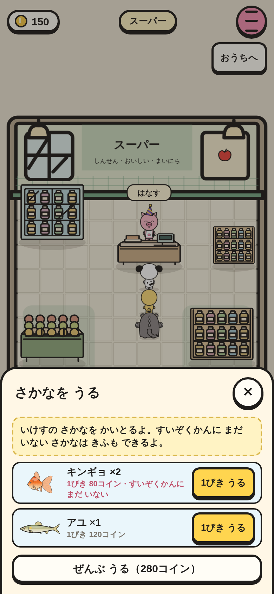
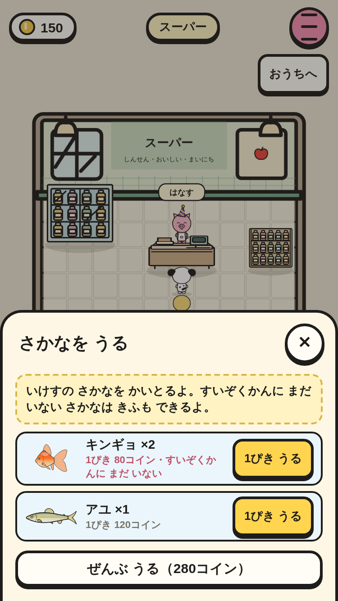

# いけす・うる・りっぱな つりざお（③ の 3番 → UI-02 で うるのは スーパーに）

つった ときには うらない（どうぶつの森と おなじ）。スーパーで てんいんと はなすと「さかなを うる」が 出る（いけすに 魚が いる ときだけ）。きふは すいぞくかん。

|場面|390×844|375×667|
|---|---|---|
|スーパーで「さかなを うる」（1ぴき うる・ぜんぶ うる。すいぞくかんに まだ いない 魚は あかい しるし）|||
|いけすが いっぱい（30ぴき）で つった とき → じまんの あと にがす|||
|みなとの マルシェで りっぱな つりざお（1200コイン）|||

スモーク `fish-keep-*` で、次を たしかめて いる。

- 1ぴき うると コイン +ねだん・いけすが へる。ぜんぶ うる（すいぞくかんに まだ いない 魚が いると たしかめる）で いけすが からに なる。からの ときは「さかなを うる」が 出ない。
- いけすが いっぱいで つると「いけすが いっぱい」の ことば → いけすは 30ぴきの まま・ずかんは ふえる。ずかんに いけすの かず。
- シティの マルシェには りっぱな つりざおが ない。みなとの マルシェで かえる。
