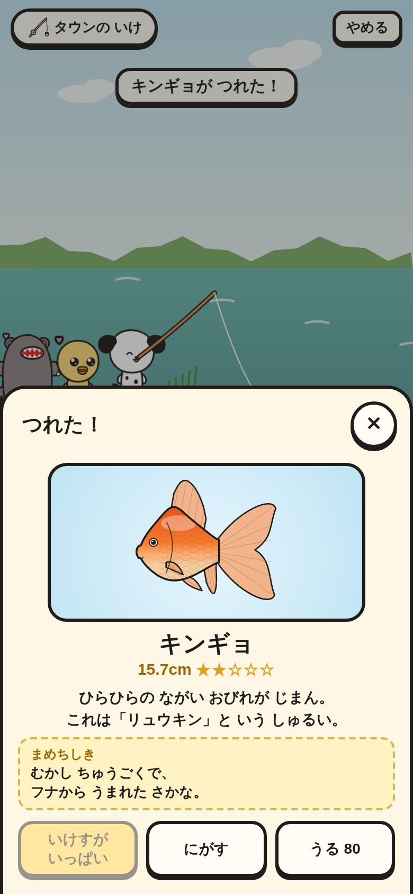
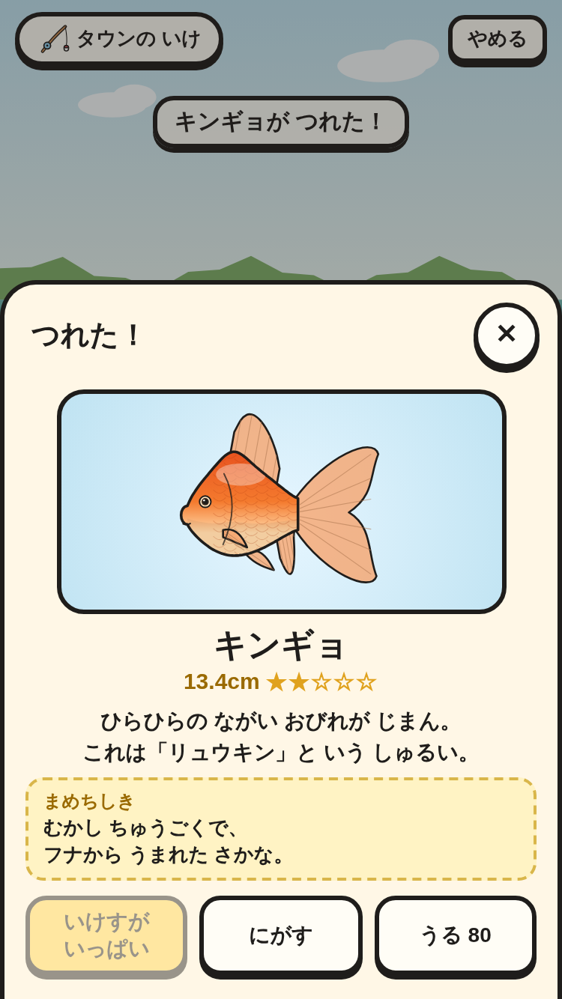
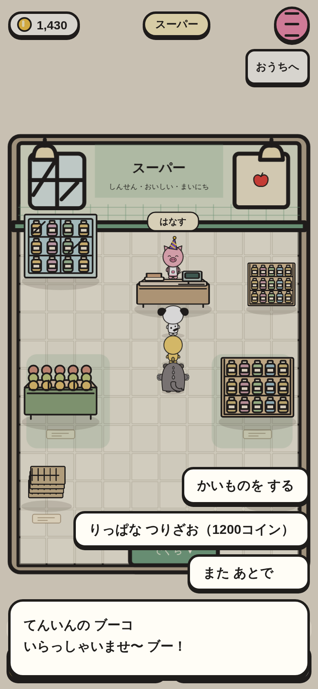
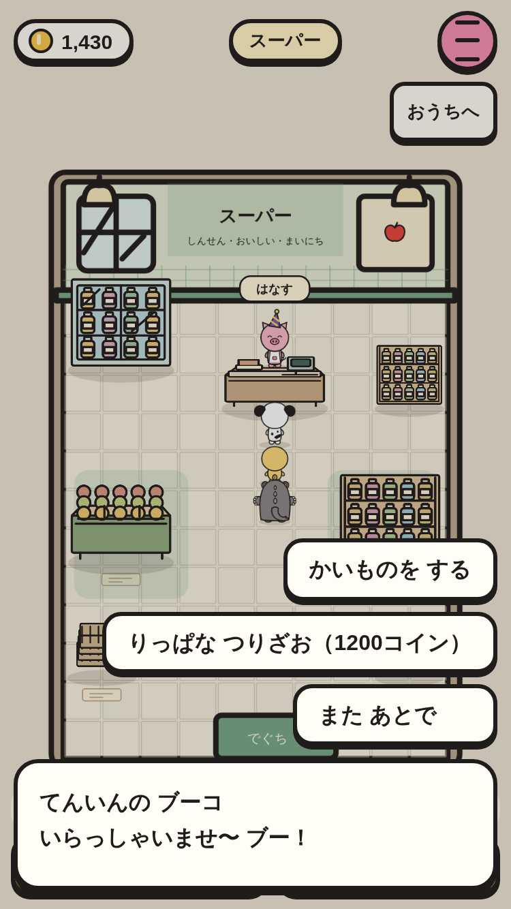

# いけす・うる・りっぱな つりざお（③ の 3番）

つれた 魚は いけすへ／にがす／うる。いけすは 30ぴき まで。みなとの マルシェで りっぱな つりざおが かえる。

|場面|390×844|375×667|
|---|---|---|
|いけすが いっぱい（にがす／うる）|||
|みなとの マルシェ（りっぱな つりざお）|||

スモーク `fish-keep-*` で、次を たしかめて いる。

- キンギョを うると コインが ねだんだけ ふえる。いけすには 入らず、ずかんには のる。
- いけすが 30ぴきの ときは「いけすが いっぱい」（おせない）で、にがしても 30ぴきの まま。ずかんに「30 / 30」。
- シティの マルシェでは りっぱな つりざおが 出ない。みなとの マルシェで 1200コインで かえる（rod 2）。
