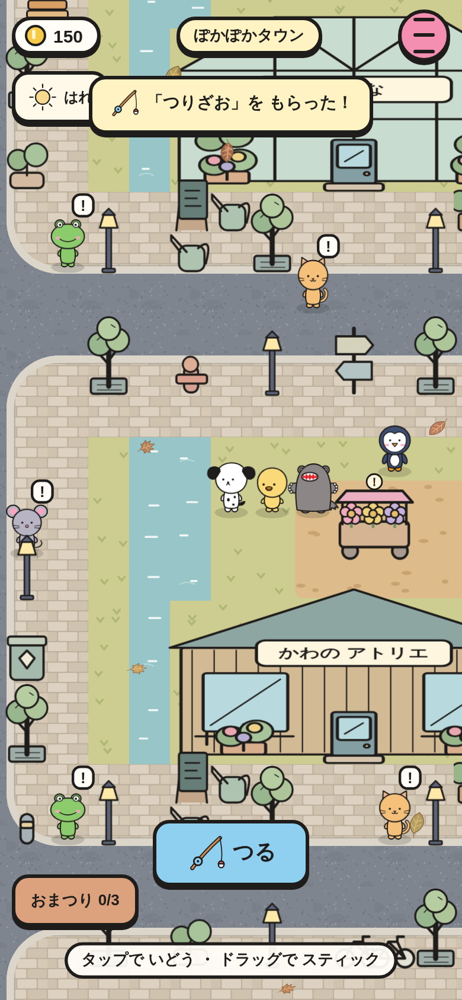
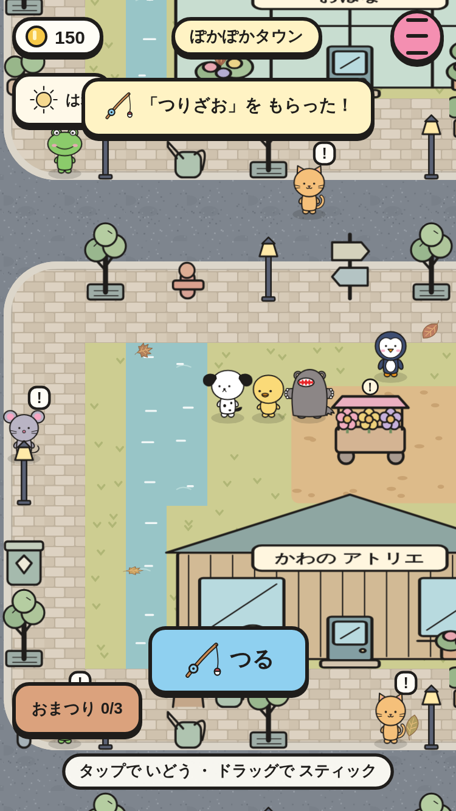
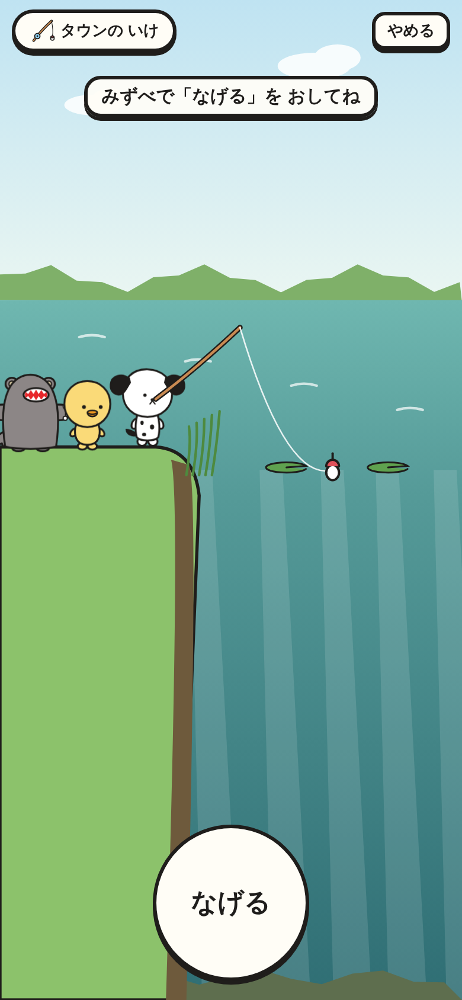
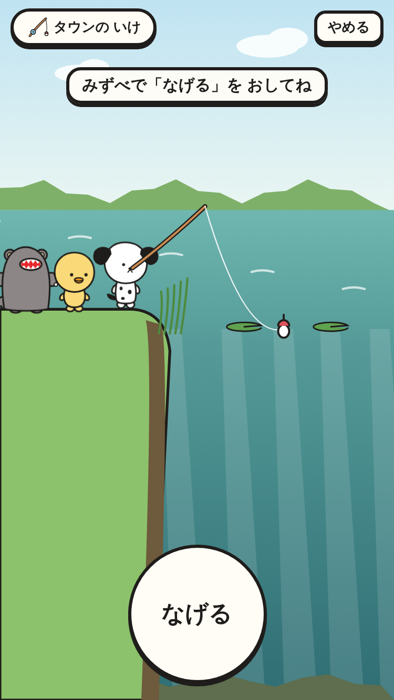
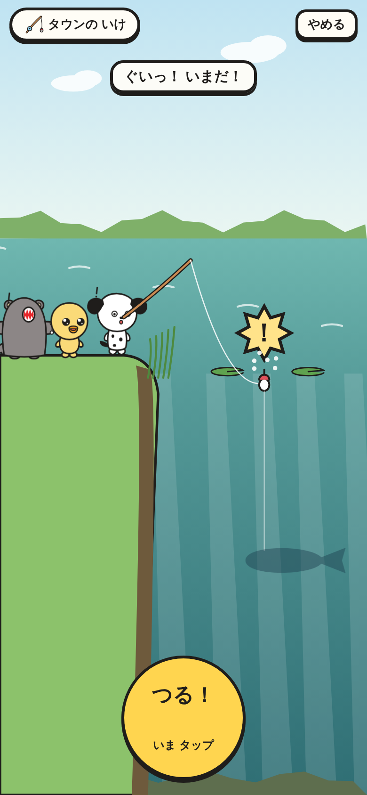
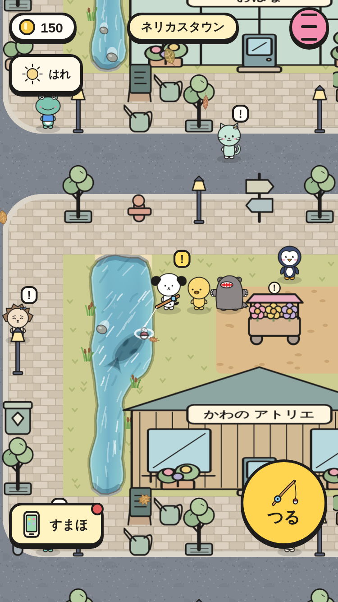
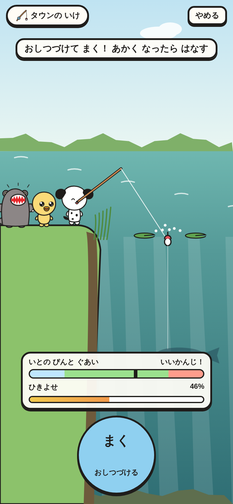
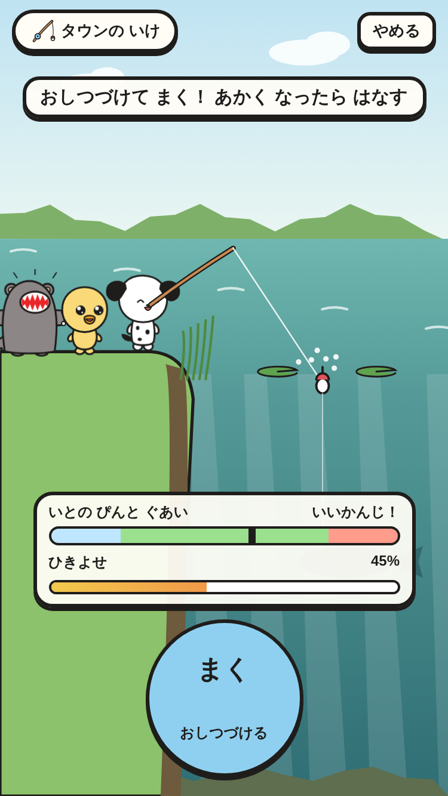
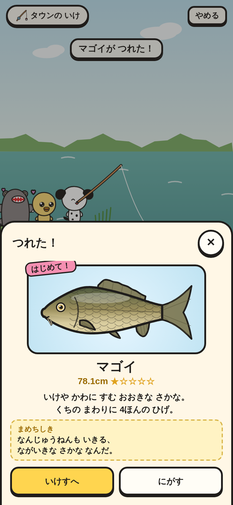
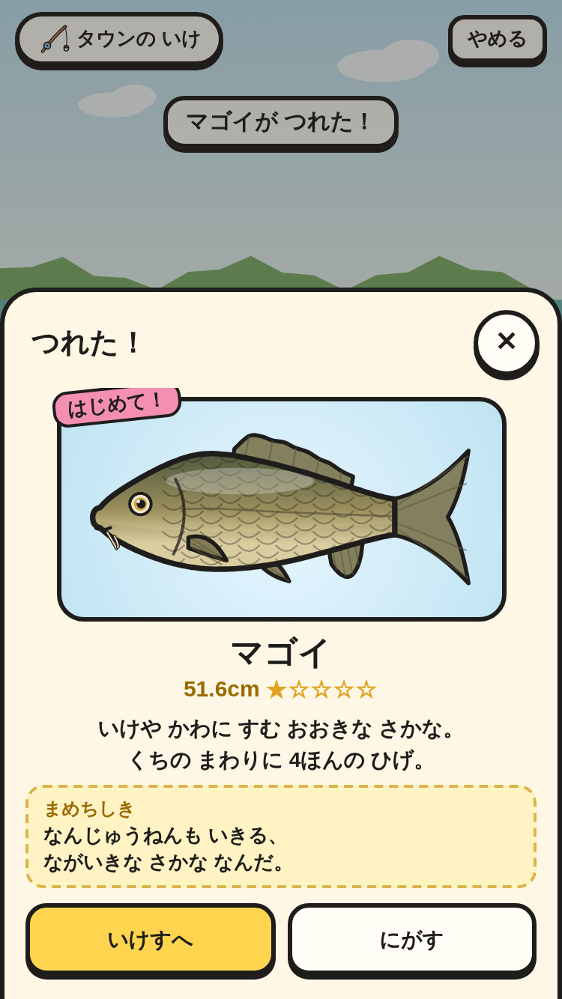

# 釣りざおと 釣りの 画面（③ の 2番）

タウンの いけの ペンに 話すと「つりざお」が もらえる。釣り場の 水べで 水を 向くと「つる」が 出て、横から 見た 岸で 3人 いっしょに 釣りを する。

|場面|390×844|375×667|
|---|---|---|
|水べで「つる」（下の まん中。④ の 2番から「ほる」と おなじ ボタン）|||
|なげる（タウンの いけ）|||
|ぐいっ！ → つる！|||
|まく（いとの ぴんと ぐあい）|||
|つれた！（はじめての 魚）|||

スモーク `fishing-*` で、次を たしかめて いる。

- ペンから つりざお。
- 水べの「つる」が 44px いじょうで 画面の 中に ある。「やめる」で もとの 場所に もどる。
- マゴイを つると カード（はじめて！・cm・まめちしき・いけすへ／にがす／うる。「うる」は ③ の 3番）。いけすへ で ずかん・いけすに のる。
- ぐいっ！ で おさないと にげる（なにも へらない）。
- アユの おねがい：つる → さんぽの ミントに わたす → コイン +160、いけすから へる。
