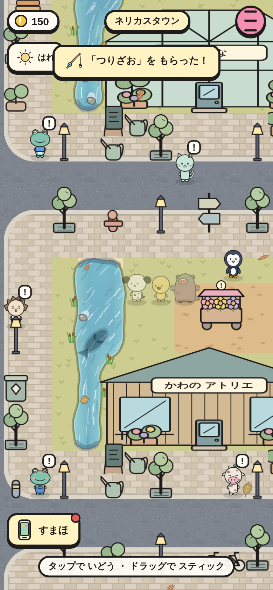
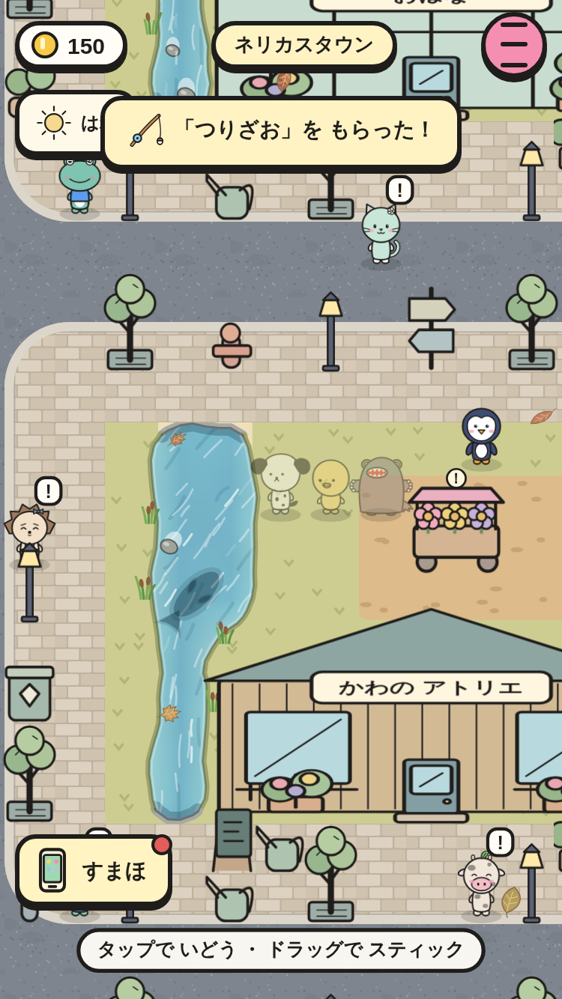
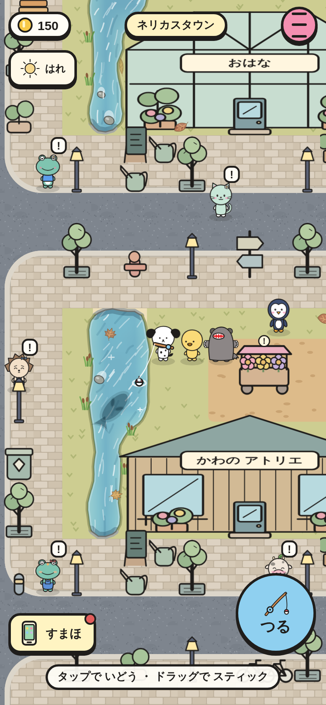
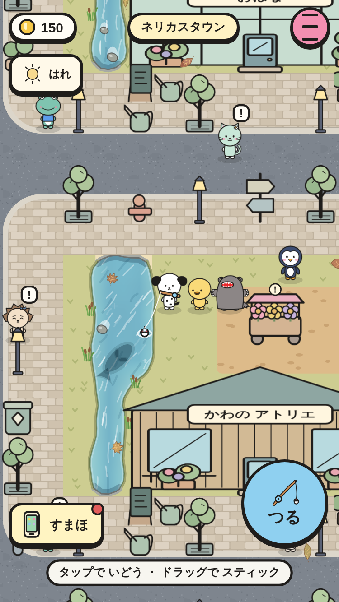
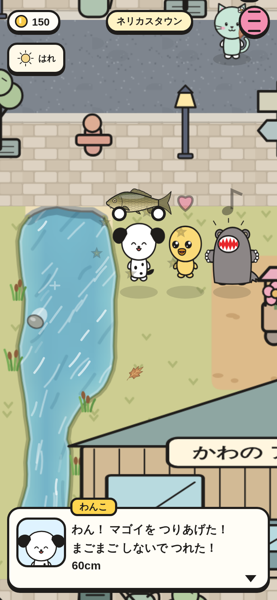
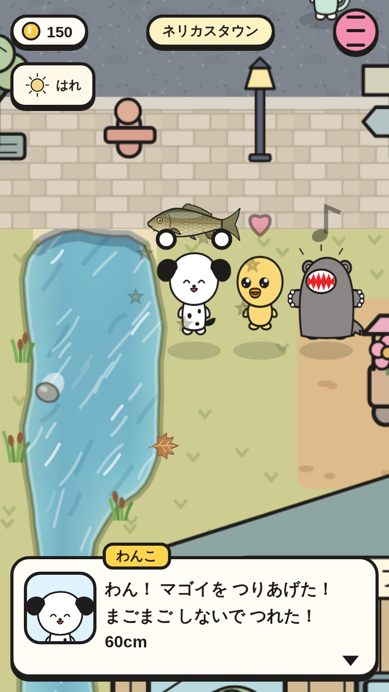

# 釣り（③ の 2番 → UI-02 で 見おろしの まま つる ように 作りなおし）

タウンの いけの ペンに 話すと「つりざお」が もらえる。水べに ときどき 魚の かげが 出る（いない ときも ある）。水を ながおしすると さおを ふって なげ、かげの あたまの まえに うきが おちると 魚が よって くる。ちょんちょん（0〜4かい）の あと うきが しずんだら 1びょう いないに「つる」。つれると カメラが せんとうの 子に ズームして、魚を かかげて じまん する（どうぶつの森の ように 魚ごとの ひとこと）。

|場面|390×844|375×667|
|---|---|---|
|魚の かげ（マゴイ 60cm → ながさ 48px。cm × 0.8px）|||
|ながおしで なげた → うき（右下の まるい「つる」。3人と うきに かさならない）|||
|ちょんちょん → うきが しずむ（「！」・ボタンが きいろ）|||
|つりあげた！ ズームして じまん（わんこ「わん！ マゴイを つりあげた！ まごまご しないで つれた！」）|||

スモーク `fishing-*` で、次を たしかめて いる。

- ペンから つりざお。水べに 立っても「つる」ボタンは 出ない（なげて から だけ）。
- かげの ながさが cm に 比例。ながおしの わ → なげる。「つる」ボタンは 44px いじょう・画面の 中・3人に かさならない。
- ちょんちょん 2かい → しずむ → おすと ズーム（1.9ばい）して じまんの ことば → ずかん・いけすに のる → もとに もどる。
- ちょん で おすと にげる（はやすぎ）。しずんでも おさないと にげられる（うきは のこる）。どちらも なにも へらない。
- アユの おねがい: はらっぱの かわで つる → さんぽの ミントに わたす → コイン +160、いけすから へる。
