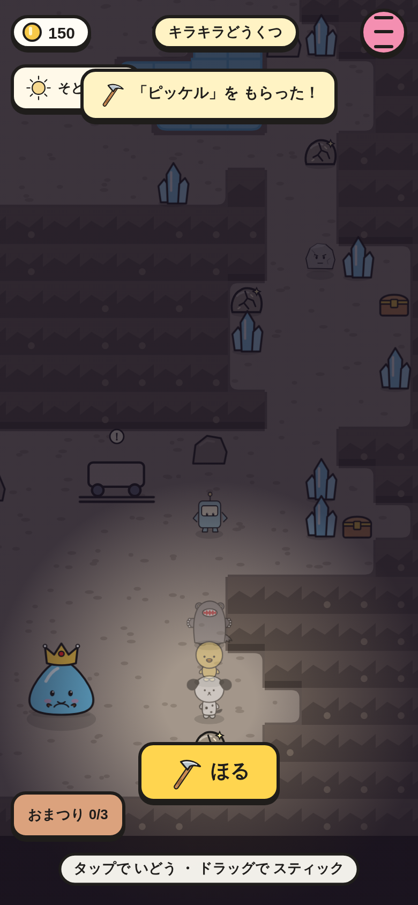
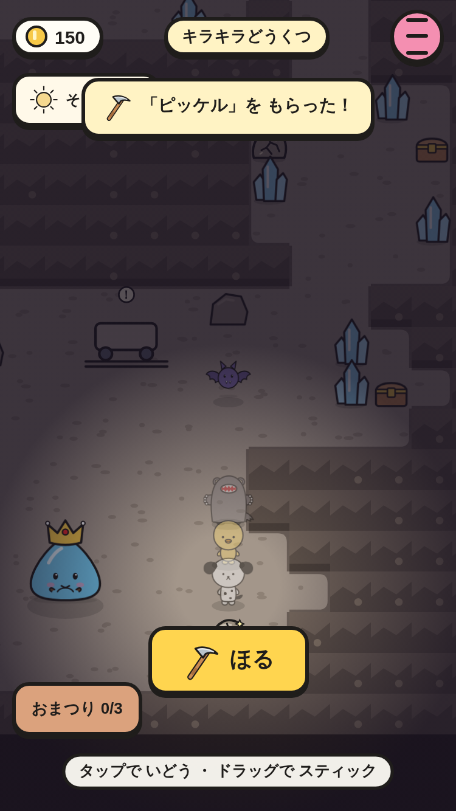
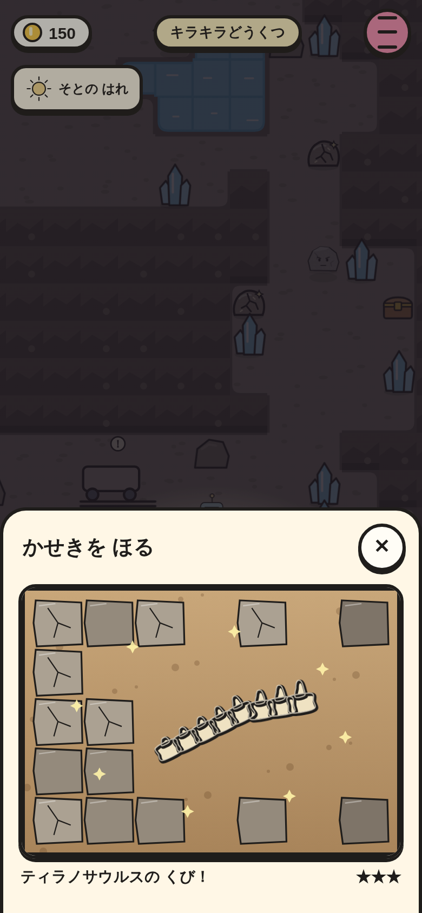
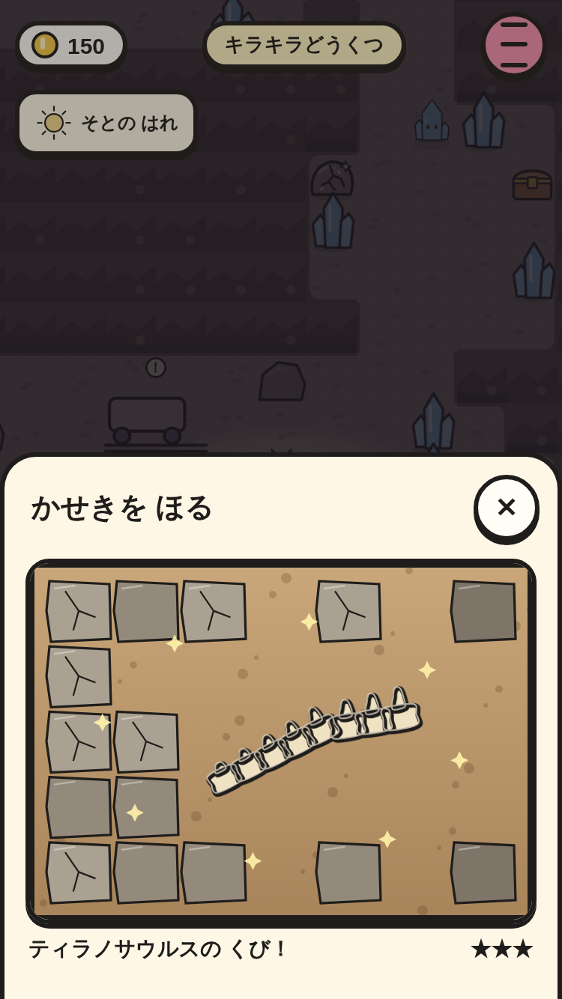
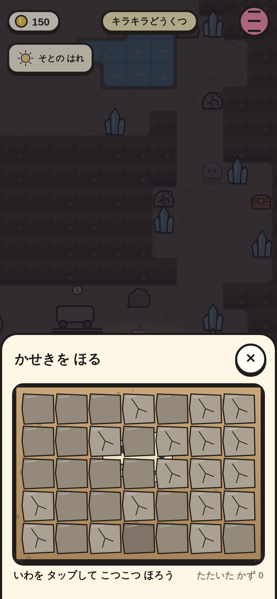
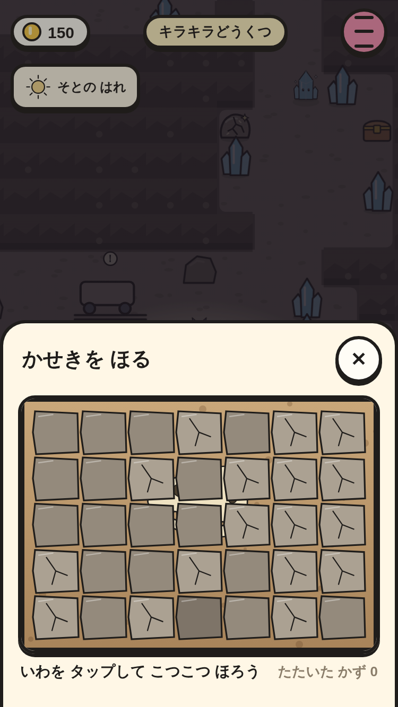
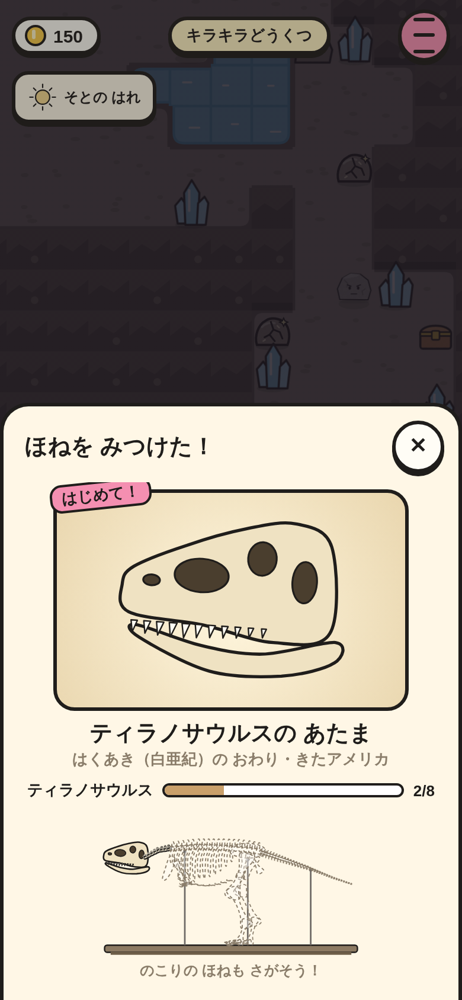
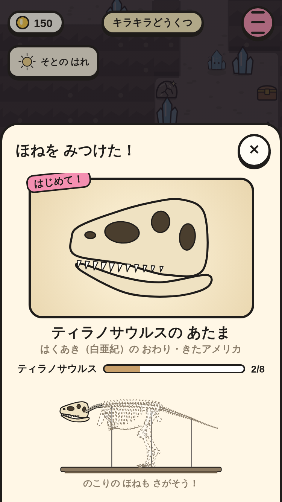

# ピッケルと ほる（④ の 2番）

もりの ケロスケに 話すと「ピッケル」が もらえる。どうくつ・もり・ビーチに まいにち「ひびの ある いわ」が 出て、となりで「ほる」を おすと、いわを タップして こつこつ ほりだす（しっぱいは ない）。

|場面|390×844|375×667|
|---|---|---|
|いわの となりで「ほる」（どうくつ）|||
|ほりだせた！（たたいた かずで ★）|||
|こつこつ たたく（ティラノサウルスの あたま）|||
|ほねを みつけた！（はじめて・あつまりぐあい・骨格の 小さい 絵）|||

スモーク `fossil-dig-*` で、次を たしかめて いる。

- ケロスケから ピッケル（はじめての あいさつの あと）。
- きょうの いわが どうくつ 4こ・もり 3こ・ビーチ 3こ。いわの マスは とおれない。
- いわの となりで「ほる」が 44px いじょうで 画面の 中（「つる」とは いっしょに 出ない）。
- ほる 画面（7×5）を マウスで たたいて ほりだす → 骨なら カード、おまけなら ひとこと。どちらでも いわは きえて、また とおれる。
- `fossilDig('cave', 'trex.skull')` → ティラノサウルスの あたま（★）→ カード（はじめて！・n/8・骨格の 小さい 絵・はみ出さない）→ 骨が 1こ ふえる。
- とちゅうで とじると なにも もらえない。
- ② の おねがい「ほねを みせて」: ケロスケに たのまれる → ほる → ケロスケに 話すと おわる（コイン +150）。
- ノートに「ほね n/8」。セーブして よみこんでも ピッケル・骨・ほった いわは そのまま。
