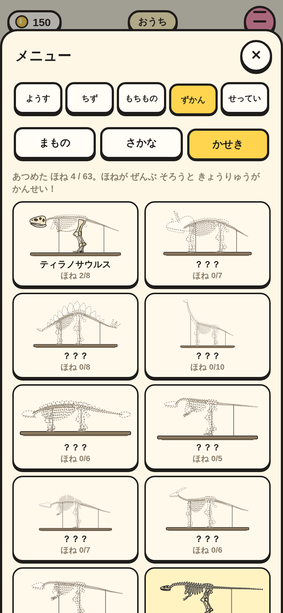
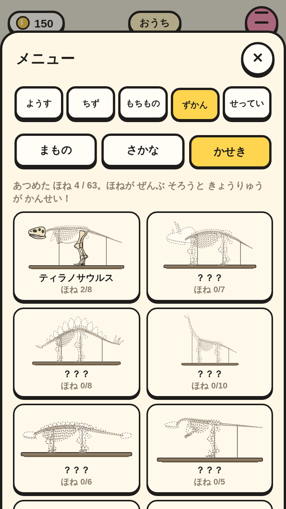
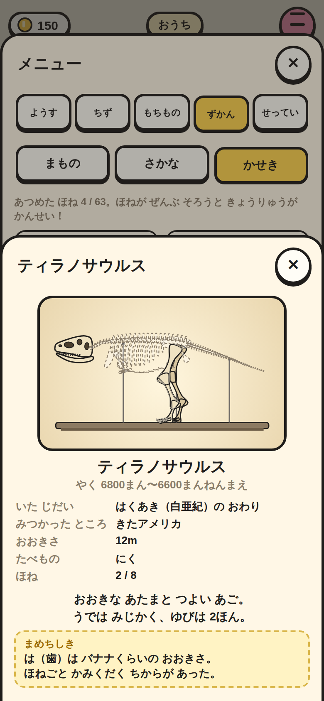
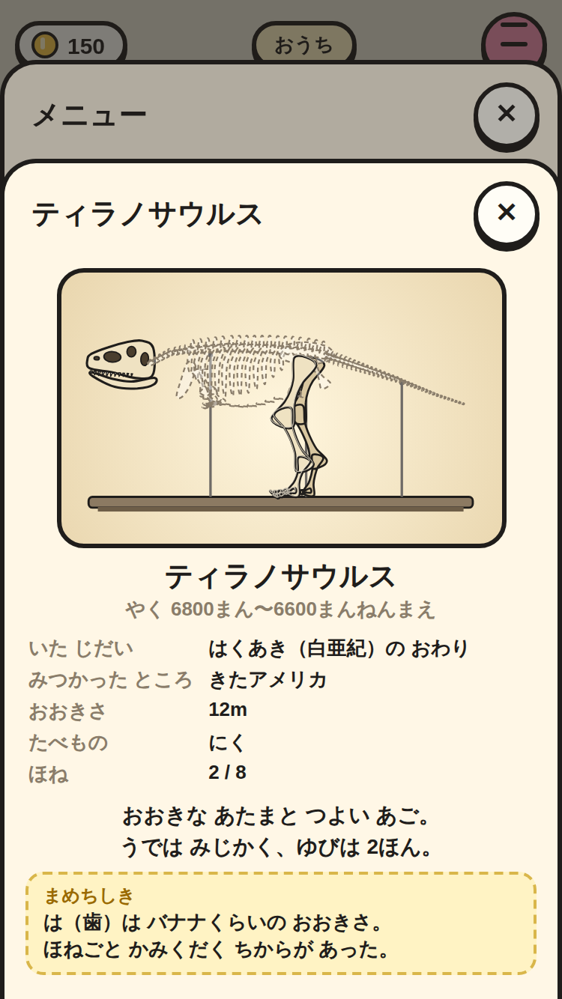

# かせき ノート（④ の 1番）

メニューの「ずかん」に「かせき」を 足した。もって いる 骨は 骨の 色、ない 骨は 点線の かげ。

|場面|390×844|375×667|
|---|---|---|
|かせき ノート（ティラノサウルス 2/8・コンプソグナトゥス そろった！）|||
|くわしい ページ（ティラノサウルス）|||

スモーク `fossil-note-*` で、次を たしかめて いる。

- `fossilGive` で 骨を もつ（ピッケルは まだ ない）。
- まもの／さかな／かせき の 3つの タブが 44px いじょうで 画面の 中。
- 10しゅの マス。ティラノサウルスは「ほね 2/8」、コンプソグナトゥスは「そろった！」、ほかの 8しゅは「？？？」。「あつめた ほね 4 / 63」。
- ティラノサウルスの くわしい ページに きたアメリカ・12m・2 / 8・まめちしき。骨が ない 恐竜は ひらかない。
