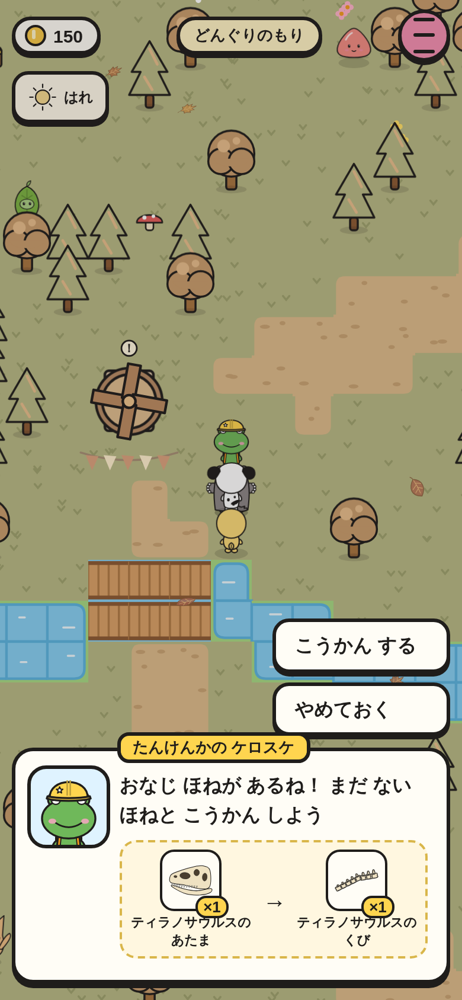
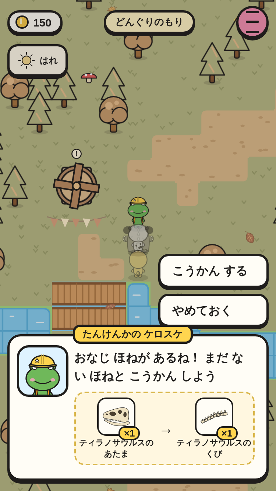
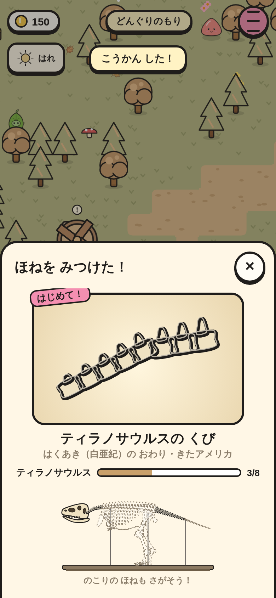
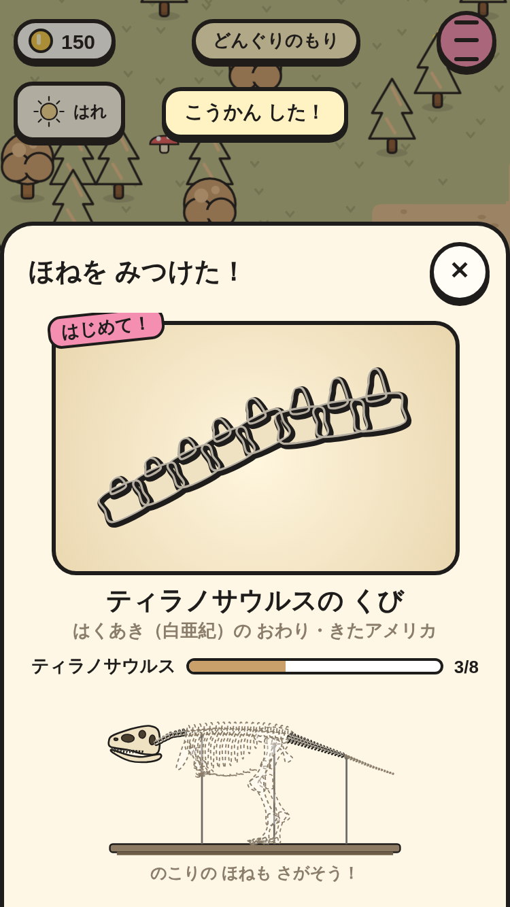

# ケロスケの 物々交換（④ の 3番）

だぶった 骨（2こ いじょう）が あると、もりの ケロスケが「おなじ ほねが あるね！ まだ ない ほねと こうかん しよう」と もちかける。わたす 骨と もらう 骨は、いま もって いる 骨で きまる（同じ 恐竜の まだ ない 骨）。

|場面|390×844|375×667|
|---|---|---|
|こうかんの カード（ティラノサウルスの あたま → くび）|||
|もらった 骨の カード（はじめて！・3/8）|||

スモーク `fossil-trade-*` で、次を たしかめて いる。

- あたま 2こ・しっぽの つけね 1こ → カードに「ティラノサウルスの あたま」→「ティラノサウルスの くび」（絵 2つ・はみ出さない・よこに スクロールしない）。
- こうかん すると あたま 1こ・くび 1こ・きろく 1かい。もらった 骨の カード（はじめて！・3/8）。
- だぶりが なくなると もう もちかけない。
