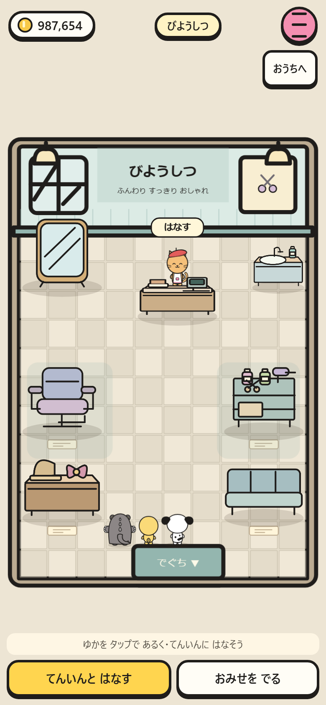
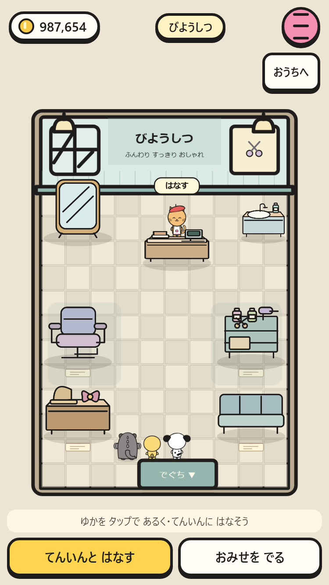
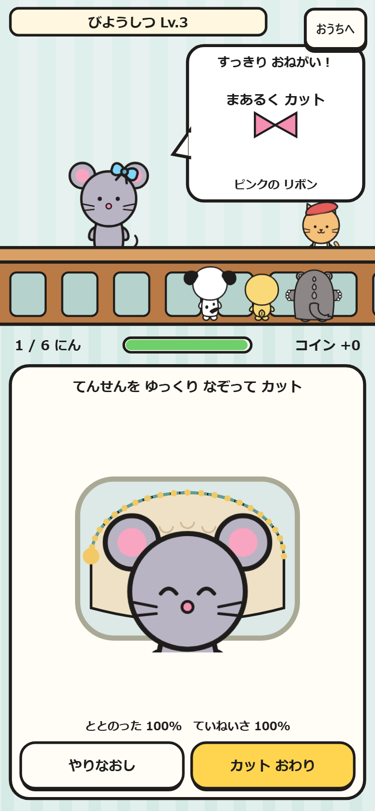
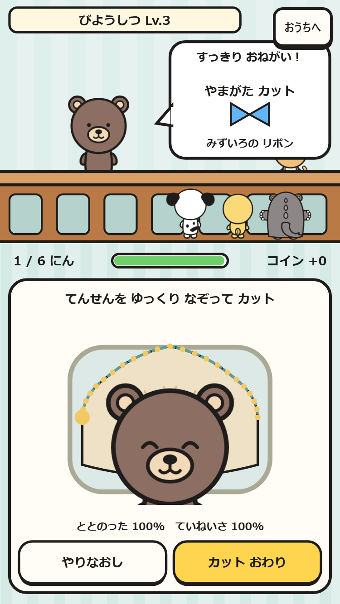
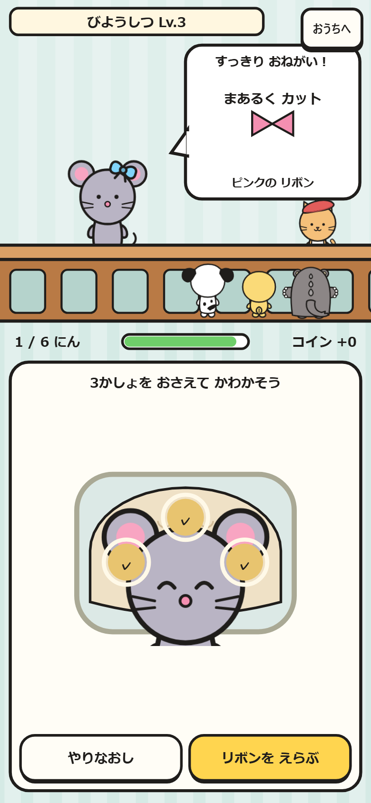
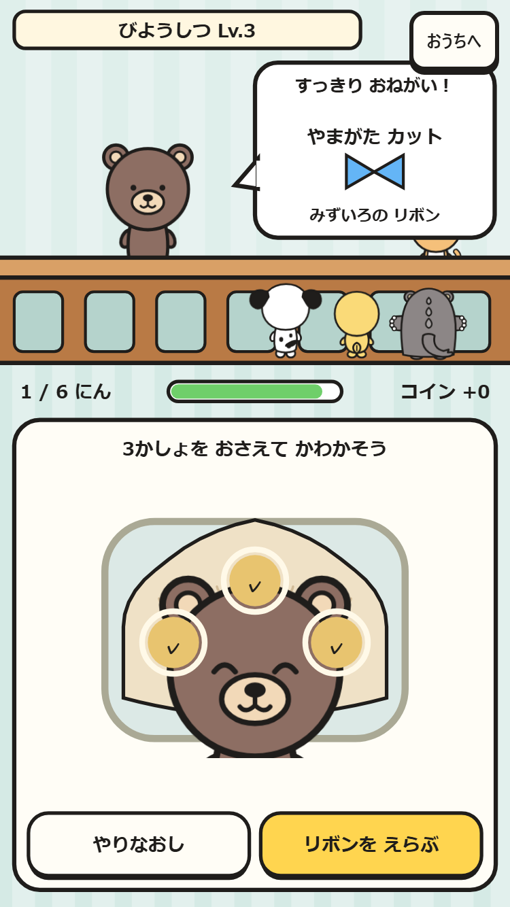

# びようしつ

シティの通りから入り、店員に話しかけてリボンの買い物やおてつだい。見本の輪郭を指でなぞってカットし、3か所を押して乾かし、注文のリボンを選ぶ。

|画面|390×844|375×667|
|---|---|---|
|店内|||
|カット|||
|乾燥|||

全レベルの輪郭・採点・操作範囲を静的に検査。実ブラウザではスマホ2サイズでLv3を6人分完了して全員◎、所持品保持と報酬の保存を確認。長いドラッグと押し続けはPointerEventをフレームごとに送り、実際の入力処理と時計を使用する。
