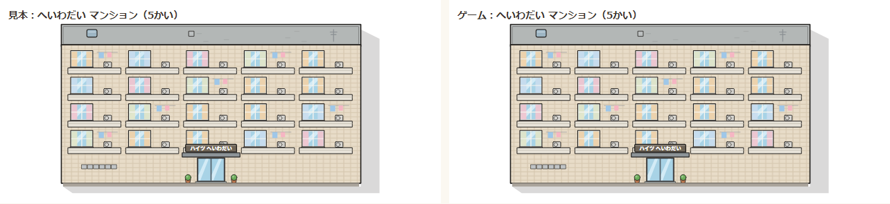
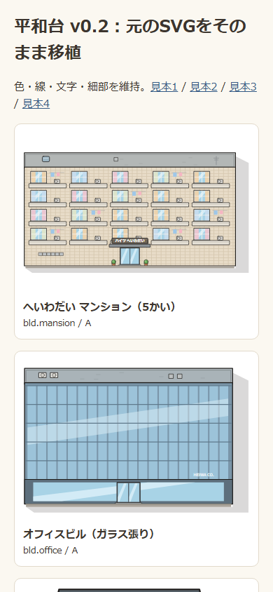
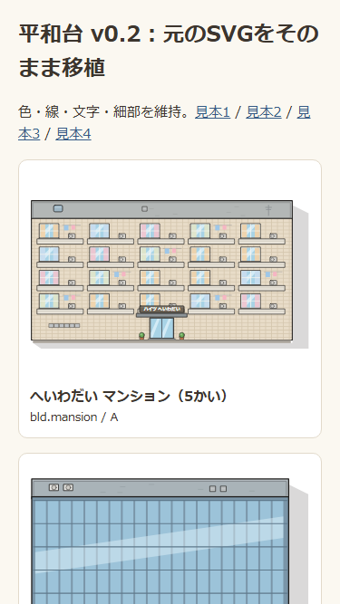

# 平和台 TOWN-03：A・B素材の比較

元のSVGとWorldArtを同じピクセル寸法で描き、81種類・配置オプションを含む175パターンを全画素比較しました。色チャンネルの最大差は0です（comparison.json）。asset-01.png〜asset-81.pngに、左を見本・右をゲームとして並べています。

|390×844|375×667|
|---|---|
|||

[配置のスマホ見本①〜⑤](../../design/towns/heiwadai/img/phones.png)。配置変更は後続のTOWN-04で行います。

再生成：node tools/heiwadai-asset-screenshots.mjs --ab。素材一覧は tools/heiwadai-preview.html?priority=AB（file://対応）。
