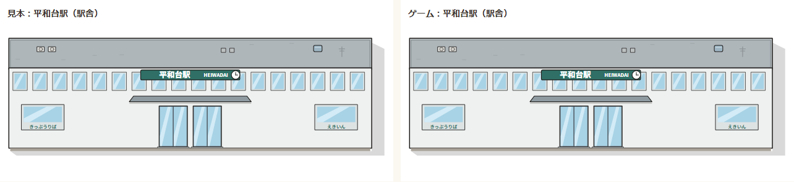
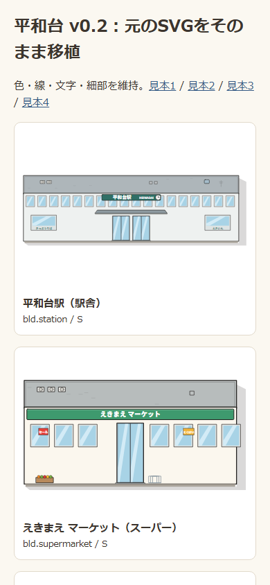
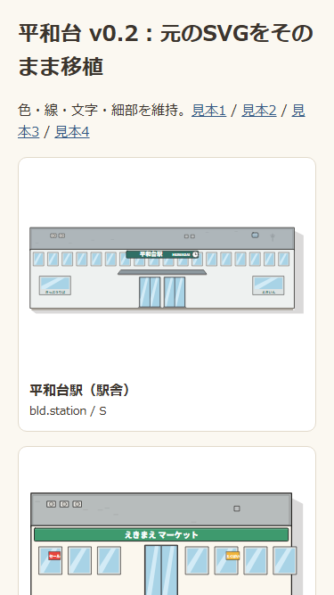

# 平和台 TOWN-02：優先度S素材の比較

元のSVGと、ゲームのWorldArtが返すSVGを、同じ大きさに描いたものを並べています。26種類・配置オプションを含む61パターンを全画素比較し、色チャンネルの最大差は0でした（comparison.json）。

|390×844 素材一覧|375×667 素材一覧|
|---|---|
|||

- asset-01.png ～ asset-26.png：全26種類の左右比較。
- [配置時のスマホ見本①〜⑤](../../design/towns/heiwadai/img/phones.png)。町そのものの配置と同じ地点の実機比較はTOWN-04で行います。この段階は素材の登録だけです。
- 再生成：node tools/heiwadai-asset-screenshots.mjs（file://でも一覧を表示）。
