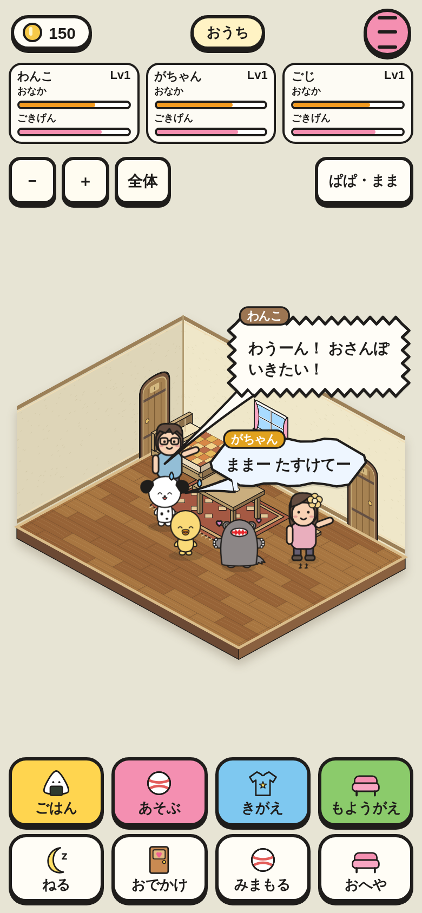
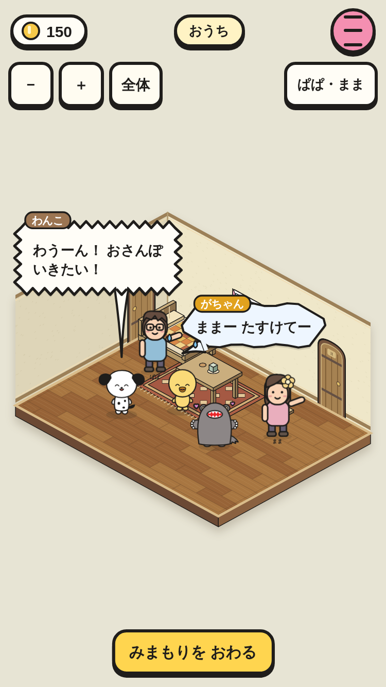
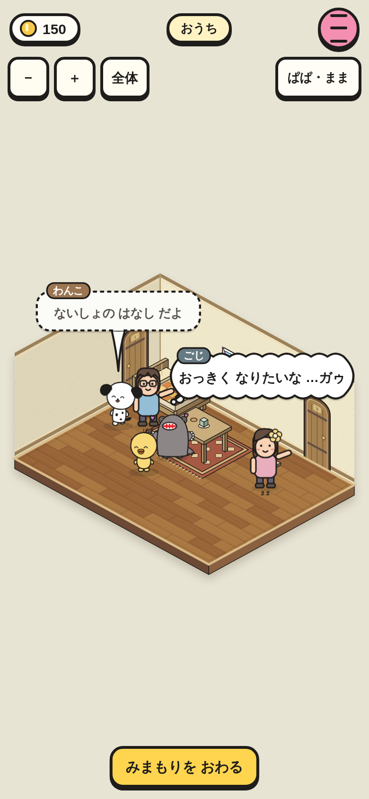
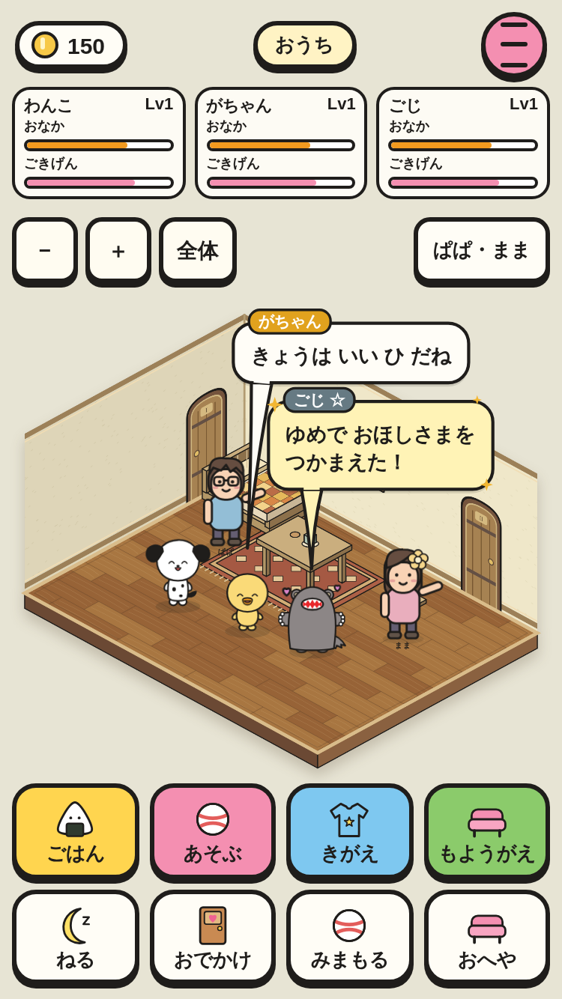
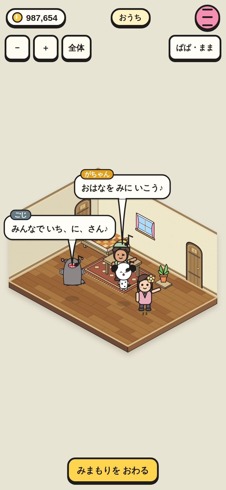
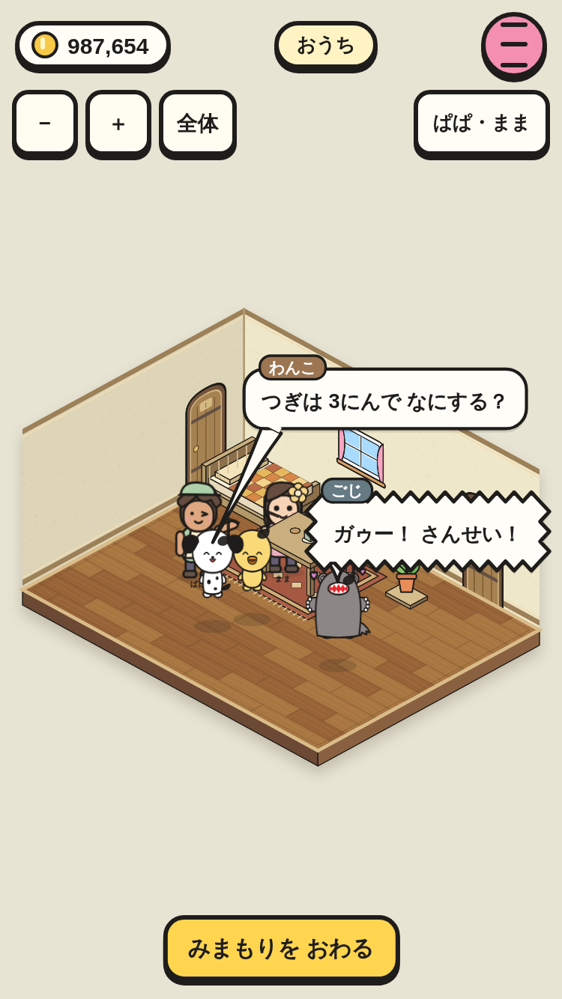

# おうちの 吹き出し（① の 1番）

話し手の 頭の 真上に 出て、しっぽは 短く 話し手を さす。名札の 色で だれか、形で 気持ちが わかる。同時に 2つまで、かけあいは 1つずつ 順番に 出る。

|画面|390×844|375×667|
|---|---|---|
|さけぶ・なく|||
|こころの こえ・ひそひそ／ふつう・めずらしい|||
|かけあい（みまもり）|||

スモーク「吹き出しの 形と 場所」（2サイズ × ふつう／みまもり × 形 6しゅ）と「ぱぱまま・吹き出し・セーブ」で撮影。どの ときも 2つまで・画面の 中・重ならない・しっぽの 先が 話し手の 頭から 30px いない・話し手の 顔に かからない ことを たしかめて いる。
