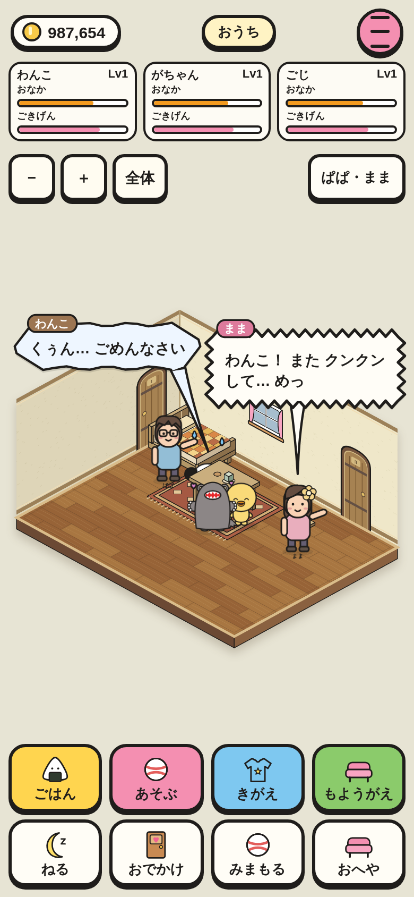
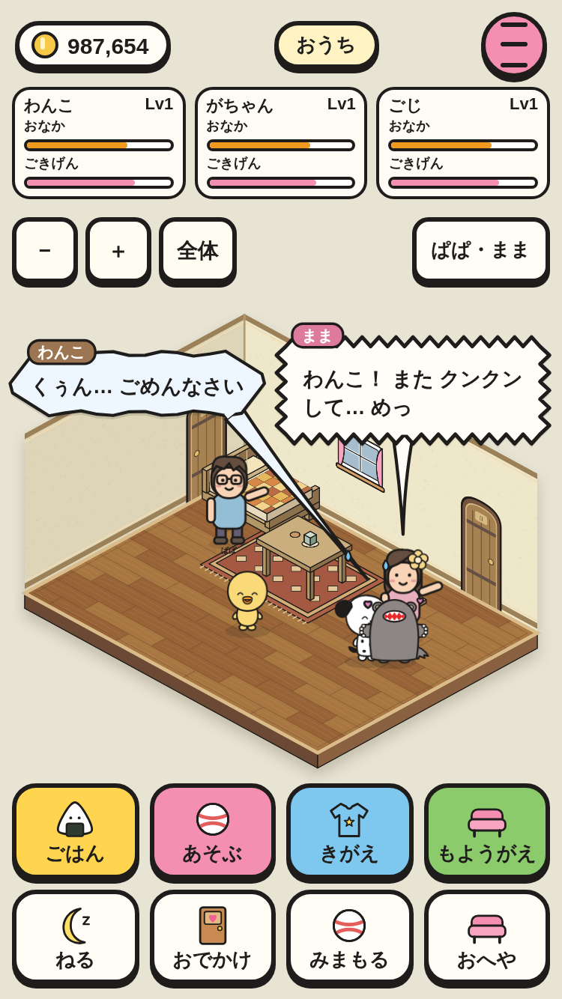

# おうちの 会話（① の 2番）

会話は 718種（ひとこと 658・かけあい 60）。時間・天気・季節・おまつり・へや・近くの 家具・おなかと きげん・できごとで えらぶ。3人の 性格と くせも 出る。
下は わんこが 60秒に 3回 クンクン して、ままに おこられる かけあい（sniff-scold）。

|390×844|375×667|
|---|---|
|||

スモーク `home-talk-390` / `home-talk-375` で、あさ・あめ の ときの ひとりごとが その 条件の セリフだけに なる こと、かけあいが 1.3秒おきに データの 順番どおりに 出る こと、叱られて しょんぼり（cry）する こと、セーブが 変わらない ことを たしかめて いる。
