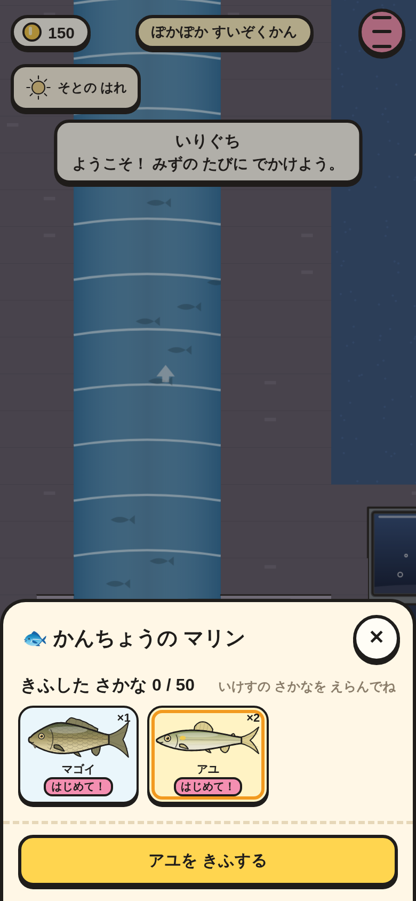
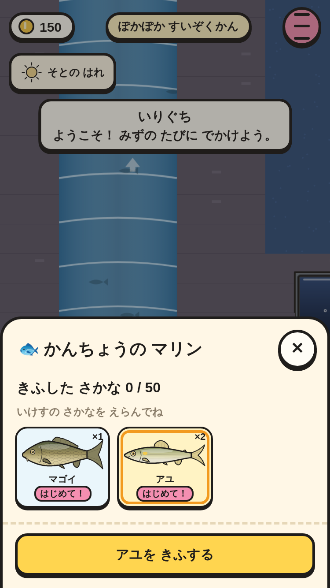
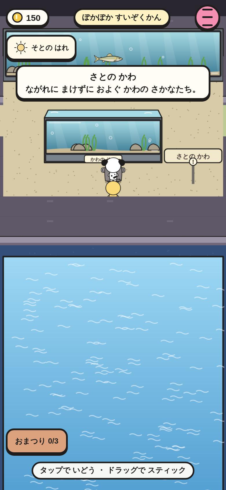
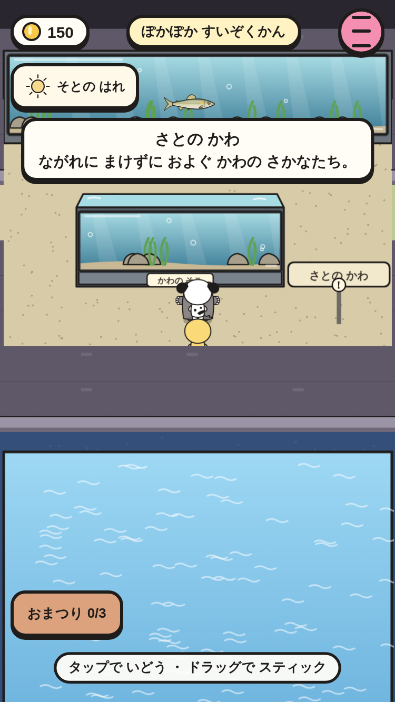
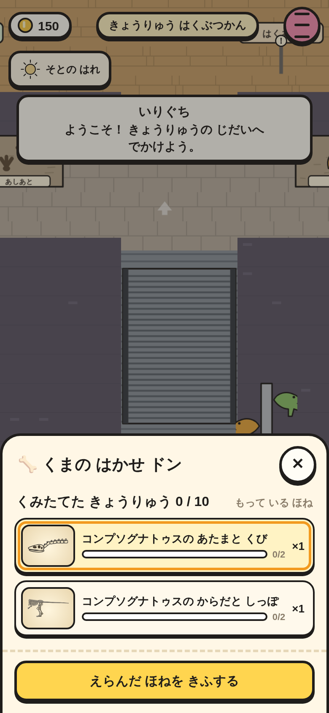
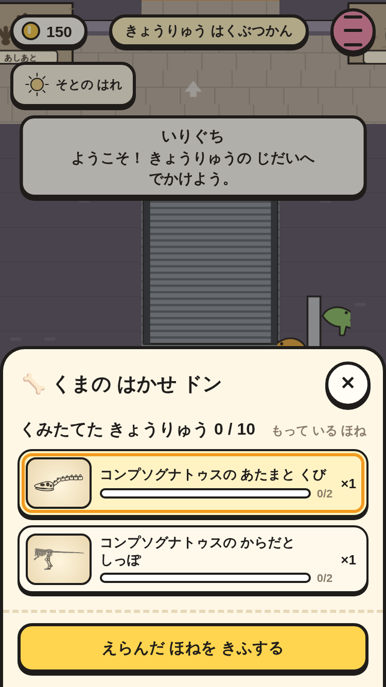
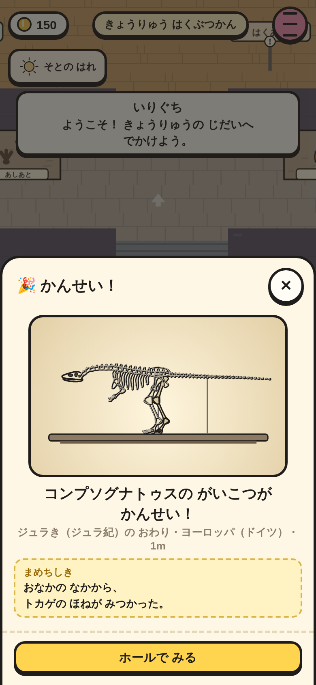
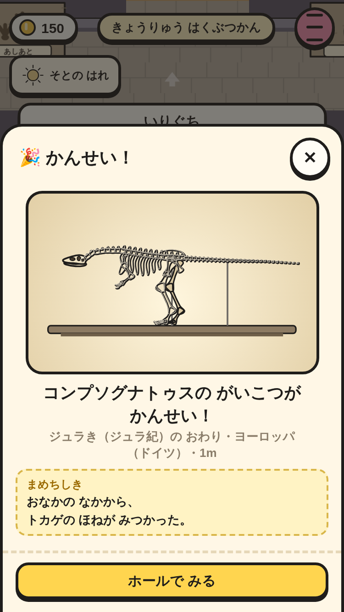
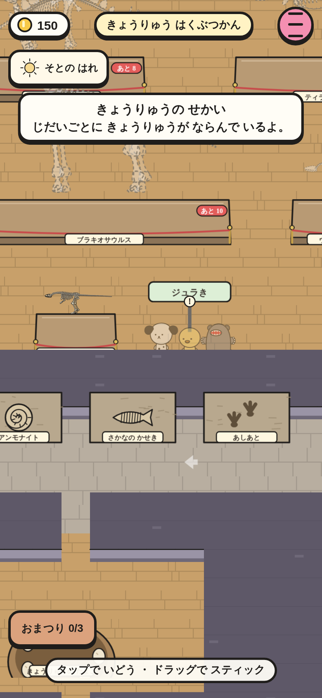
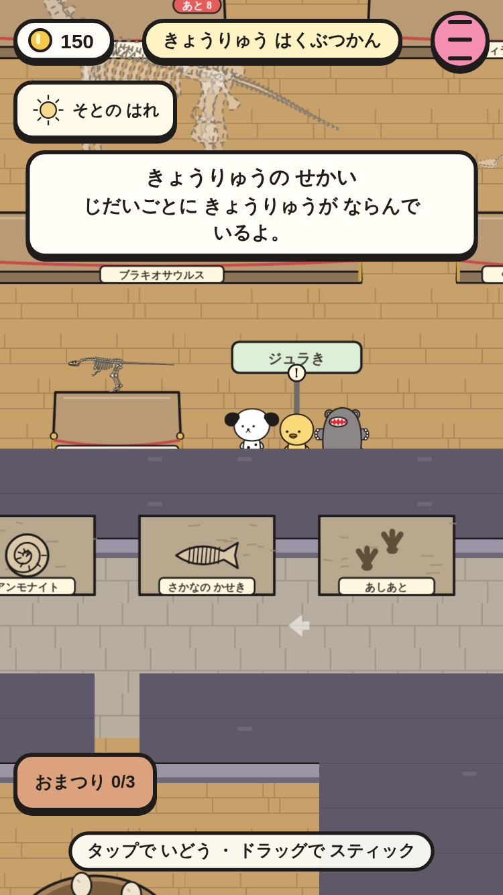

# 寄贈（⑤ の 2番）

すいぞくかんの かんちょう（マリン）に いけすの 魚を、はくぶつかんの はかせ（ドン）に もって いる 骨を 寄贈できる。寄贈した 魚は 水そうで およぎ、寄贈した 骨は 台の 上の 骨格に なる。1ぴきの 骨が ぜんぶ そろうと「かんせい！」。

|場面|390×844|375×667|
|---|---|---|
|かんちょうに 魚を えらぶ（いけすの 中身・はじめて！）|||
|寄贈した アユが 水そうで およぐ（さとの かわ）|||
|はかせに 骨を えらぶ（恐竜ごとの あつまりぐあい）|||
|骨が ぜんぶ そろった（かんせい！）|||
|ホールの 台に コンプソグナトゥスの 骨格|||

スモーク `museum-donate-*` で、次を たしかめて いる。

- 寄贈の 画面: いけすの 魚が「はじめて！」で ならぶ（44px いじょう・はみ出さない）。えらぶまで ボタンは おせない。「アユを きふする」。
- きふすると いけすの アユが 1ぴき へり（ずかんは のこる）、「きふずみ」に なって えらべない。水そう（かわの ながれ）に アユが 1ぴき およぐ。
- はかせ: コンプソグナトゥスの 骨 2つ → 2つめで「〇〇の がいこつが かんせい！」（まめちしき）→ `Save.d.museum.done.compso`。骨格の 台が ぜんぶ 骨の 色。
- 寄贈しても かせき ノートは「そろった！」の まま。セーブして よみこんでも 寄贈は のこる。
