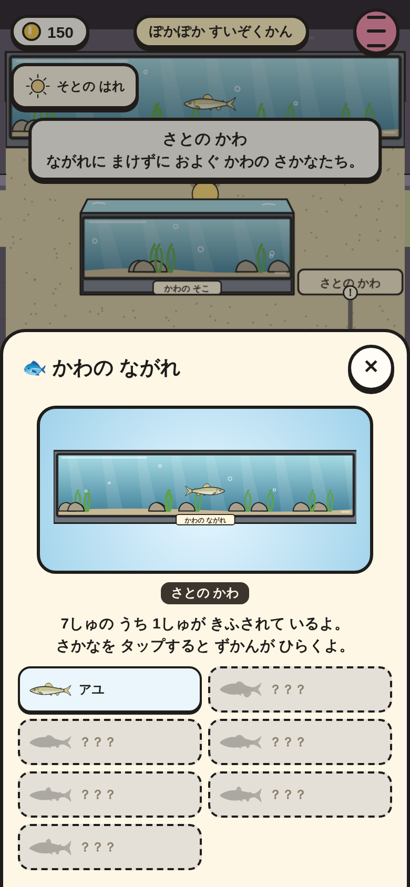
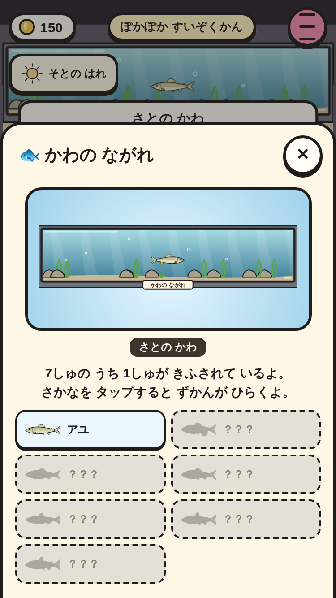
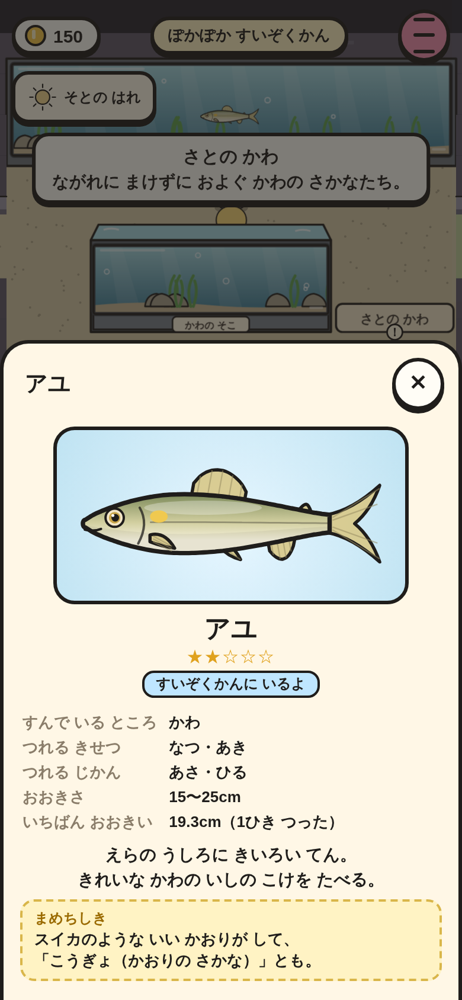
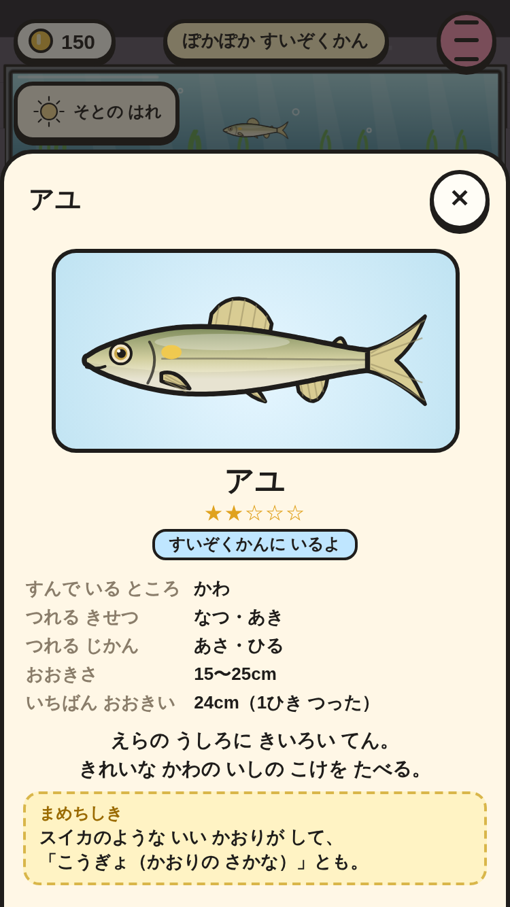
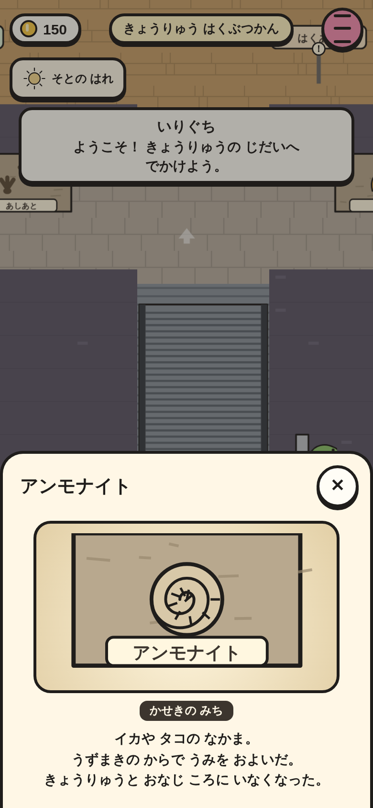
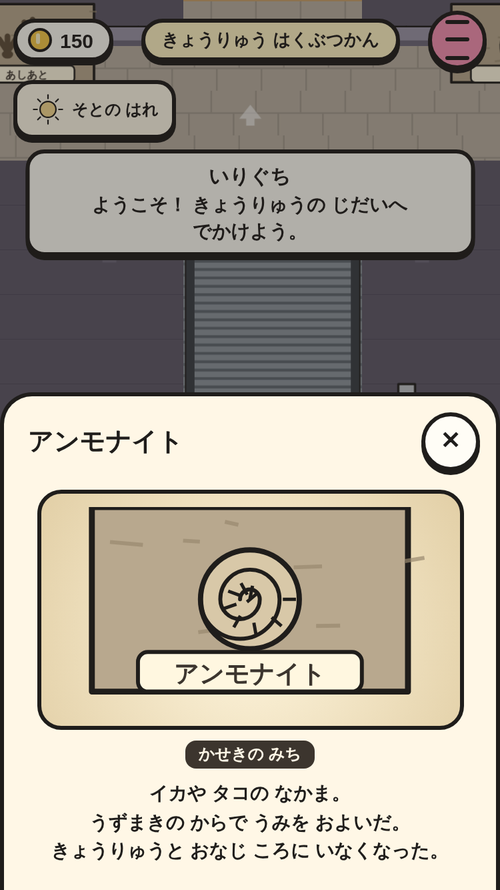
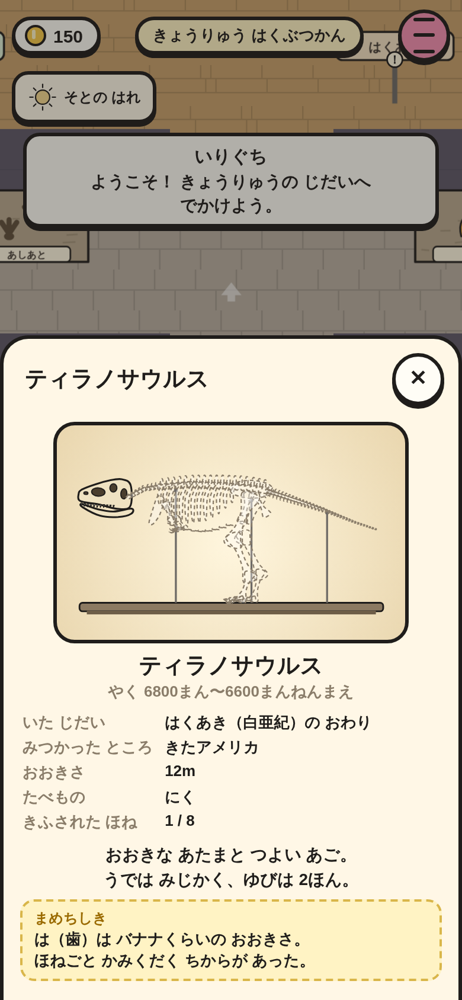
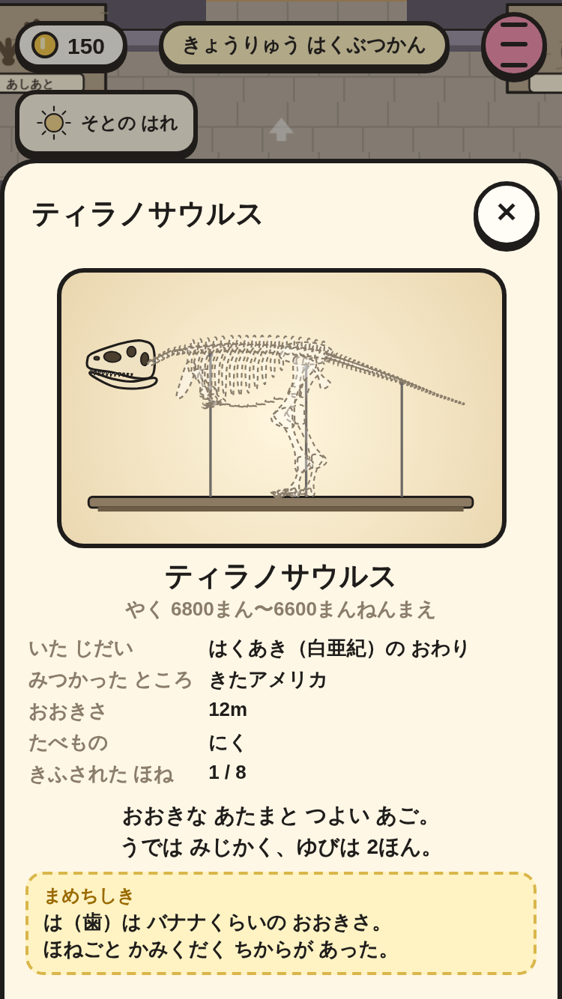

# 展示を しらべる（⑤ の 3番）

館の 展示の まえで ok（または 展示を タップ）すると 説明が 出る。水そうは 中の 魚（まだ 寄贈されて いない 魚は ？？？）、魚を おすと ③ の ずかん。骨格の 台は ④ の くわしい ページ（寄贈された ほね）。化石の かべ・くらげ・トンネル などの かざりは 説明。

|場面|390×844|375×667|
|---|---|---|
|水そう（かわの ながれ・7しゅの うち 1しゅ）|||
|魚を おすと ずかん（すいぞくかんに いるよ）|||
|化石の かべ（アンモナイト）|||
|骨格の 台（ティラノサウルス・きふされた ほね 1 / 8）|||

スモーク `museum-show-*` で、次を たしかめて いる。

- かわの ながれの まえで 上を むいて ok → 説明（7しゅの うち 1しゅ・さとの かわ・アユと ？？？ ×6・44px いじょう・はみ出さない）。
- アユを おすと ③ の ずかんの くわしい 画面に「すいぞくかんに いるよ」。
- 化石の かべ（mu_f1）の 説明。ティラノサウルスの 台は「きふされた ほね 1 / 8」、寄贈 0 の ステゴサウルスの 台も「0 / 8」で ひらく。
