# 町の 建物と 館の 中（⑤ の 1番）

あおぞらポートの「みなとの しりょうかん」が「ぽかぽか すいぞくかん」に、きらめきシティの「まちの としょかん」が「きょうりゅう はくぶつかん」に なった（同じ 場所・大きさ）。入口に 入ると 館の 中を 3人で 歩いて まわれる。まだ 寄贈が ないので、水そうは 水と かざりだけ・骨格は 点線の かげ（「あと n」）。

|場面|390×844|375×667|
|---|---|---|
|町の 外がわ（すいぞくかん）|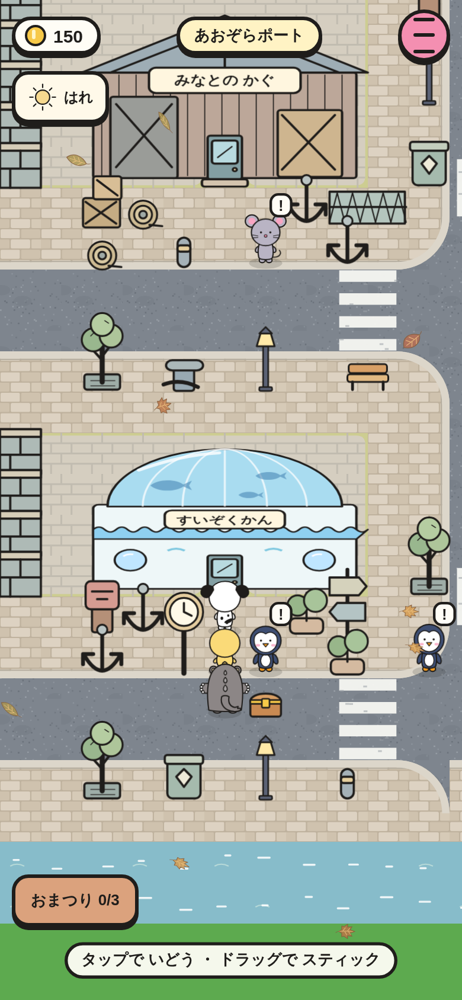|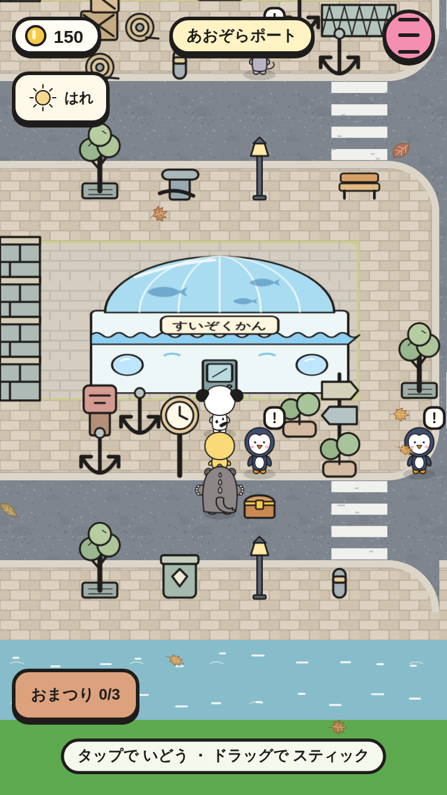|
|館の 入口と 案内（すいぞくかん）|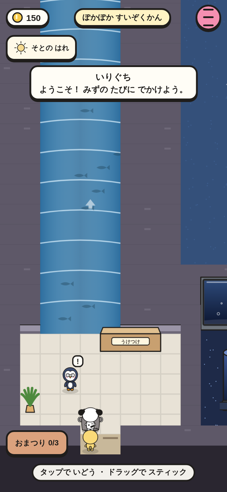|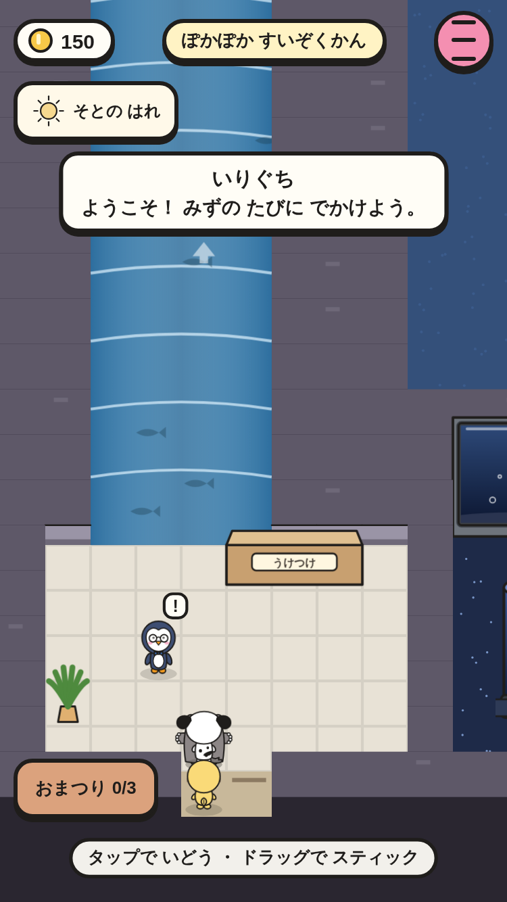|
|さとの かわ（へやの 案内）|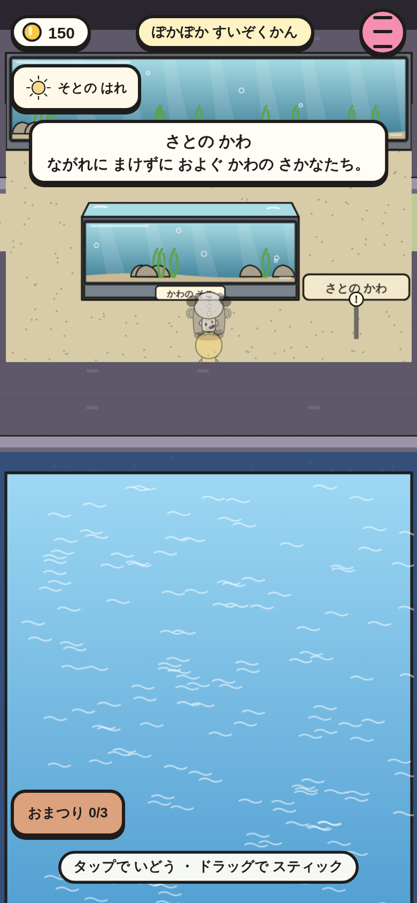|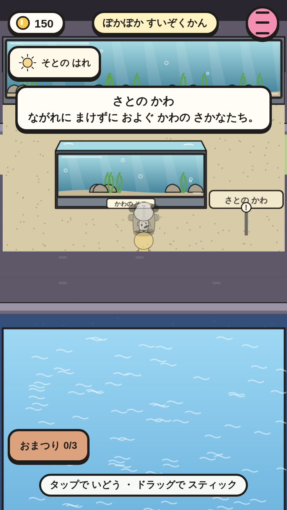|
|町の 外がわ（はくぶつかん）|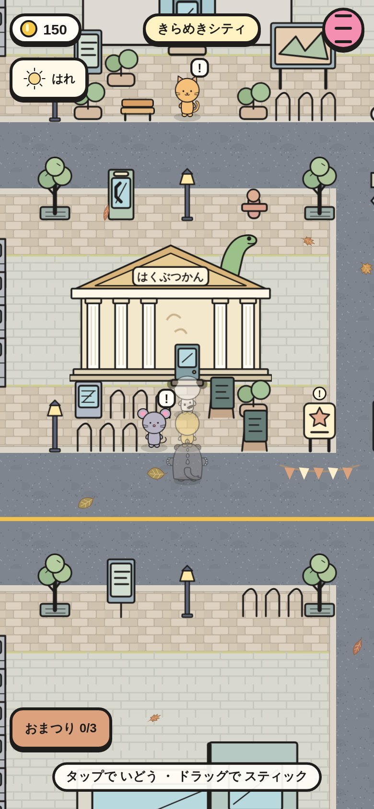|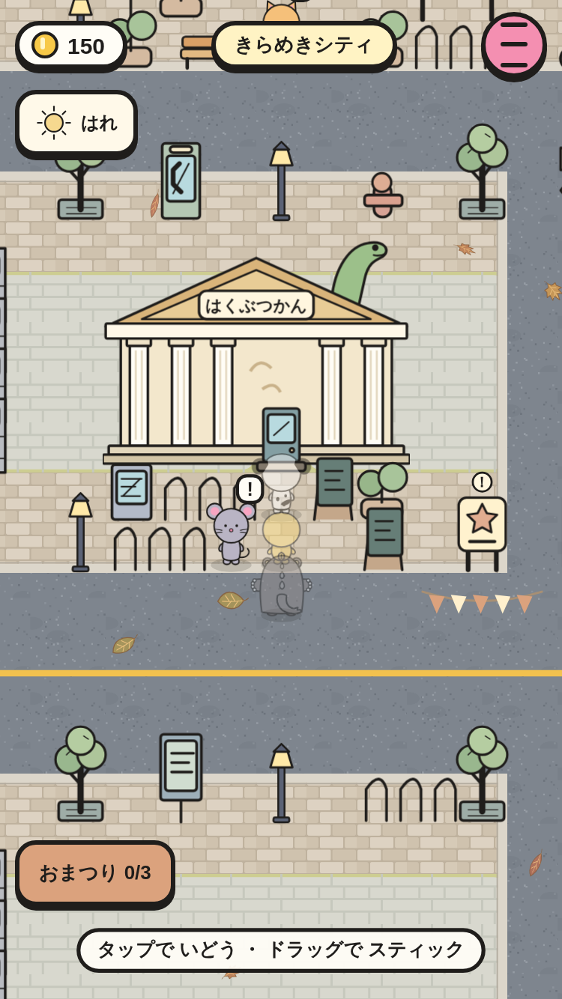|
|館の 入口と 案内（はくぶつかん）|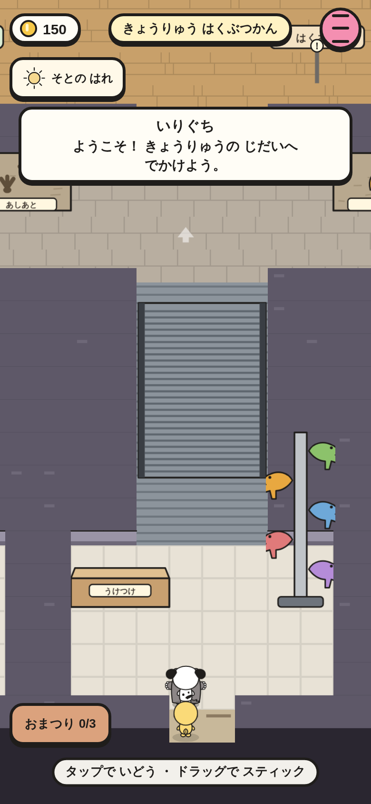|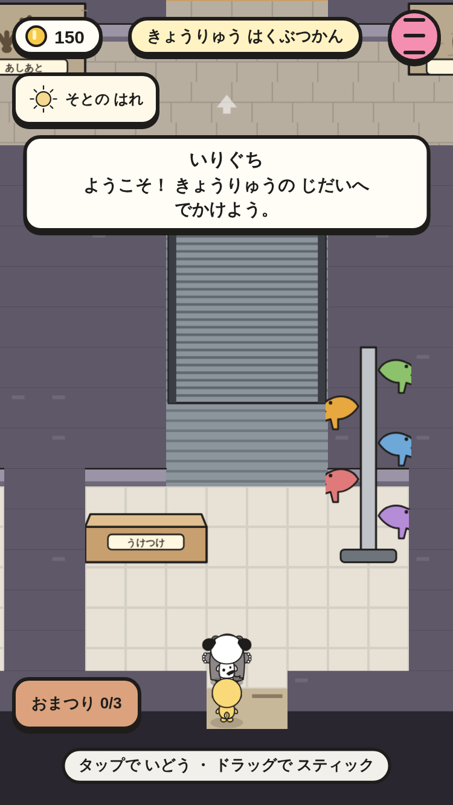|
|きょうりゅうの せかい（ホール）|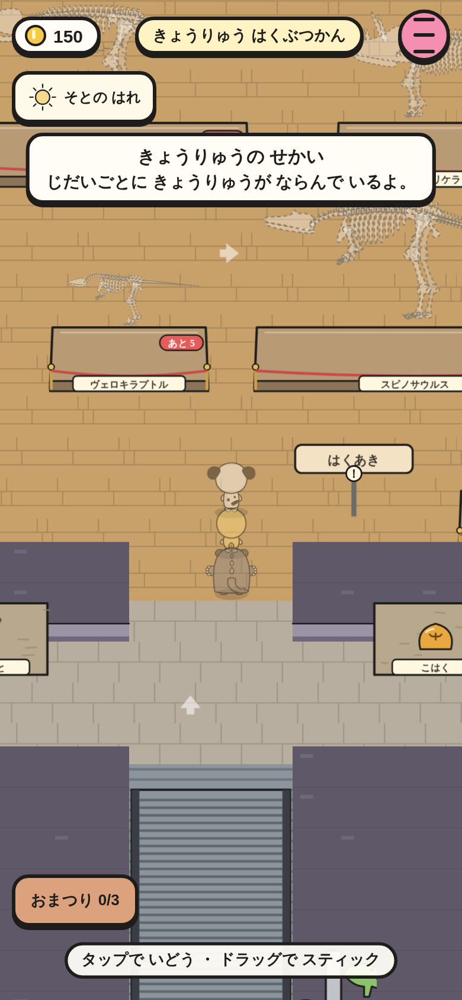|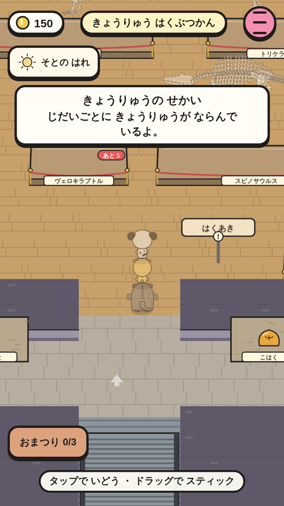|

スモーク `museum-visit-*` で、次を たしかめて いる。

- 町の 建物（`act: indoor`・名前・入口の 場所）。入口へ 歩くと 館の 入口に 3人で 立つ。
- 館の 中: 館の BGM・敵が いない・HUD に 館の 名前・「いりぐち」の 案内（画面の 中）・展示の 絵が ぜんぶ よみこまれて いる・よこに はみ出さない。
- へやに 入ると 案内が 1かいだけ 出る（2かいめは 出ない）。出口から 出ると 町の 入口の まえに もどる。
- セーブして よみこんでも 入った へやの きろくが のこる。
