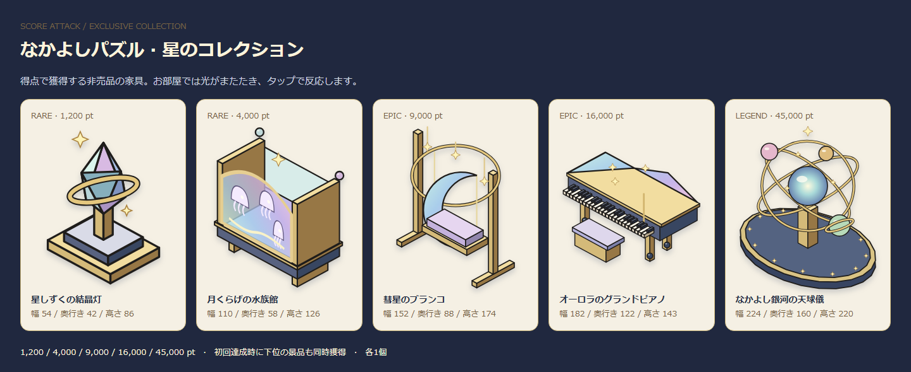

# なかよしパズル：操作・表示の検証

390×844 と 375×667（端末倍率2）の独立したテスト用セーブで撮影。元のプレイヤーデータには触れていません。

|場面|390×844|375×667|
|---|---|---|
|受付と非売品|[画像](390-lobby.png)|[画像](375-lobby.png)|
|盤面と時計|[画像](390-play.png)|[画像](375-play.png)|
|輪の全色消去予告|[画像](390-loop.png)|[画像](375-loop.png)|
|得点による累積景品|[画像](390-prizes.png)|[画像](375-prizes.png)|
|お部屋に飾った景品|[画像](390-room.png)|[画像](375-room.png)|

盤面は操作検証用の固定配置、時計は自動操作の待ち時間に左右されない検証用設定です。得点・形の判定と消去はゲーム本体の処理を使っています。景品の画面は9,000点の境界値を設定して、配布・保存を確認したものです。

[キャラクター3人×4方向](characters.png)。家具一覧とキャラ画像は `node tools/puzzle-preview.mjs` で file:// から再生成できます。

難易度・参加料・実測分布・参考にしたパズルの公式資料は [設計書](../../design/features/puzzle-score-attack.md) に記載しています。
