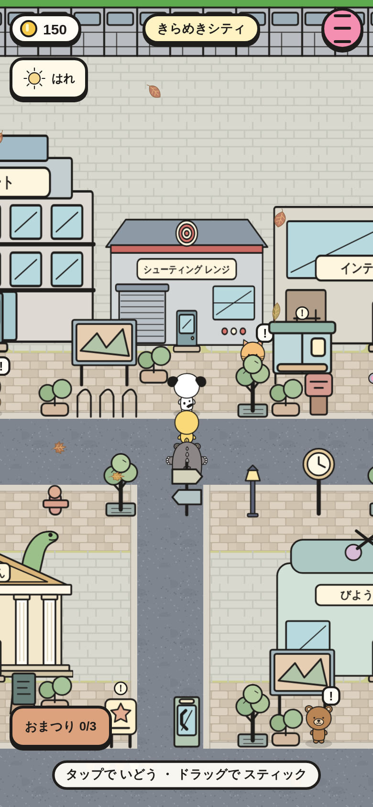
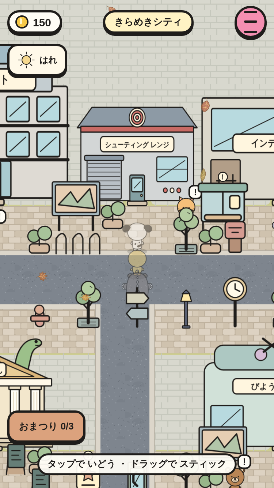
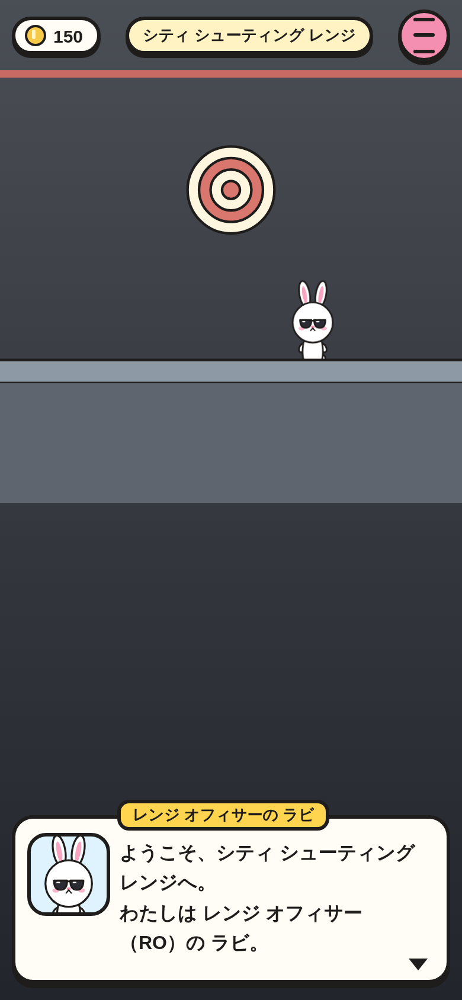
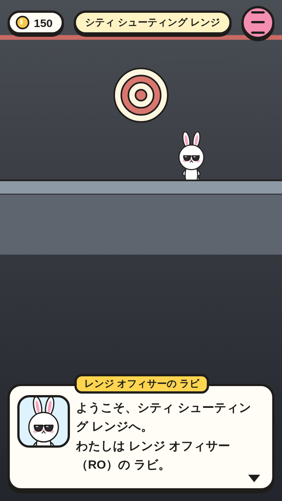
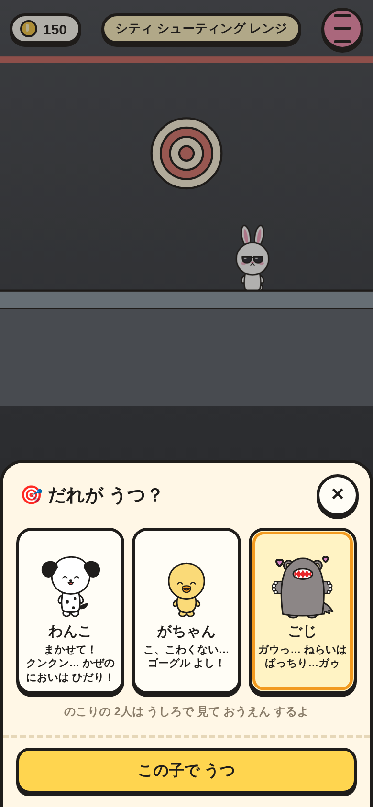
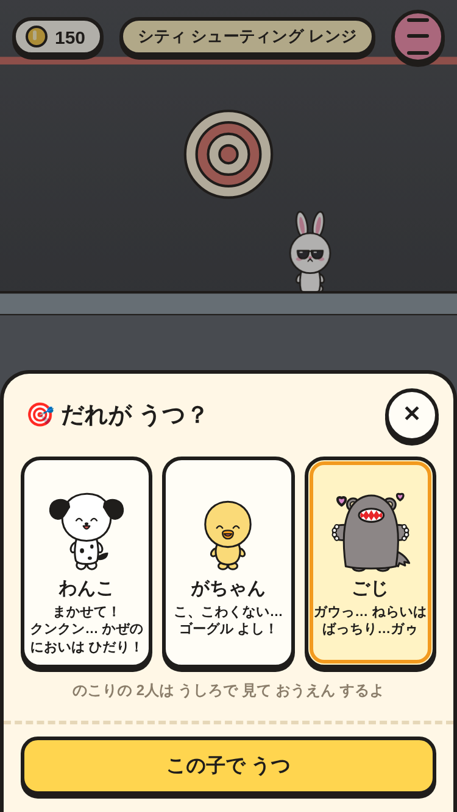
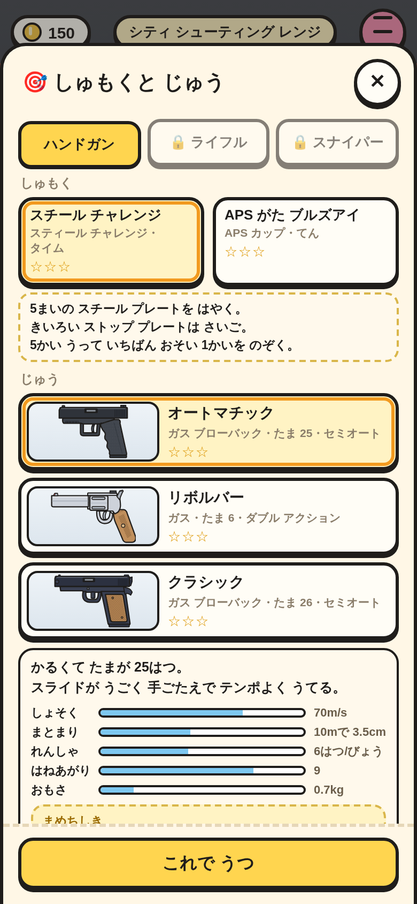
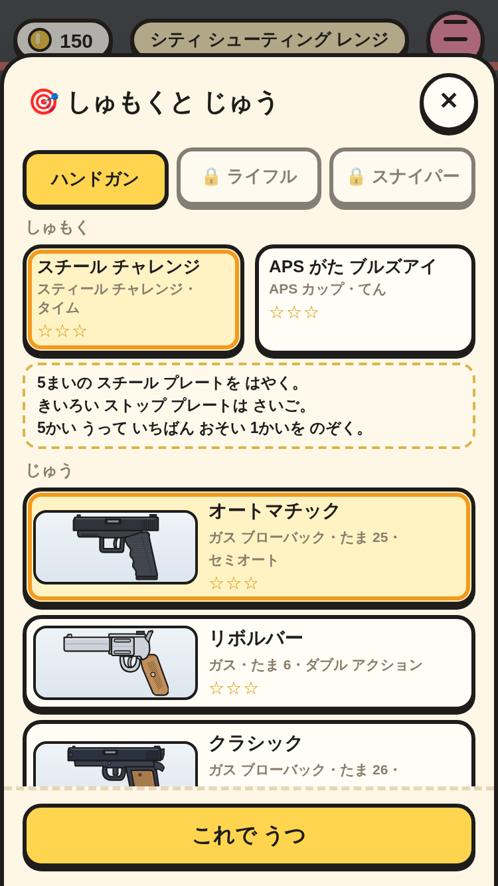
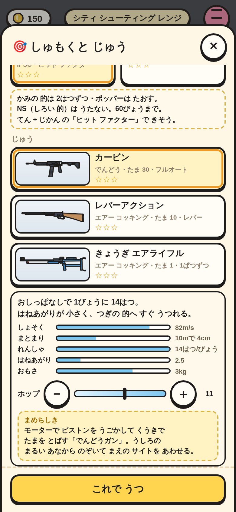
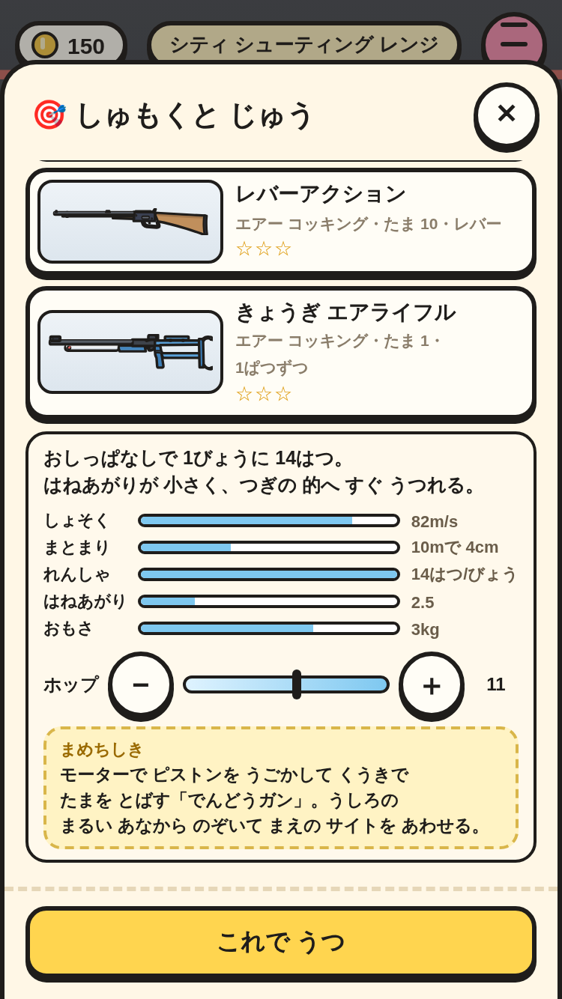

# 射撃場の ロビー（⑥ の 1番）

きらめきシティの デパートと こうぼうの あいだに「シティ シューティング レンジ」。入口に 入ると、はじめての ときだけ レンジ オフィサーの ラビが 安全の きまりを 話す。だれが うつかを えらび（のこりの 2人は うしろで おうえん）、しゅもくと エアソフトガンを えらぶ（あそぶ 画面は 2番）。

|場面|390×844|375×667|
|---|---|---|
|町の 建物（見本 ①）|||
|はじめての とき: RO の きまり（見本 ②）|||
|だれが うつ？（ごじを えらんだ ところ・見本 ③）|||
|しゅもくと じゅう: ハンドガン（ライフル・スナイパーは ロック・見本 ④）|||
|ライフル（ハンドガンで ★1 の あと）・ホップ ダイヤル 11|||

スモーク `range-lobby-*` で、次を たしかめて いる。

- シティの (10, 6) に 5×4 の 建物（入口 (12, 9)・act は range）。入口へ 歩くと 射撃場。
- はじめてだけ ラビが 話し、`Save.d.range.safety` が のこる。2かいめは 話さない。
- だれが うつ？ は 3まい（さいしょは 先頭の 子）。しゅもく 2つ・じゅう 3しゅ（絵つき）・ルールと せつめいが えらんだ ものに かわる。タブ・カード・ボタンは 44px いじょうで、よこに はみ出さない。
- ライフルは ハンドガンの しゅもくで ★1 を とるまで ロック（「ハンドガンで ★1を とると あそべるよ。」・これで うつ を おせない）。
- ホップ ダイヤルは ライフルと スナイパーだけ。＋／− で かわり、`Save.d.range.hop` に のこる。
- ✕ で だれが うつ？ に もどり（えらんだ 子は そのまま）、もう いちど ✕ で 町の 入口の まえ (12, 10) に 3人で もどる。
