# 射撃場で あそぶ（⑥ の 2番）

えらんだ 1人の 目の たかさの 主観で うつ。ゆびを うごかして ねらい、「のぞく」で サイト・スコープ、「うつ」で うつ。ボルト・レバー・リロードは じぶんで、「いき」を おしている あいだ ゆれが へる。のこりの 2人は ひだりしたで 見て いる。

|場面|390×844|375×667|
|---|---|---|
|スチール: ブザーまえ（じゅうを さげて まつ・見本 ⑤）|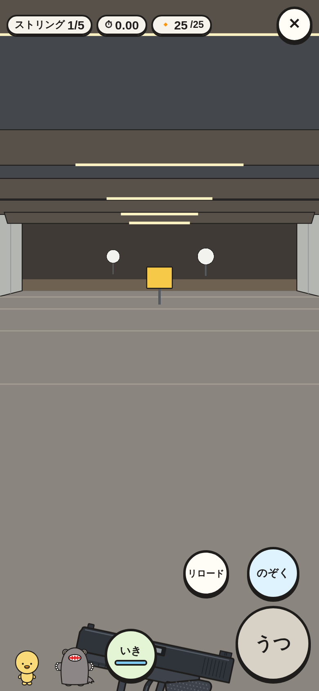|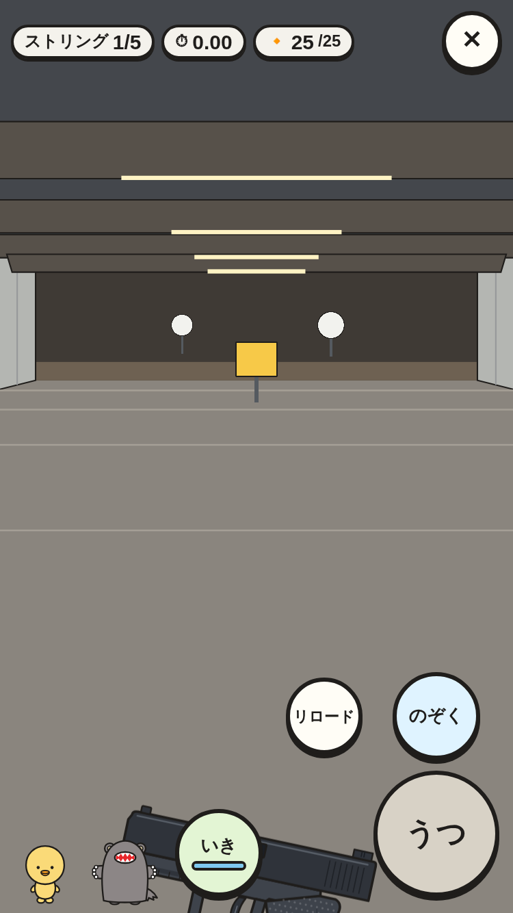|
|スチール: 3ドットで ねらう（わんこ・オートマチック・見本 ⑥）|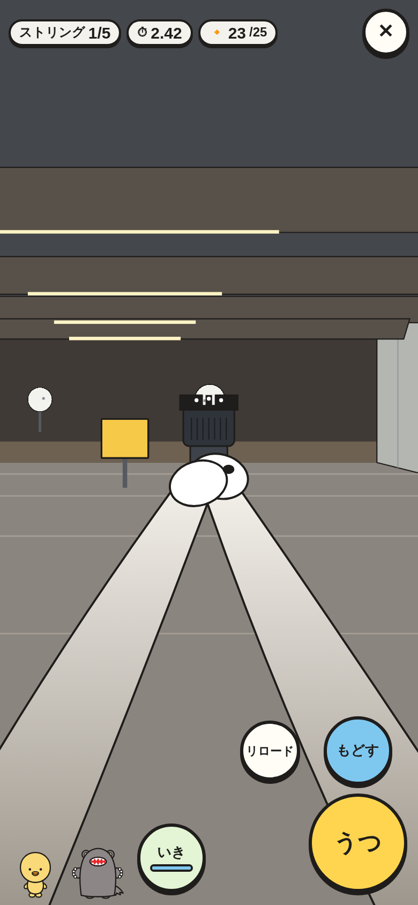|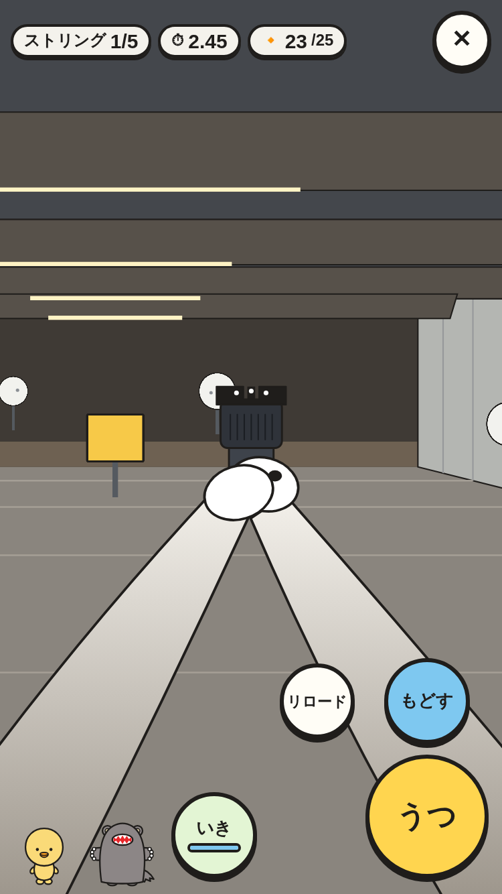|
|スチールの けっか（5ストリング・いちばん おそい 1かいに 線・見本 ⑪）|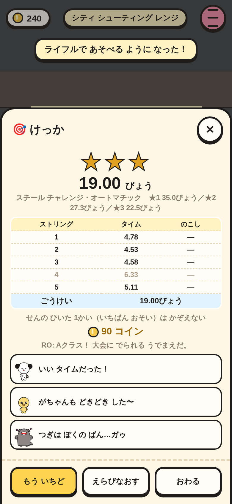|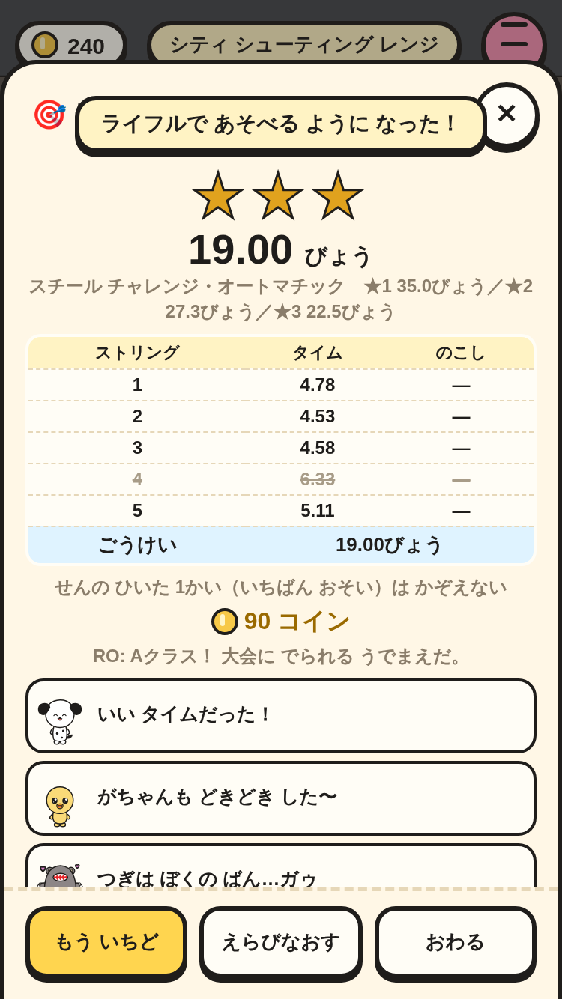|
|ロングレンジ: スコープ・かぜ・うった あと ボルト（ごじ・見本 ⑨）|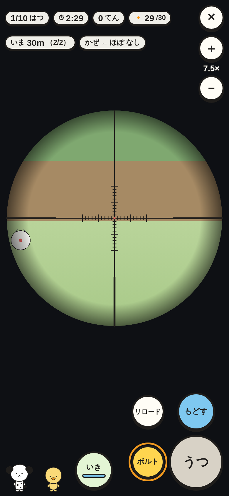|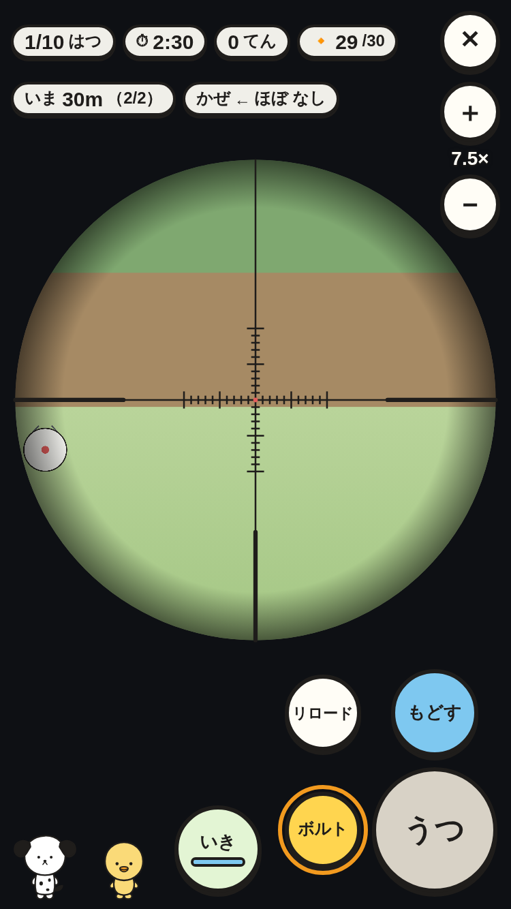|
|IPSC の けっか（A・C・D・ミス・NS・ヒット ファクター・見本 ⑫）|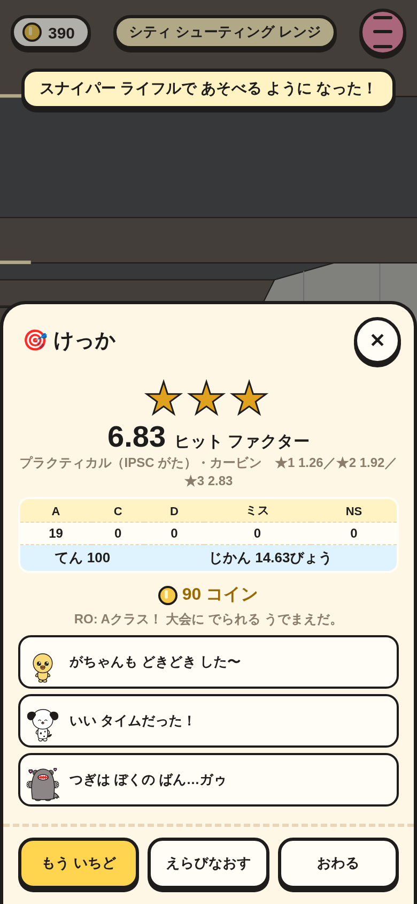|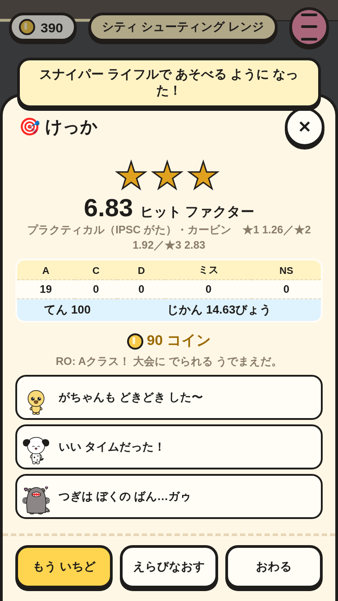|
|ブルズアイ: あかい ランプと スコア モニター（わんこ・リボルバー）|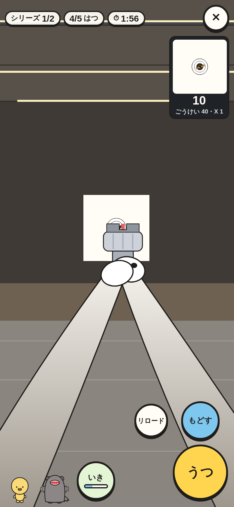|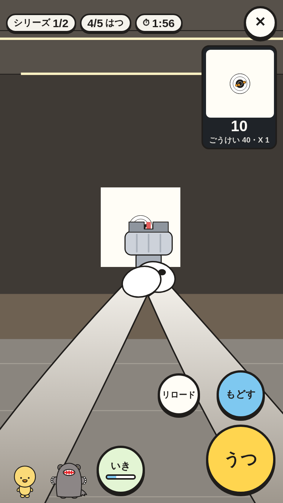|
|10m エアライフル: ダイオプター（ごじ・見本 ⑧）|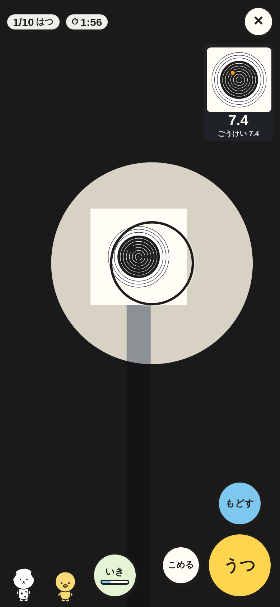|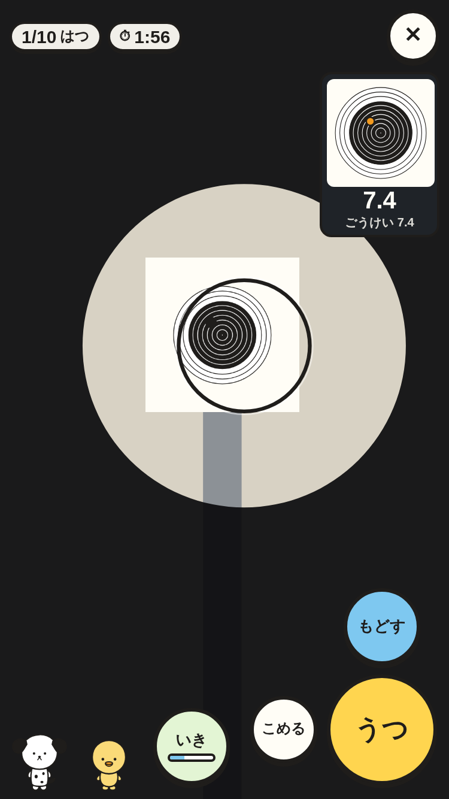|
|ムービング ターゲット: スコープと まど（がちゃん・見本 ⑩）|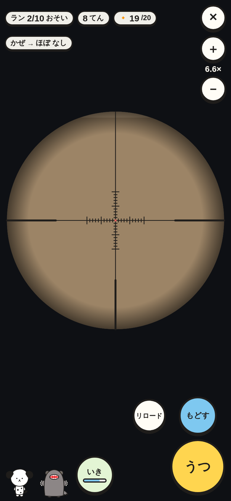|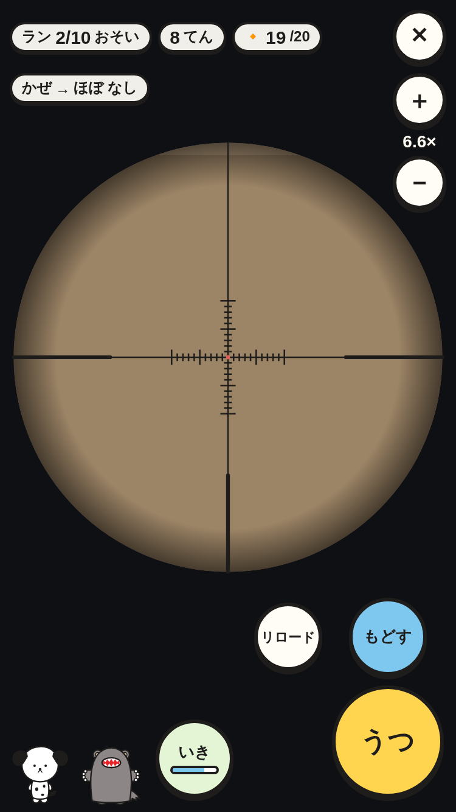|

スモーク `range-play-*` と `range-sights-*` で、次を たしかめて いる。

- HUD・ボタンが 画面の 中で かさならず、ボタンは 44px いじょう（うつ は 92px）。おうえんの 2人は えらんで いない 子。
- スチールを じどう（good）で あそぶと 5ストリングで おわり ★2 いじょう。シート・きろく（`Save.d.range.best`）・コインが ふえる。ハンドガンで ★ を とると ライフルが あく。
- ロングレンジ: のぞくと ばいりつが 上がり、＋で ズーム。うつと ボルトを ひく まで うてない（ボルトの ボタンが 光る）。ボルトの 0.8びょう あとに うてる。2だんめに いまの かねと かぜ。
- プラクティカル: ヒット ファクターと シート。もう いちどで 同じ しゅもく・じゅう。✕ は たしかめて ロビーへ（コインは ふえない）。
- セーブして よみこんでも きろくと あそんだ かずが のこる。
- ブルズアイ・10m・ムービングも じどうで さいごまで おわる。
