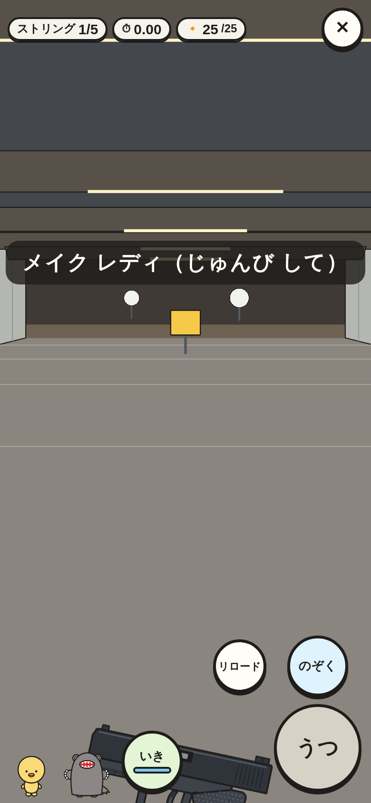
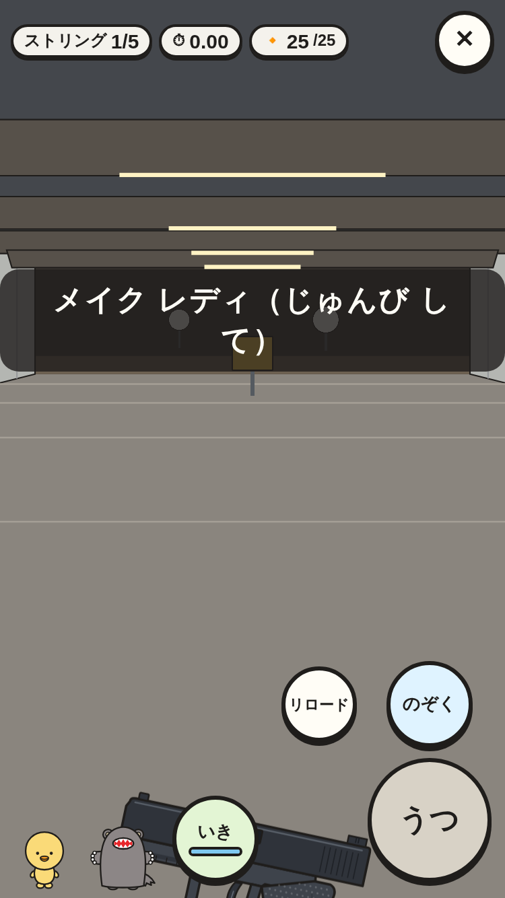
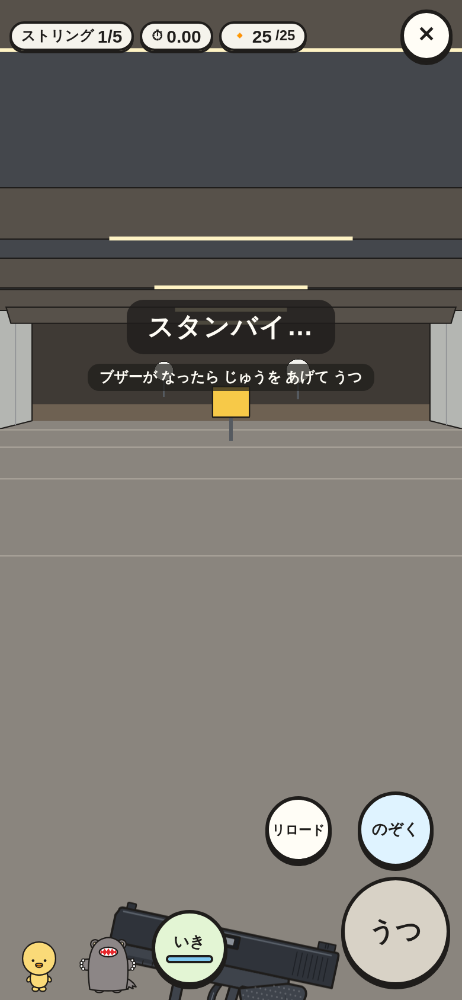
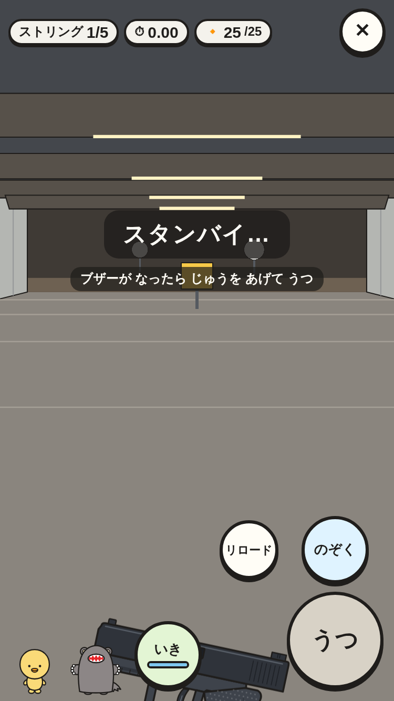
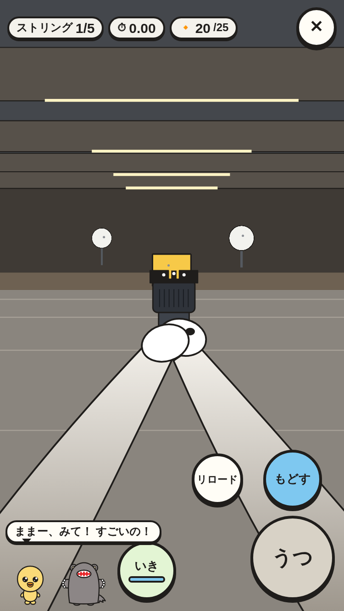
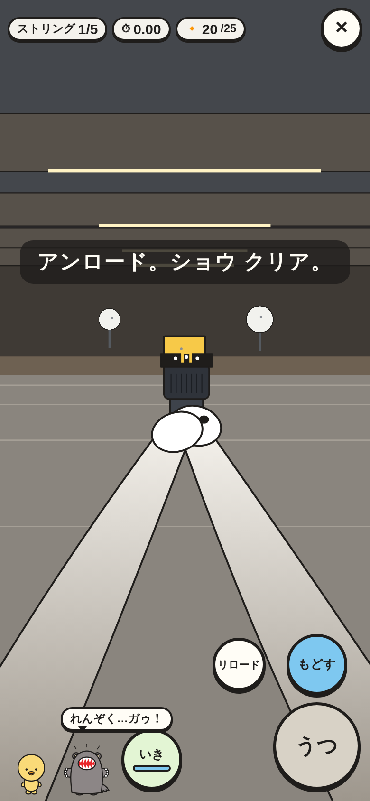
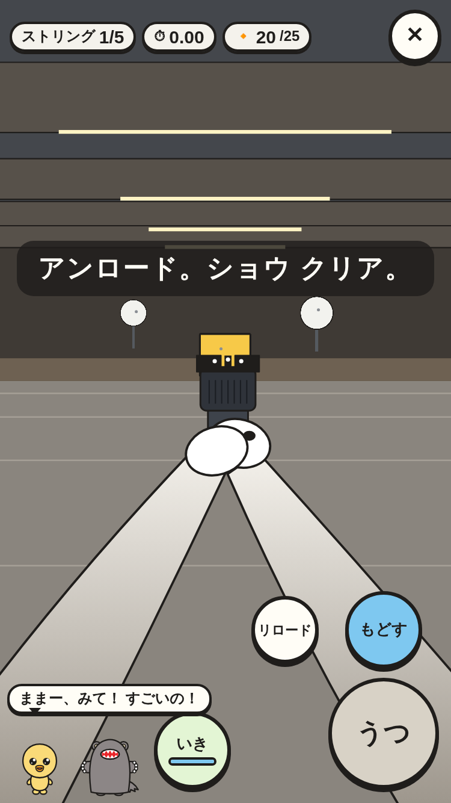
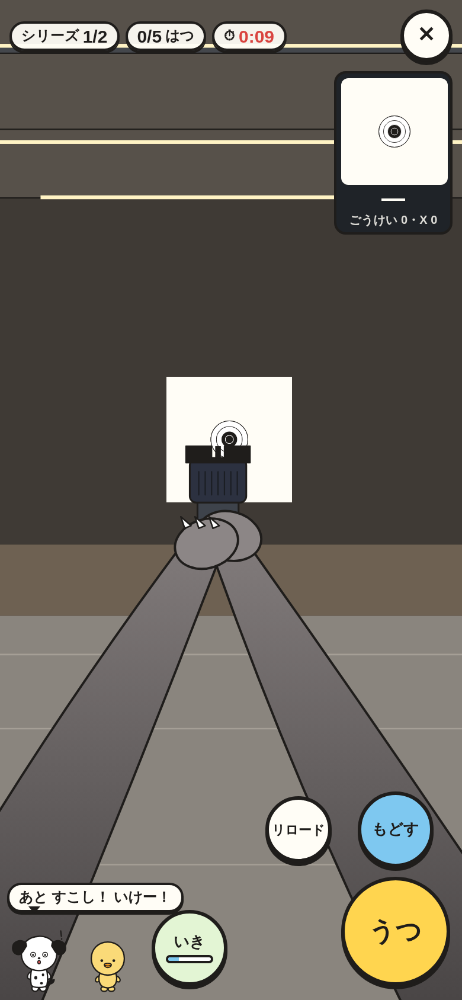
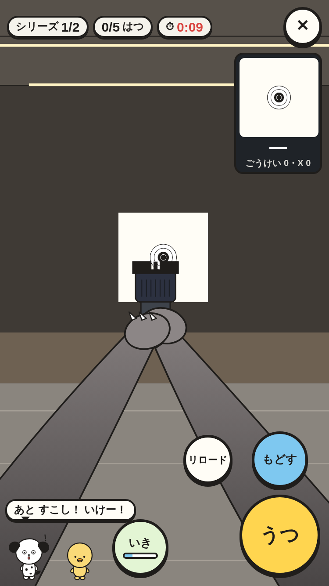

# RO の 号令と おうえん（⑥ の 3番）

レンジ オフィサーが 本物の 競技と 同じ 号令を かける。うしろの 2人は あたりや のこり 10びょうで おうえん する。

|場面|390×844|375×667|
|---|---|---|
|メイク レディ（じゅんび して）|||
|スタンバイ…（ブザーまで じゅうを さげて まつ）|||
|おうえん（のこしの ない ストリング・ごじ「れんぞく…ガゥ！」）|||
|アンロード。ショウ クリア。（けっかの まえ）|||
|ブルズアイの のこり 10びょう（いそいで）|||

スモーク `range-ro-*` で、次を たしかめて いる。

- 号令の じゅんばん: メイク レディ → アー ユー レディ？ → スタンバイ…（ブザーの 文つき・まだ standby）→ ブザーで きえる。
- スチールの 1ストリングで、えらんで いない 2人の どちらかが データの ことばで おうえん（スチールでは「ゾーン」の ことばを つかわない）。ふきだしは 画面の 中。
- すぐ おわらせると「アンロード。ショウ クリア。」の あとで けっか。② に `signal({ do: "range", stars })` が とどく（とちゅうの スチールは きろく なし・★ 0）。
- ブルズアイで うたずに 111びょう まつと、のこり 10びょう いかで「いそいで」の ことば。
