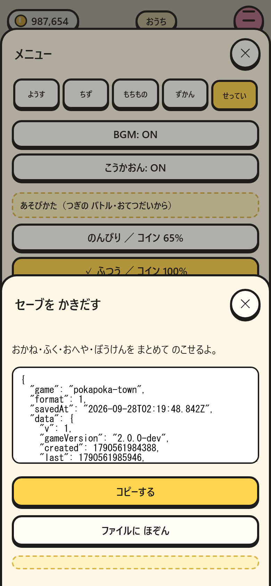
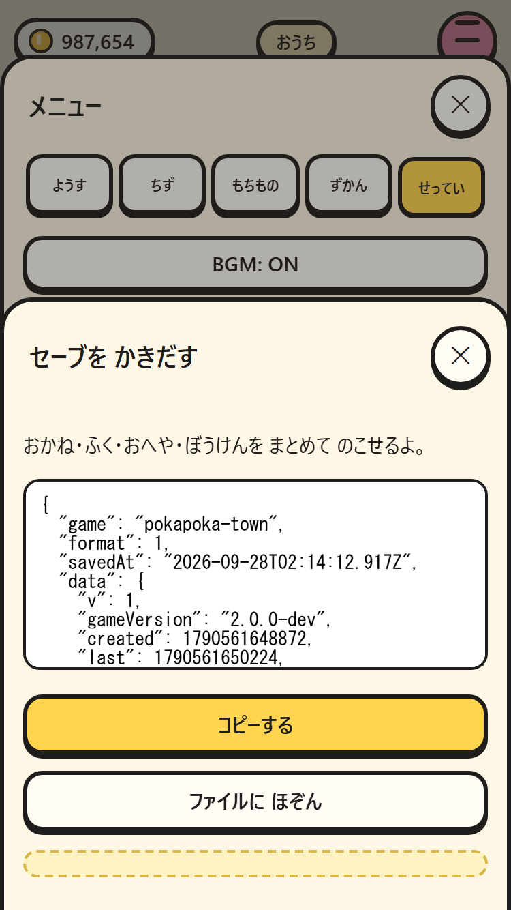
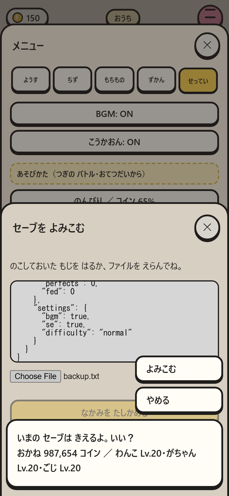
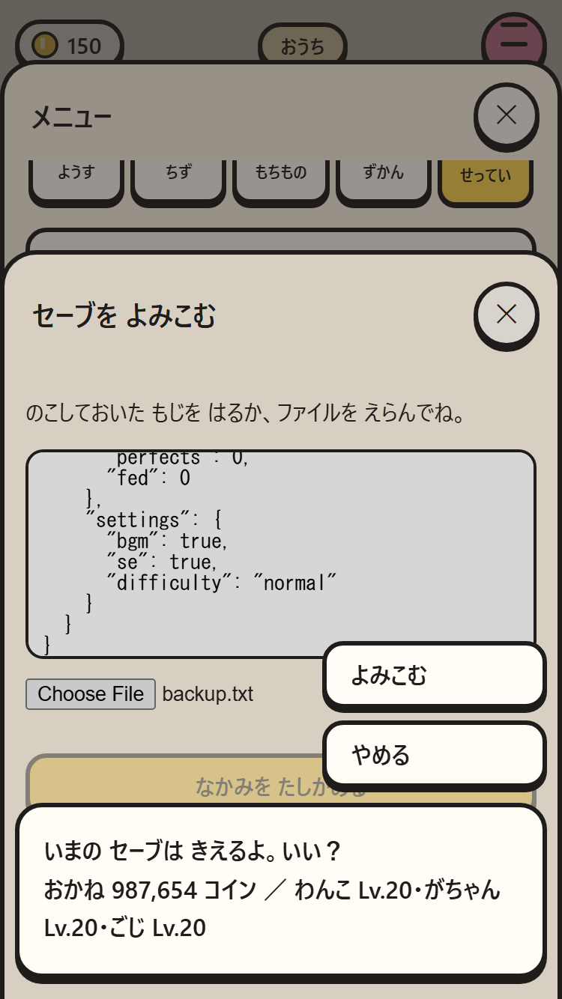
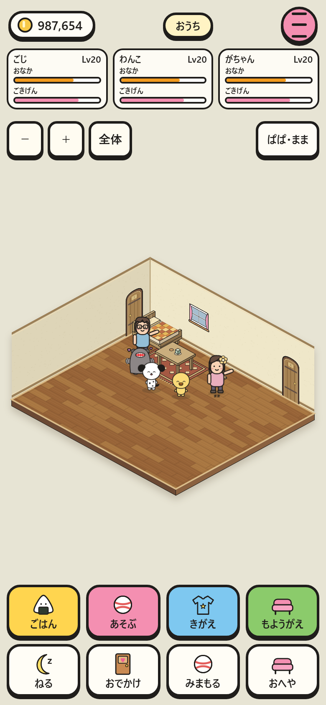
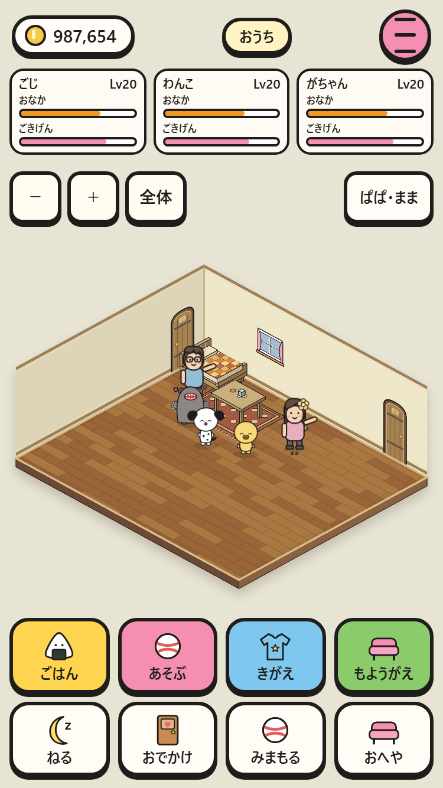

# セーブのバックアップ

実ゲームの設定から書き出し、987,654コイン・Lv20・拡張済みの部屋を復元。

|画面|390×844|375×667|
|---|---|---|
|書き出し|||
|確認|||
|復元後|||

`npm run check` 成功、`npm test -- --shots` 29/29成功、375pxのバックアップ操作も別途成功。無効データ・キャンセル・ファイル保存・別ブラウザでの読み取り・保存容量不足も検証。
