# お店のレベルで増える飾り

Lv1は元の建物、Lv3は星と花、Lv5は三つ星と旗。入口・通行・所持金は変えず、平和台の原画は独立した飾りで保持する。

## 390×844

|場面|Lv1|Lv3|Lv5|
|---|---|---|---|
|町|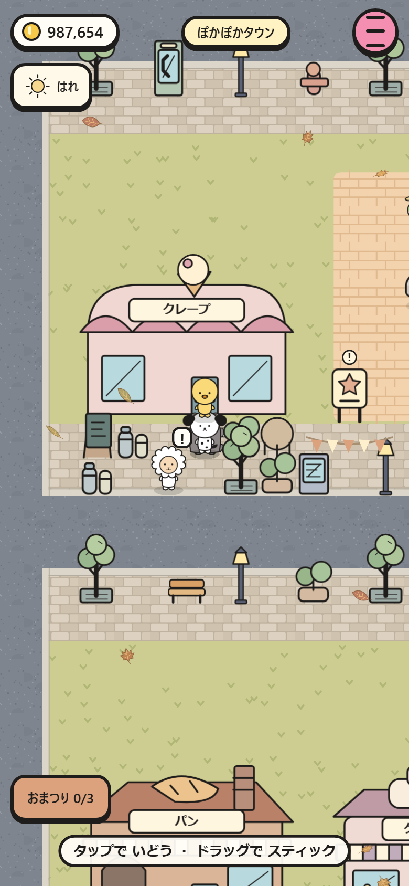|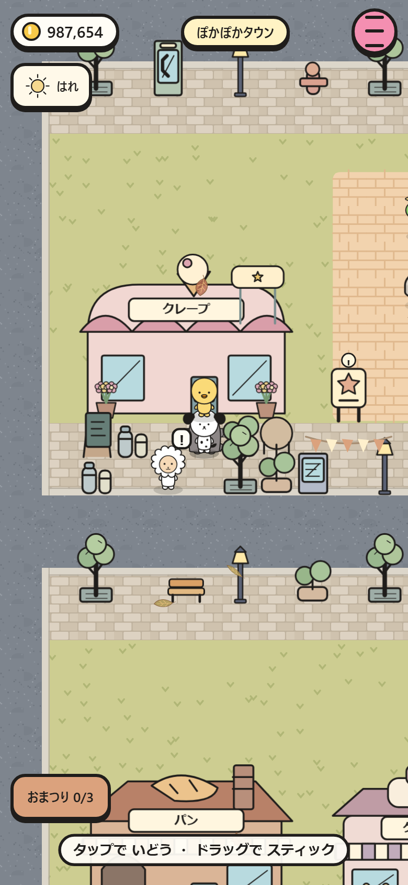|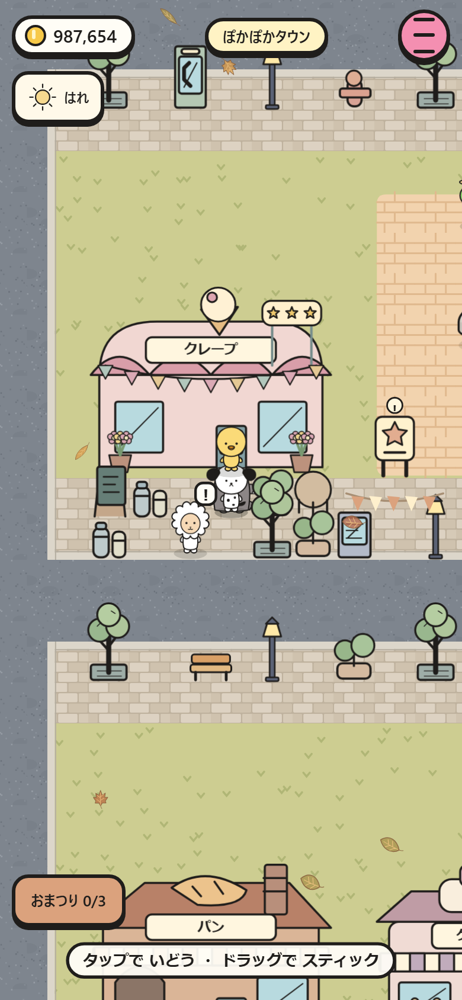|
|店内|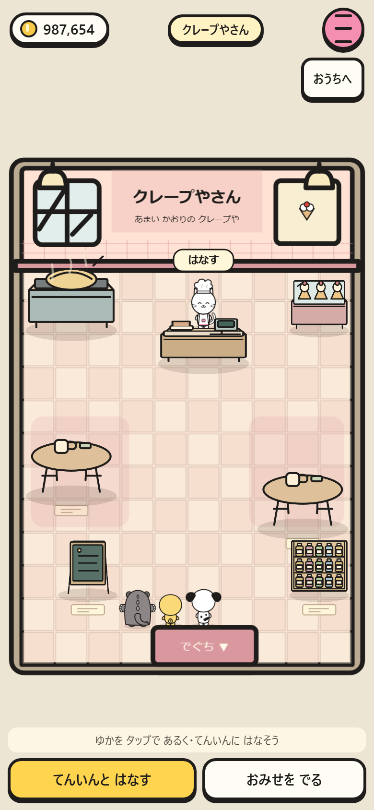||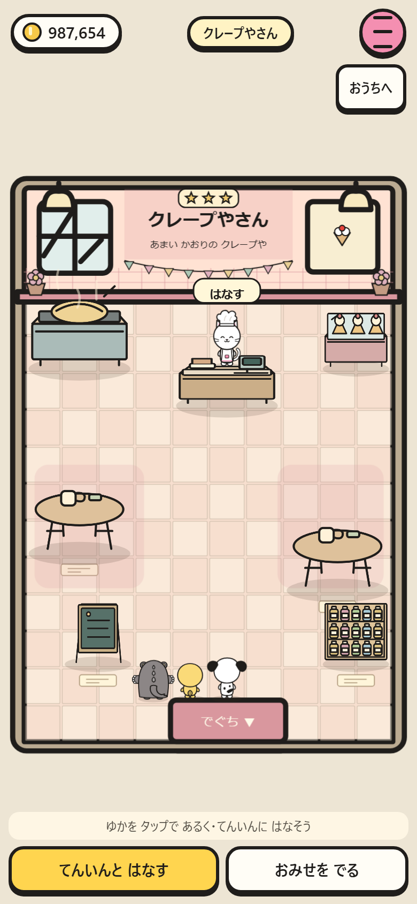|
|おてつだい|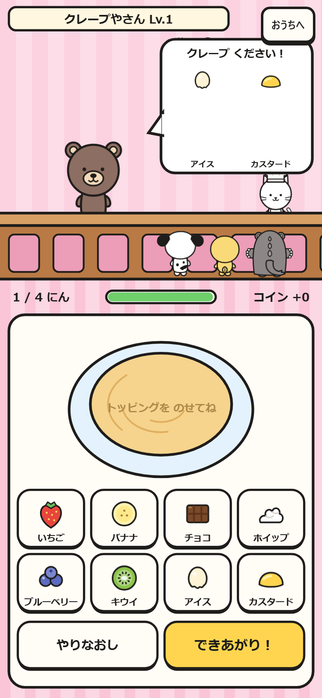|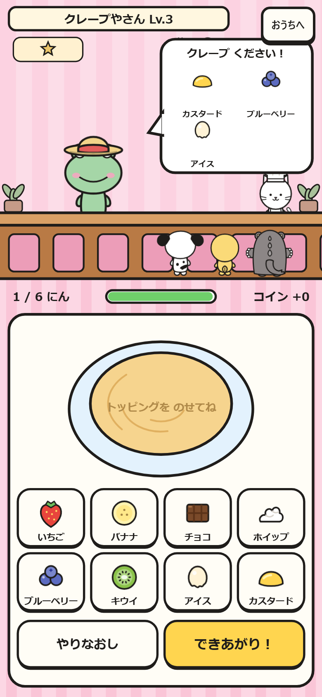|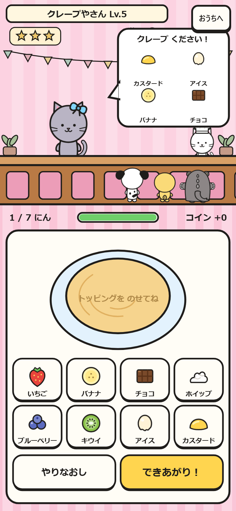|

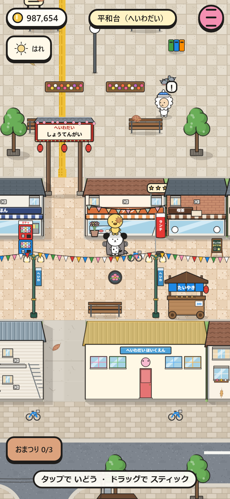

## 375×667

|場面|Lv1|Lv3|Lv5|
|---|---|---|---|
|町|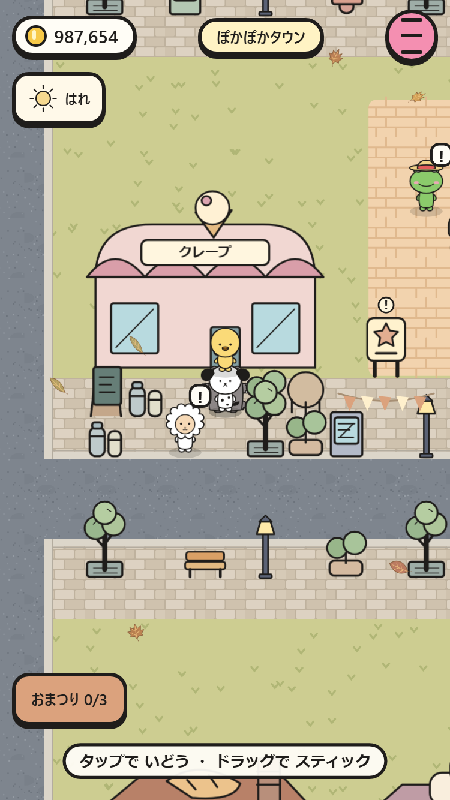|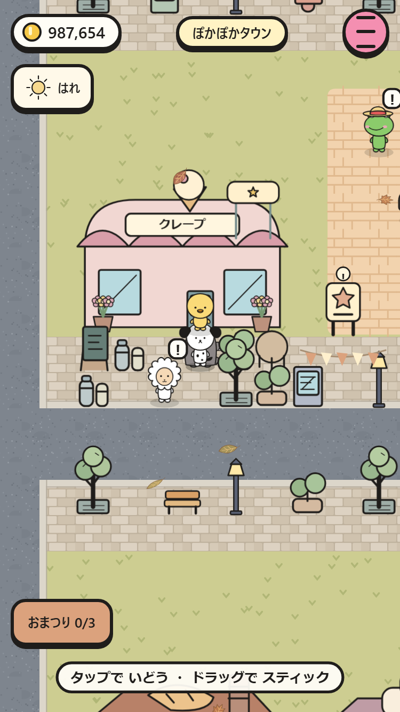|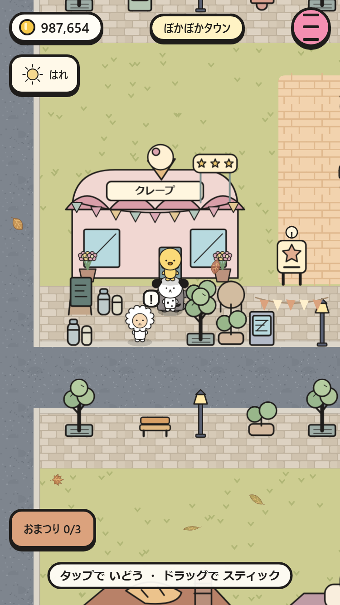|
|店内|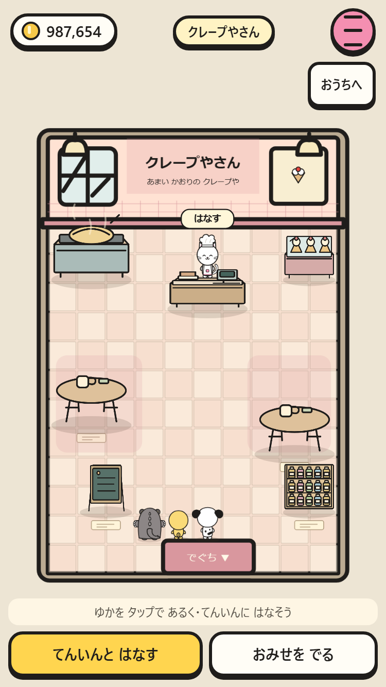||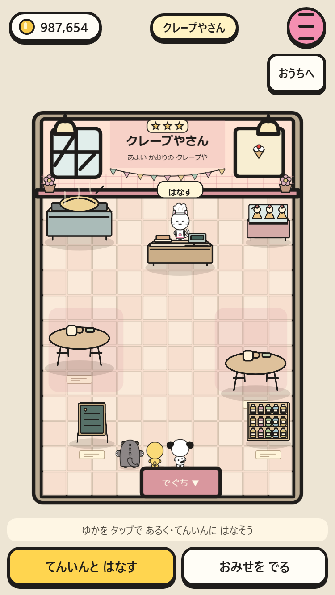|
|おてつだい|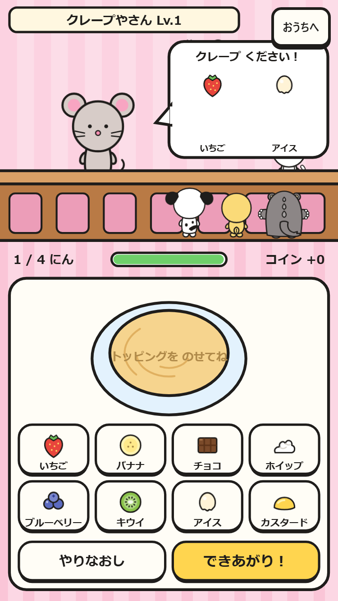|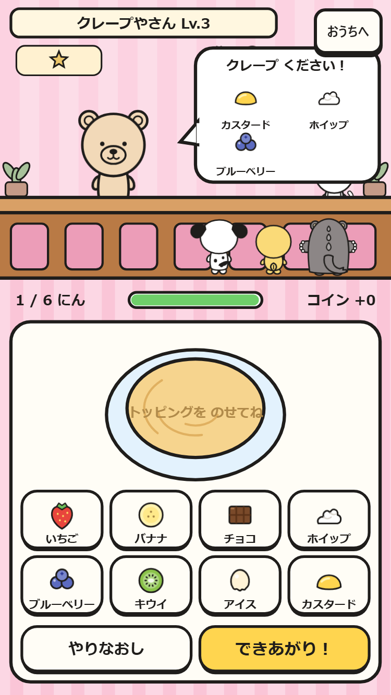|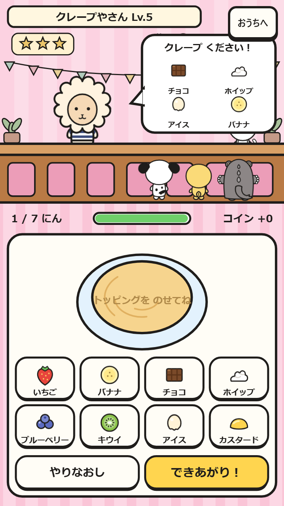|

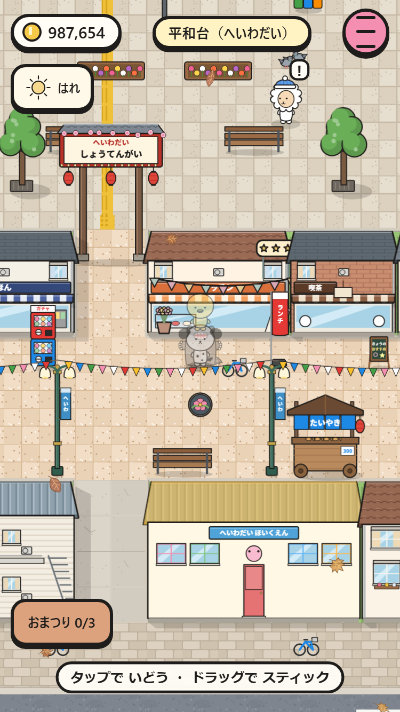

両サイズで3段階の移動・入店・おてつだい開始を操作し、987,654コインと所持品の保持を確認。クレープのLv4/5で注文名が重なっていた表示も2列に修正した。
