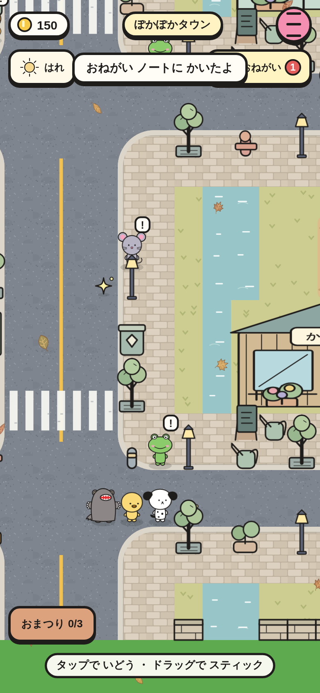
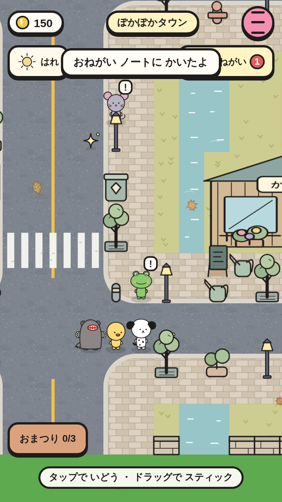
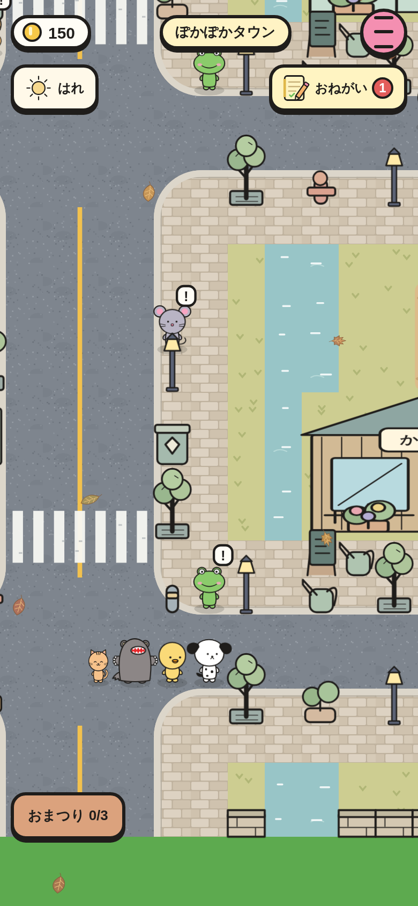
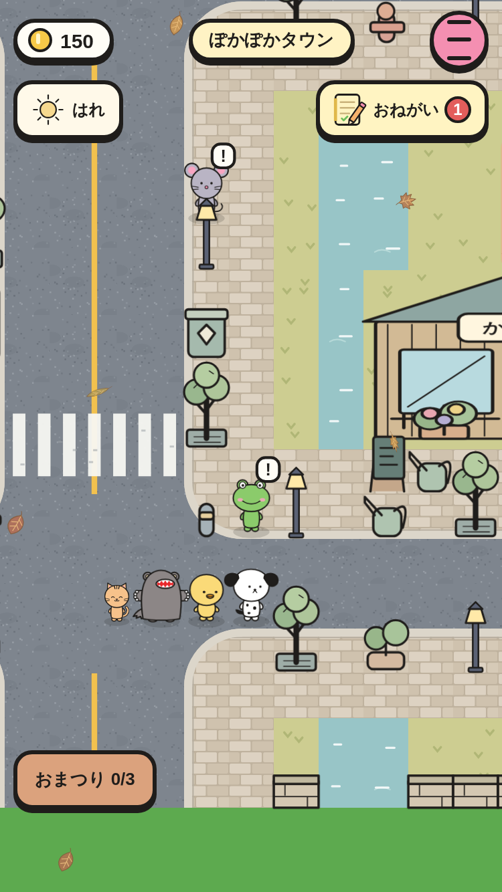
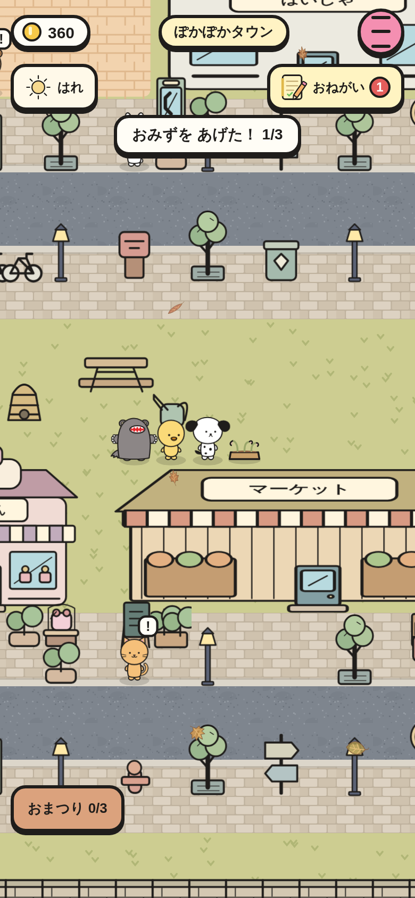
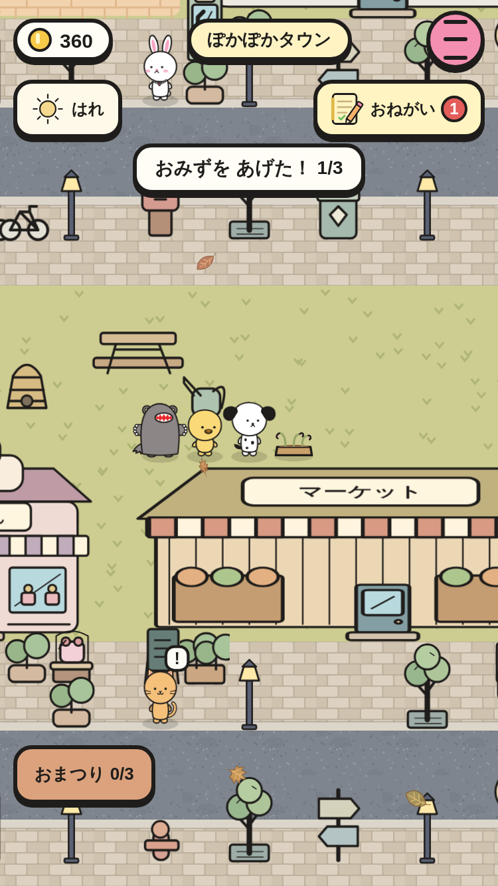
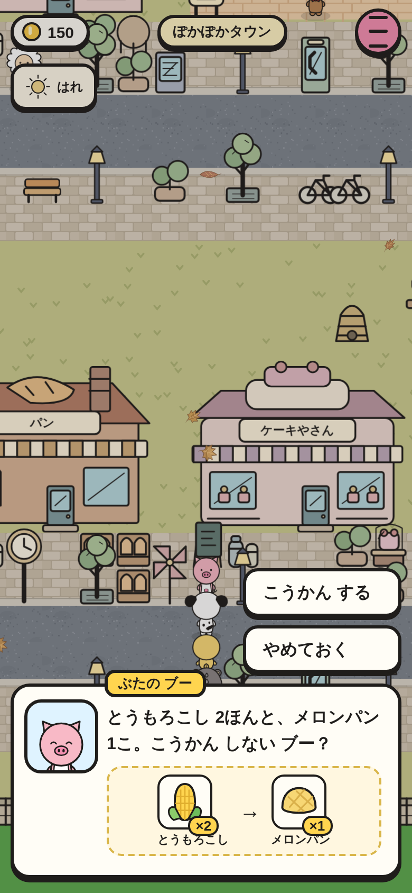
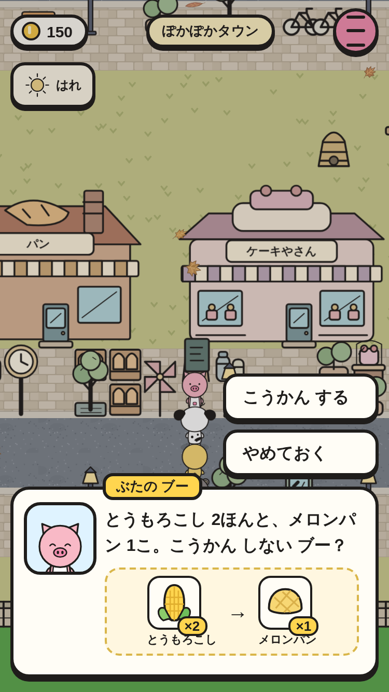
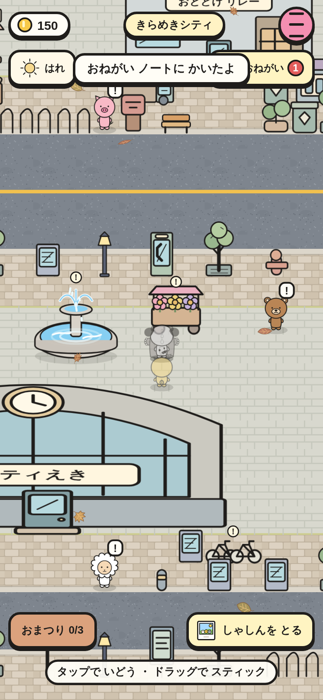
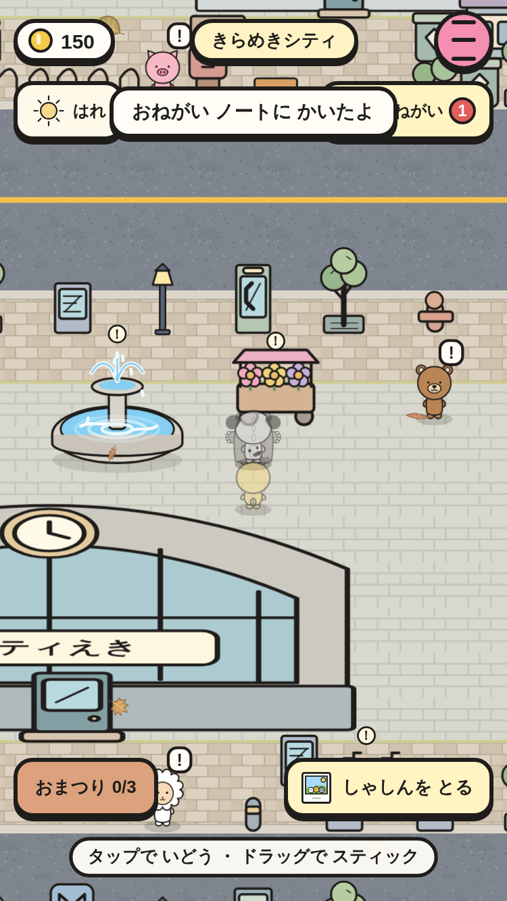

# さがす・さわる・つれていく・しゃしん・物々交換（② の 3番）

おねがいに さがしもの・まいごの こねこ・おそうじ・みずやり・しゅうかく・どんぐり・しゃしんが くわわった。おねがいが ない ときは、たまに 物々交換を もちかけられる。

|場面|390×844|375×667|
|---|---|---|
|きらきらを しらべる（あたりは 1つ）|||
|こねこが 3人の うしろを ついて くる|||
|かだんに みずやり（1/3）|||
|物々交換（わたす → もらう の カード）|||
|ふんすいの ちかくで「しゃしんを とる」|||

スモーク `folk-find-*` で、次を たしかめて いる。

- まいごの こねこ：はずれ →「ここには ない みたい…」→ あたり → こねこが ついて くる（歩いても うしろに いる）→ ミケに 話す と コイン +120・なかよし +4。
- むぎわら ぼうし（はらっぱ）：コイン +90・なかよし +3。
- みずやり：かだん 3つ（みずを あげると 花が さく）→ コイン +70・りんご +1。

スモーク `folk-photo-*` で、次を たしかめて いる。

- 物々交換：カードが 画面の 中・とうもろこし −2・メロンパン +1。
- しゃしん：ボタンが 44px で 画面の 中、ほかの ボタンと かさならない。おすと ひかって すすみ、あんないの ひとに 話すと コイン +100・ポスター。
