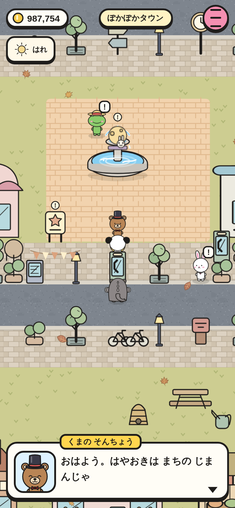
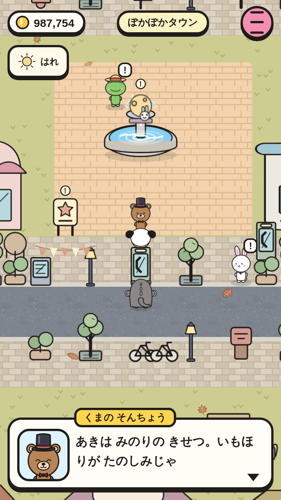
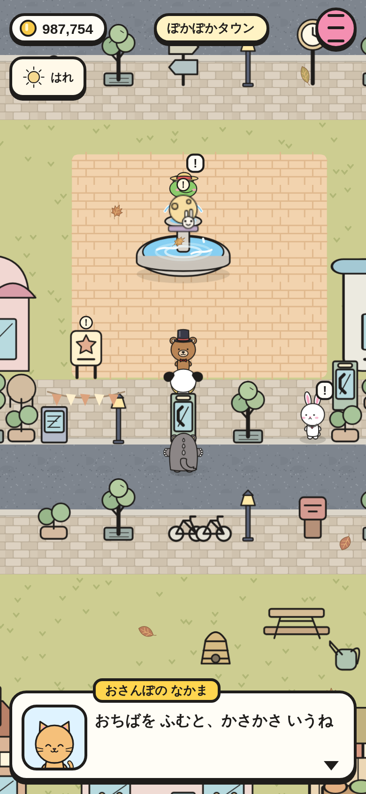
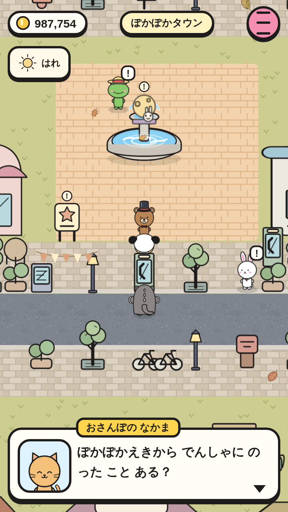

# 町の人の セリフ（② の 1番）

町の人の セリフは 443種。時間・天気・季節・おまつり・ボスの あと で かわる。町の なかまは 役ごとの 名前と セリフで 話す。

|場面|390×844|375×667|
|---|---|---|
|くまの そんちょう|||
|町の なかま（おさんぽの なかま）|||

スモーク `townsfolk-lines-390` / `-375` で、あさ・はれ の ときに 村長の セリフが その 条件の ものだけに なる こと、なかよしの セリフが まだ 出ない こと、町の なかまが 役の 名前と セリフを つかう こと、会話で セーブが 変わらない ことを たしかめて いる。
