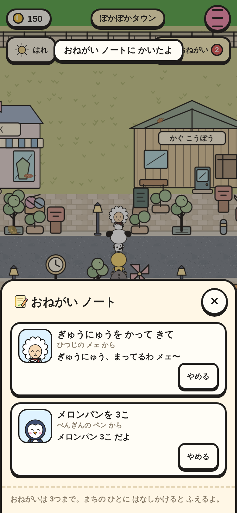
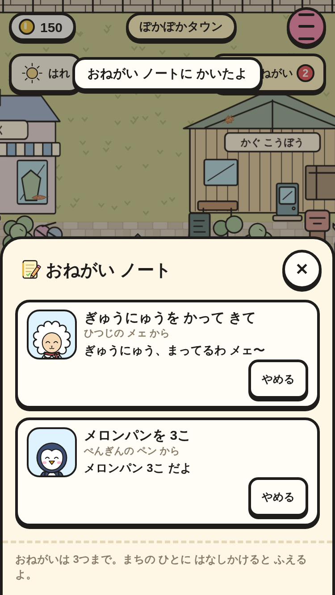
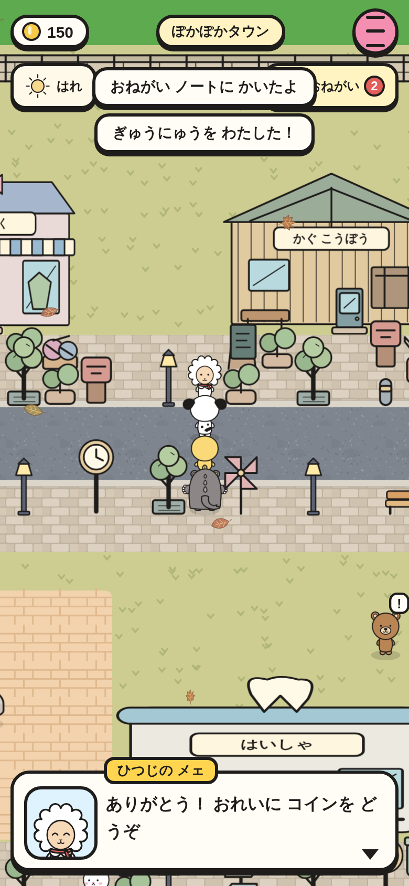
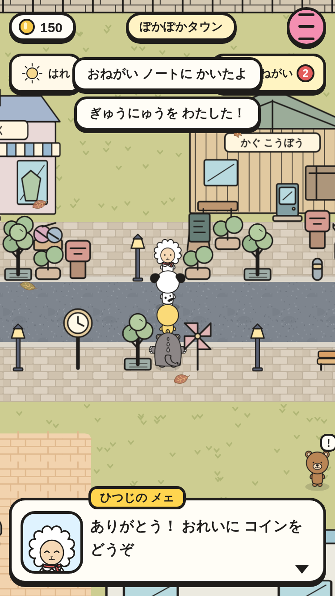
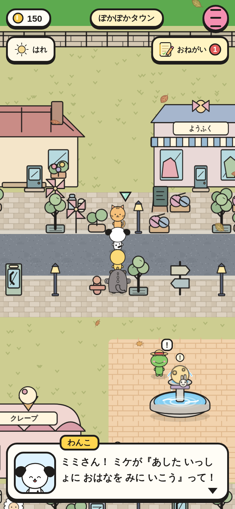
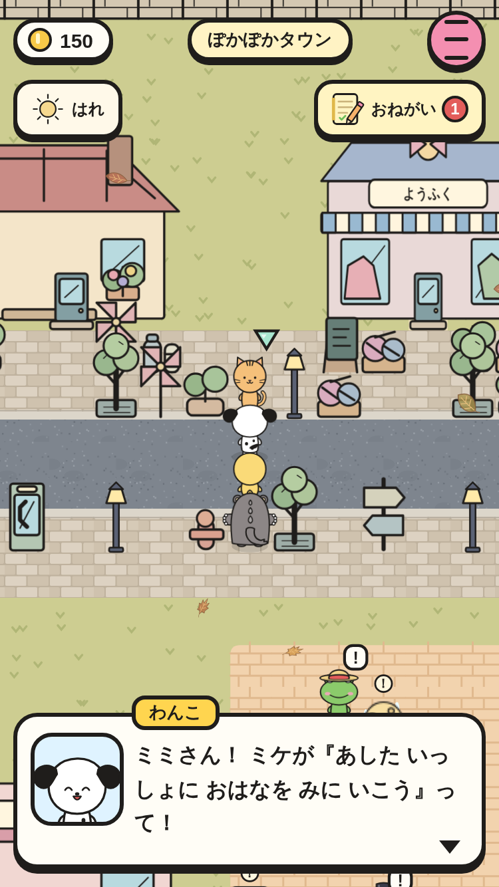

# 町の人の おねがい（② の 2番）

町の人が ときどき おねがいを たのむ（1人 1日 1回・10〜20%・3つまで）。右上の「おねがい」ノートで いまの 手順が わかる。

|場面|390×844|375×667|
|---|---|---|
|おねがい ノート|||
|かなえた（わたした → おれい）|||
|でんごん（あいてに ▼）|||

スモーク `folk-requests-*` で うける・ことわると ！・つぎは もう一度・ノート（カード 2まい・画面の 中・ボタン 44px）・かって わたす・コイン +80 と なかよし +2・セーブの 再開、`folk-chain-*` で でんごん・なぞなぞ・わらしべ（はとどけい ＋ 200）を たしかめて いる。
