# 歩いて入るおみせ

全9業種。入口 → 3人で店内を歩く → 店員をタップ → 買い物/おてつだい。全店舗に専用の展示・設備と通れる床を設けています。

[390の一覧](overview-390.png) / [375の一覧](overview-375.png) / [内装素材](assets.png) / [3人と向きの確認](characters-directions.png)

390×844 / 375×667、deviceScaleFactor=2 の実行画面。残高987,654は互換性テスト用の既存セーブを再現したものです。

| おみせ | 390×844 | 375×667 |
| --- | --- | --- |
| 洋服店 | 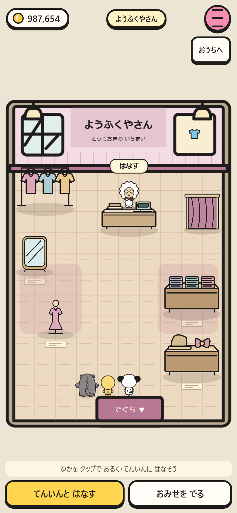 | 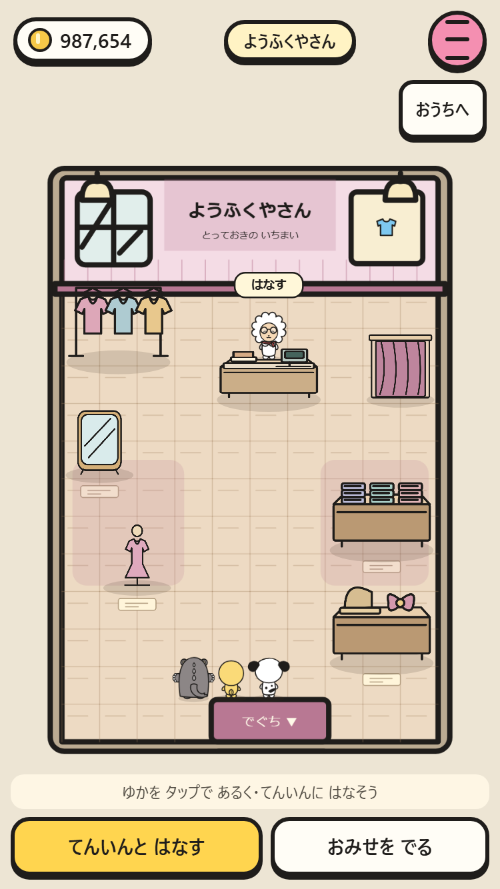 |
| 家具店 | 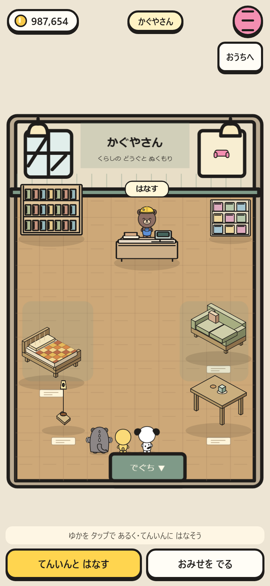 | 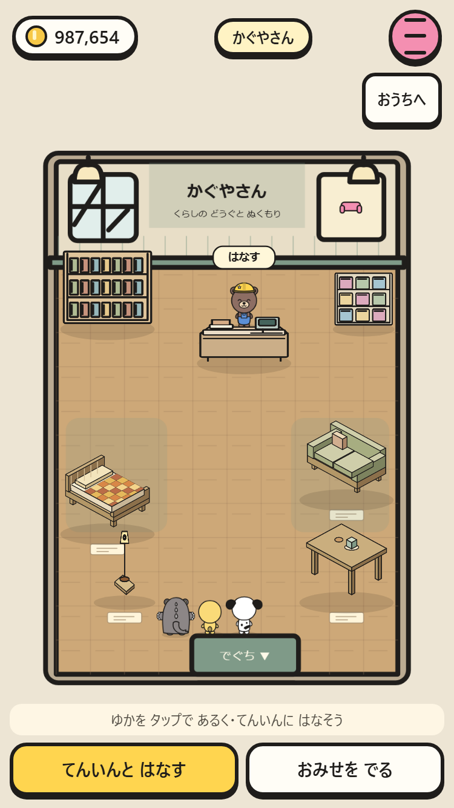 |
| スーパー | 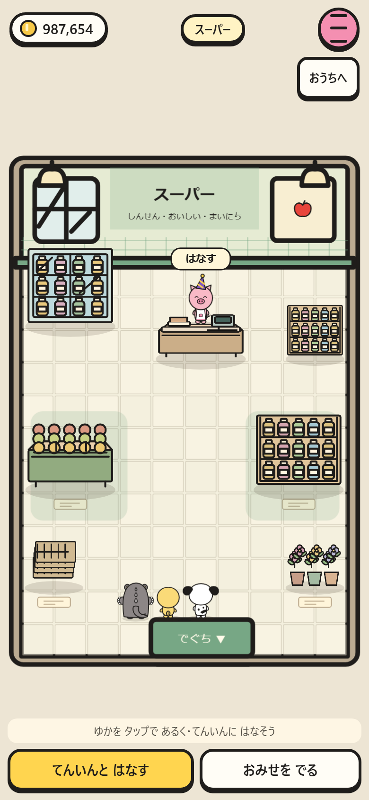 | 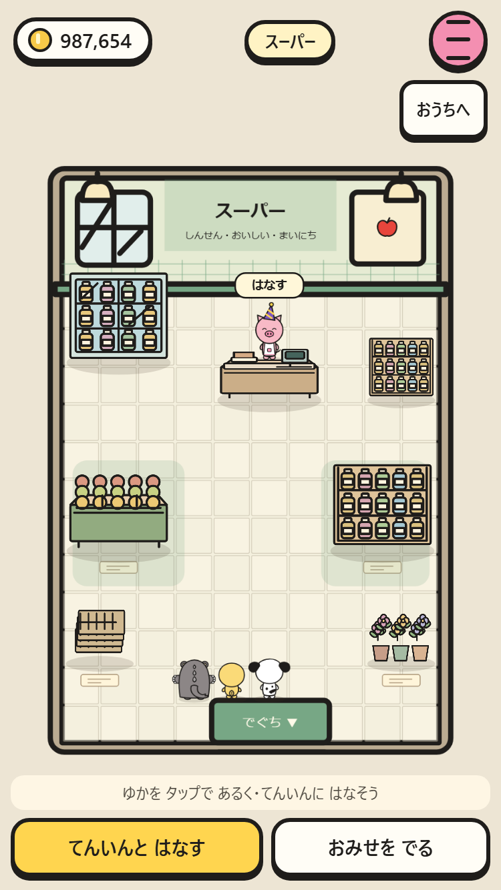 |
| クレープ屋 | 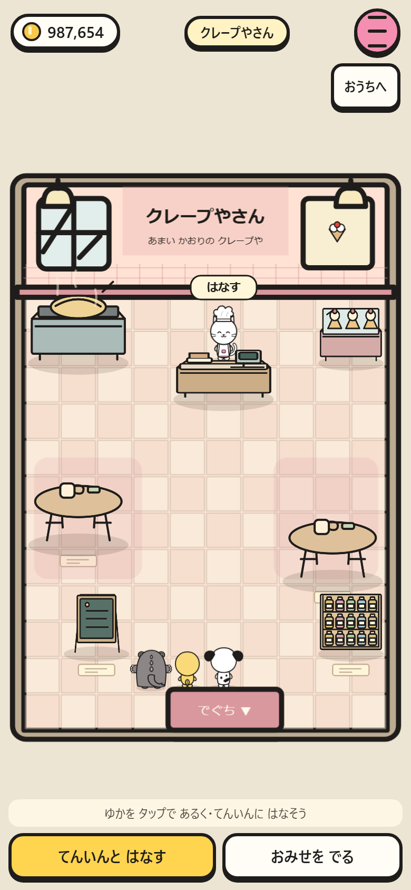 | 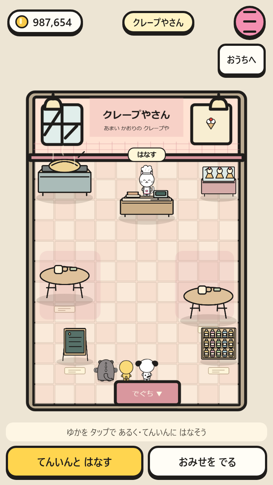 |
| 歯医者 | 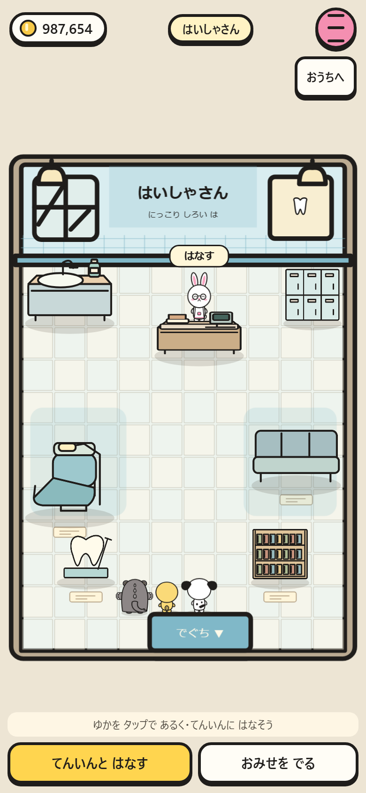 | 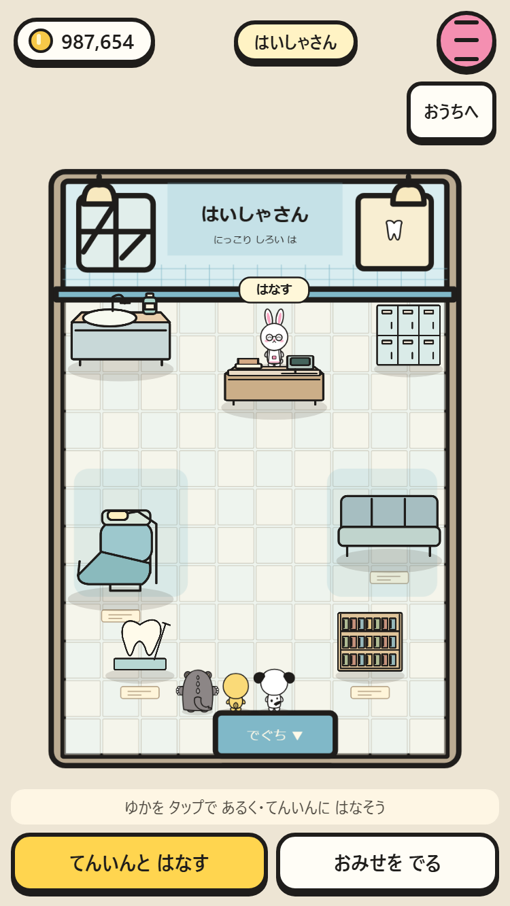 |
| パン屋 | 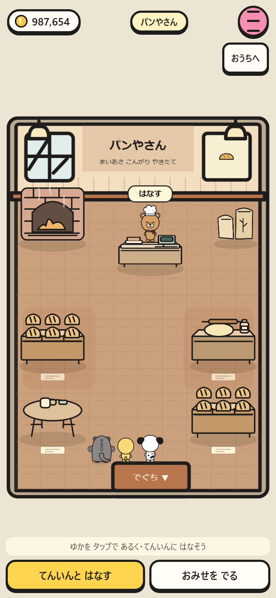 | 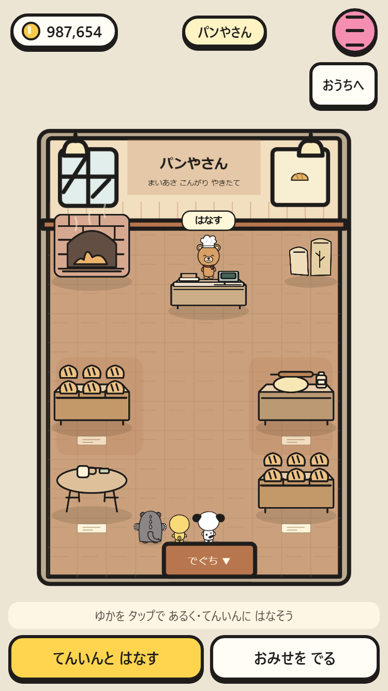 |
| 花屋 | 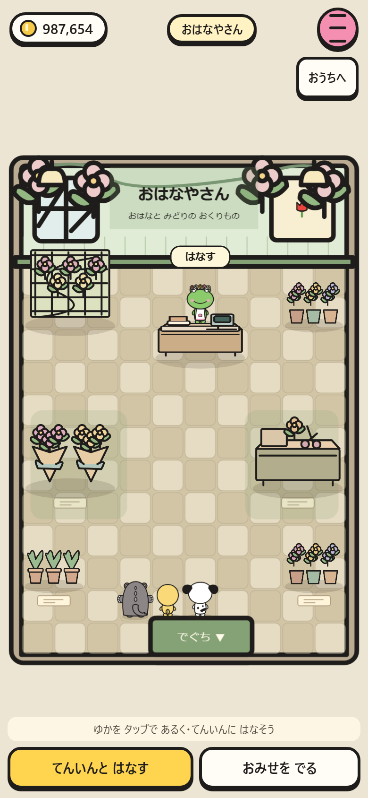 | 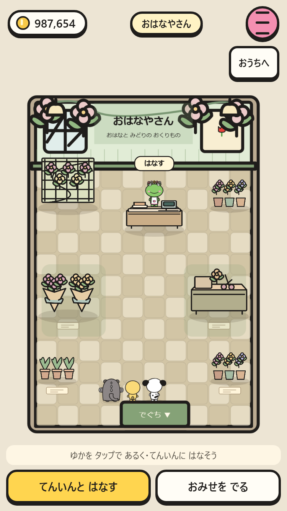 |
| パズル店 | 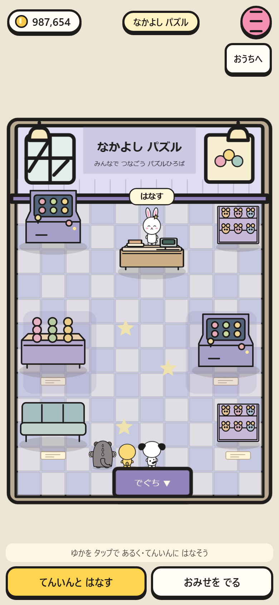 | 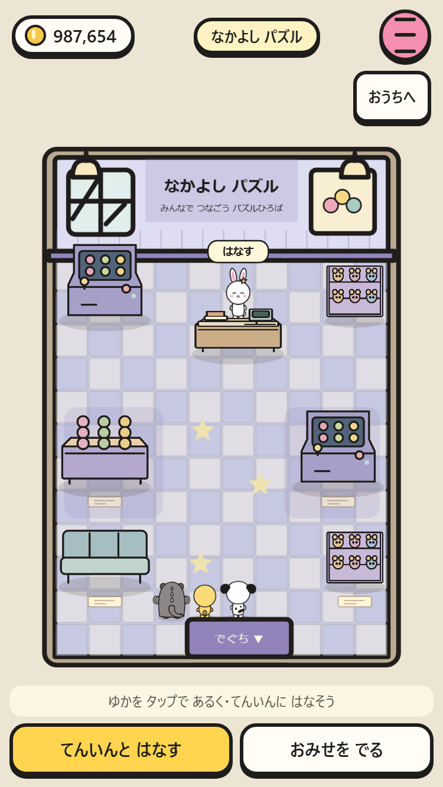 |
| 配送所 | 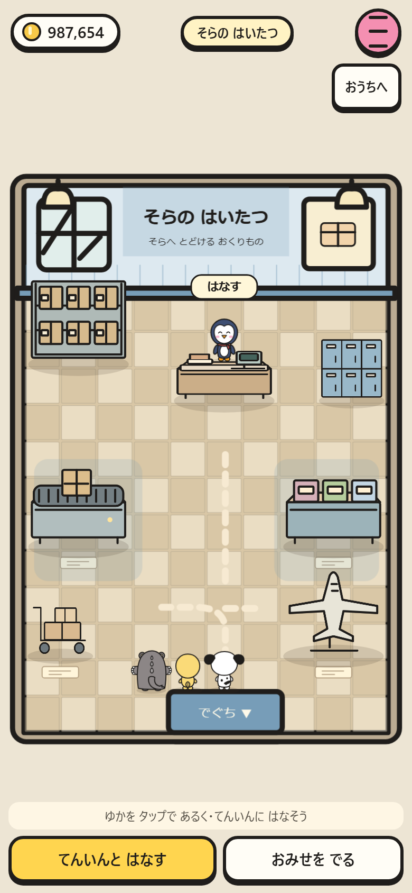 | 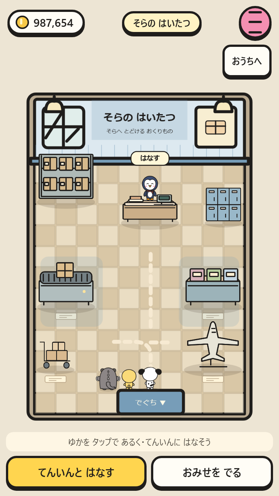 |

再現: `node tests/smoke.mjs --full --shots --only=walk-in-stores`。素材の一覧は `tools/preview.html` の「おみせの内装・展示」。

保存キー・スキーマは従来どおり。入店時に入口の外を保存し、購入は即時保存します。再読み込みでは同じ入口の外から再開します。

確認結果: `npm run check` 成功、`npm test` 24/24成功。両サイズの専用テストと、最終レイアウト調整後の375テストも成功。`file://` で全9店舗×2サイズを撮影し、素材プレビューを含めブラウザエラーは0件。
